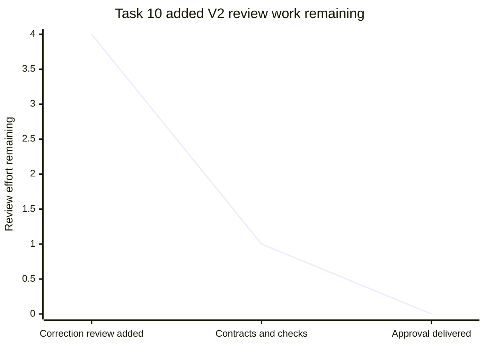
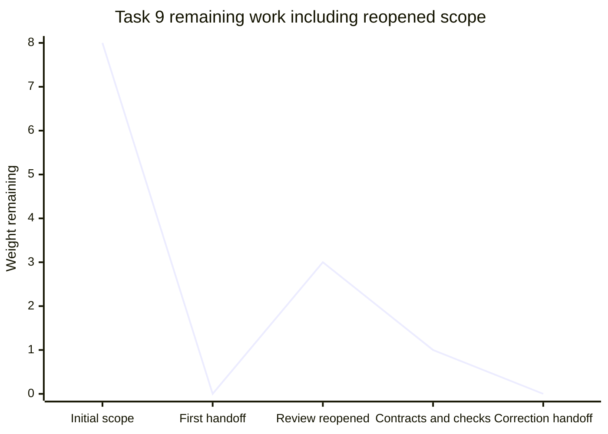
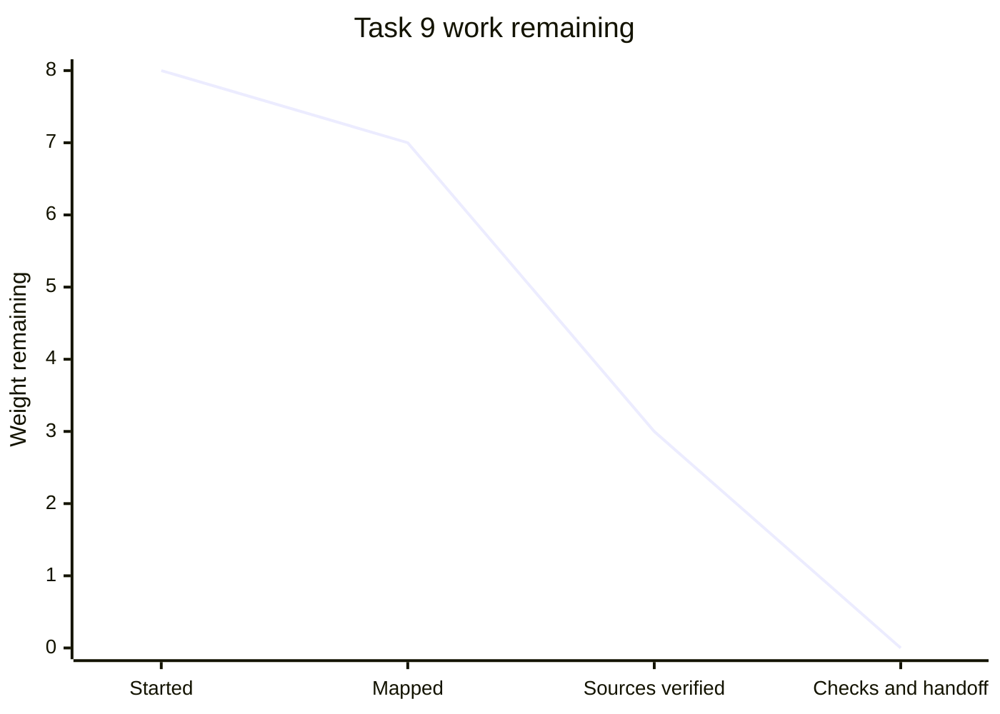
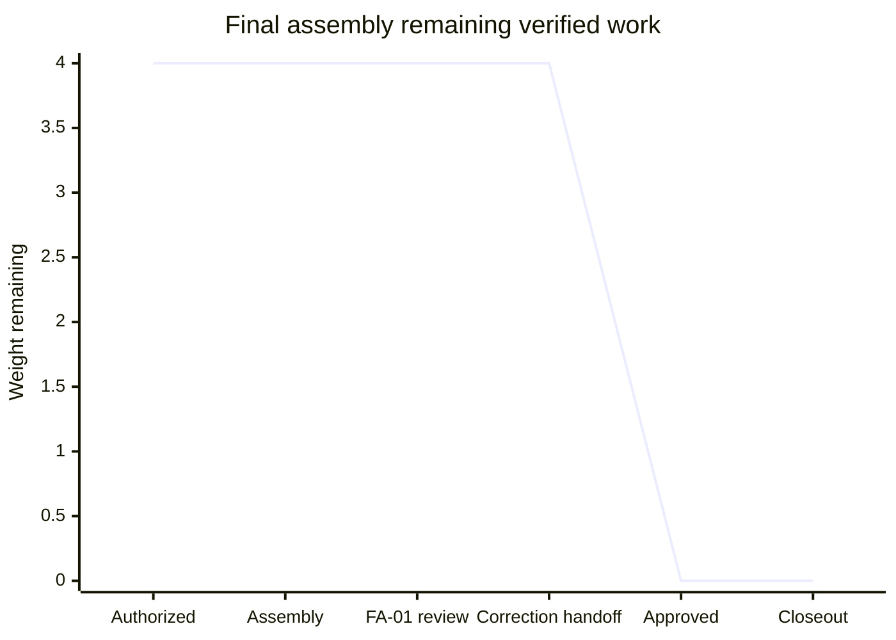
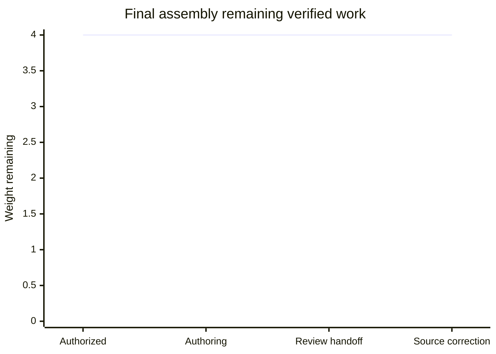
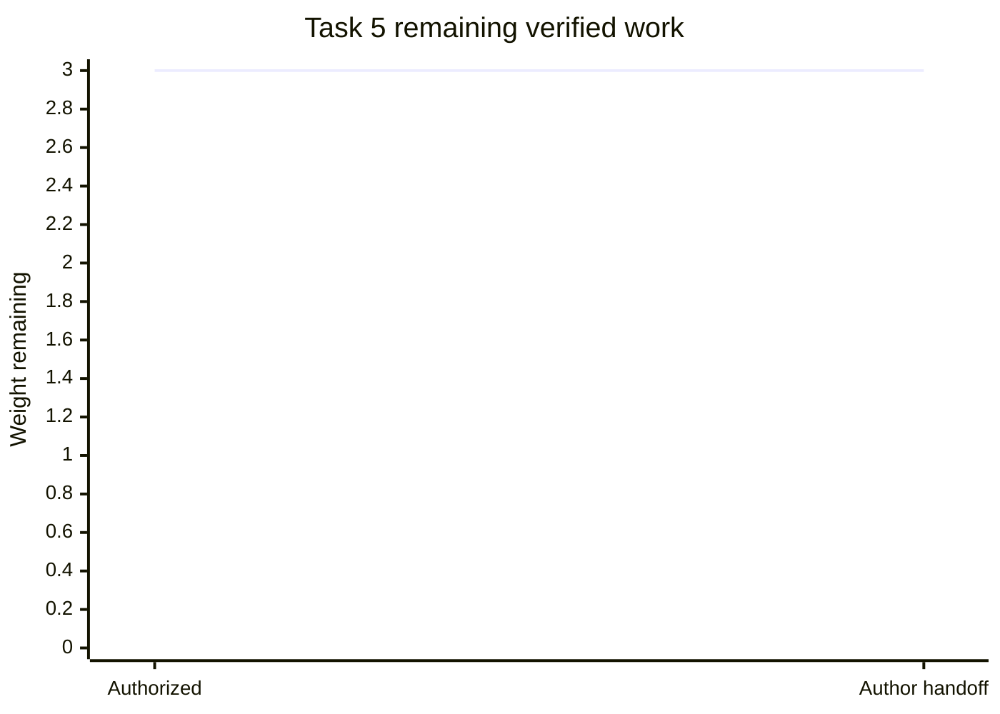
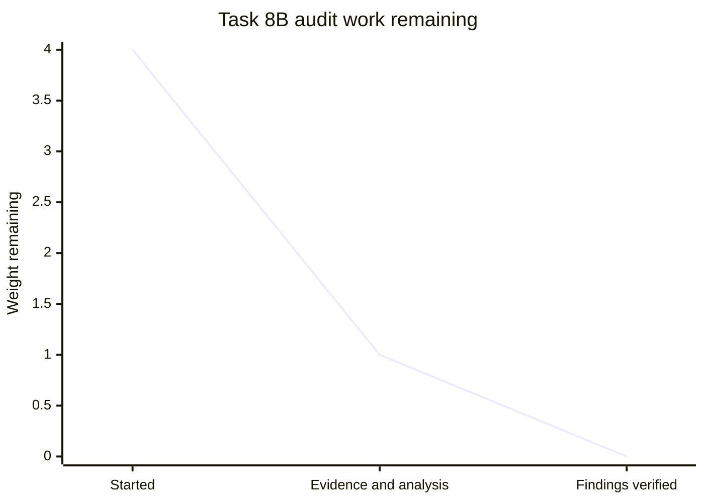
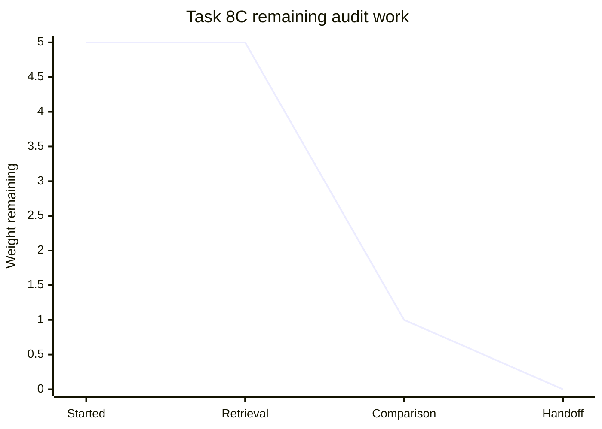
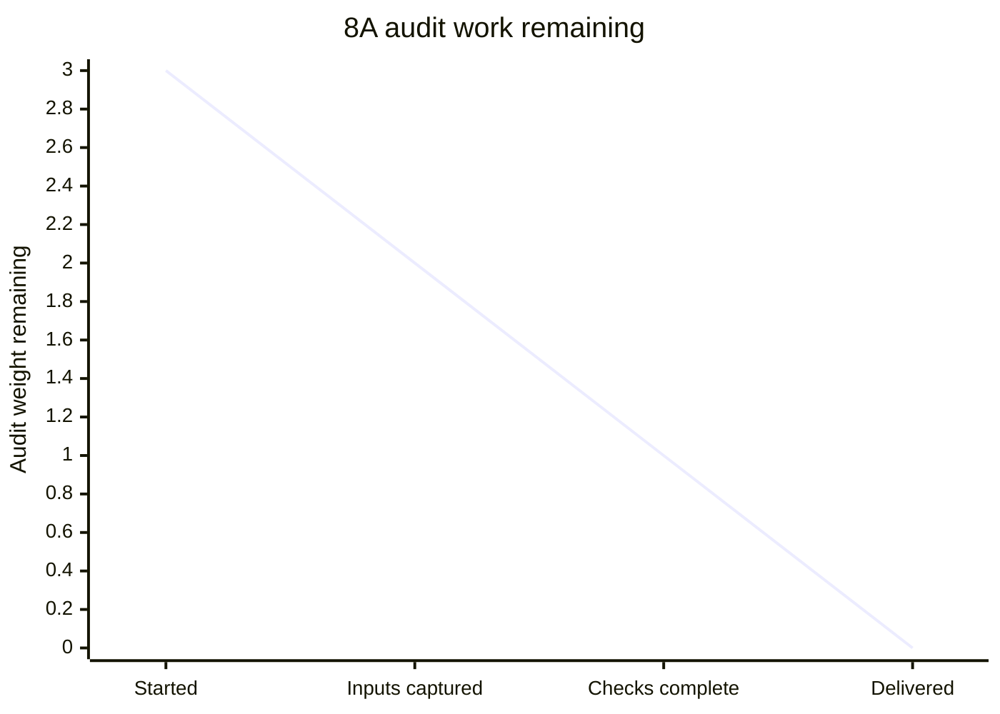
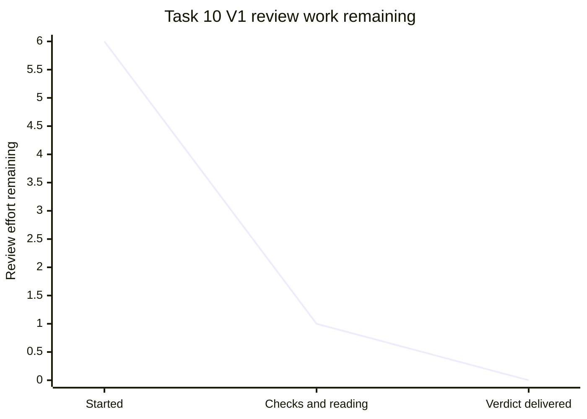

## Git-only handoff packaging

Planning remains independently approved at 409e4af. The final approval/latest workspace records and kickoff prompt are being archived into docs/handoff so the next task can proceed from Git alone. Additional packaging wave: archive and portable entry point weight 2, independent portability check weight 1; 0/3 verified, 3 remaining. This does not reopen technical review or authorize implementation here. No unresolved report feedback was found. Next: implementor packages records, then verifier checks portability. Task 11 preflight is complete: full Spec/task read, clean approved checkout confirmed, 32-note catalog identified (excluding only Tasks 11/12), and exact coordinator kickoff recovered. Source capture and local navigation are in progress; commit and checks remain. Independent packaging credit stays 0/3 until Task 12. The existing notes-only report has no browser tab/server to restart.

# Current work — SPEC-A3 independently approved

**APPROVED:** SPEC-A3 at **409e4afb1a7168f706e9015e5e62122a74d40453** on upon-build. Task 10 V2 closed R10-01/R10-02 and verified all20 audit dispositions against REQ-READY. **Tasks9 and10 are complete.** User review/acceptance and future runtime qualifications remain separate. Last meaningful update:2026-09-26 UTC.

[Independent V2 review and exact evidence](intent://local/task/45decaa2-2459-4100-8461-d7680076c4d3) · [Same PR Context](intent://local/upon-build/note/337dd04c-2911-4227-8217-1e2fc0b6a9f0).

**Focused V2 review:4/4 weights complete; zero remaining verification work.** This is specification readiness, not application execution.

| V2 review phase | Weight | State |
| --- | --- | --- |
| Protocol round trips and authorized route scan | 2 | Verified: typed large-event/snapshot recovery and reviewed staging transfer |
| Independent checks and preservation | 1 | Verified: checker,19 probes,49 seals,7 live pairs and exact baseline preservation |
| Verdict, task completion and handoff | 1 | Complete: APPROVED at409e4af; Tasks9/10 complete |

- [ ] **Mark reviewed — independent Task10 V2 at409e4af.** Inspect the two protocol closures and final acceptance checklist in the linked review. Leave feedback on the exact criterion or clause. Reading does not authorize implementation or paid work.

Current V2 handoff

Goal: complete final specification-readiness verification. Verdict APPROVED, High confidence for documentation. All12 REQs and20 audit dispositions verified. User keep-bytes/deletion/privacy/off-by-default spend choices and original numerical budgets/history preserved. Current reviewed sources: ARCH-1.4+A3.1, TEST-1+A3.1 and other sections unchanged from V1. Author pending-review labels in sealed409e4af files are pre-verdict provenance; this independent review records their approval.

Checks actually repeated: checker,19 mutations,49 seals,7 live-note pairs,68 exact transformations against actual Git bases, all30 decision records and26 PERF tables, unchanged history/corrections/approvals, whitespace and three manual source round trips. No runtime, browser, provider, build or benchmark execution. Q01–Q27 remain owned future qualifications.

Next owner: Coordinator receives the approved result and may perform any separately authorized closeout. No required verification work remains, no source edits were made by verifier, and no implementation is started. User review is unmarked; final open feedback was empty. This same durable notes-only report remains available; no server/app restart or duplicate tab is needed.

**Correction author work: 3/3 weights verified (100%); zero author work remaining.** The initial 8/8 wave was reopened after Task 10 found two gaps. This measures the completed correction work, not independent approval or implementation.

| Phase | Weight | State | Evidence |
| --- | --- | --- | --- |
| Complete LP-1 contracts | 1 | Complete | Typed downloads, pinned snapshots, reviewed ownership transfer and all route envelopes |
| Verify mirrors and preservation | 1 | Complete | Checker, 19 rejection probes, 49 seals, 7 exact live pairs and source round trips |
| Commit and handoff | 1 | Complete | 409e4af; Task 9 and same PR Context updated; clean checkout |

- [ ] **Mark reviewed — LP-1-R1 at 409e4af.** Inspect [ARCH §20.1](intent://local/upon-build/note/c0689bcd-8dca-4ce6-bccb-e538e0a45477#s20): large transaction download, pinned snapshot plus tail, and transfer after lost client identity. Leave feedback on the exact contract clause.
- [x] **Mark reviewed — correction evidence at 409e4af.** Inspect [PROTO03/04 and paper round trips](intent://local/upon-build/note/d7819c6b-68ff-4d89-835d-9acabe779cae#s13), [verification receipt](intent://local/file/docs/spec/verification.json) and [finding-by-finding handoff](intent://local/task/06f9a11c-d6b1-4ddf-b695-69ea592617df). These source checks do not establish runtime behavior.

Author correction handoff — superseded by Task 10 V2

Goal: finish Task 9 only. Base 59f8317; head 409e4afb1a7168f706e9015e5e62122a74d40453. Coordinator authorized this bounded correction under the existing specify-all user decision. R10-01 and R10-02 are author-corrected; the other 19 audit findings were independently verified at the base and their clauses are unchanged. Exact table/type changes are declared in 16 correction operations, within 68 total SPEC-A3 operations; original budget tables, typed contracts and sealed history are preserved.

Checks: documentation checker PASS; 19/19 mutation probes PASS; 49/49 seals PASS; 7/7 fresh note/file parity PASS; whitespace/history checks PASS; all three source round trips PASS. No application, browser, install/build, benchmark, provider, paid-call, CI or PR work ran. No new user decision or unanswered feedback blocks this handoff. Open comments were empty; no user review or acceptance was set by the author.

Next owner: Coordinator, return the exact corrected commit to existing Task 10. Review remains pending, not approved. The report remains this existing durable workspace note; there is no report server or app runtime to restart, and no duplicate browser tab or app integration was created.

Earlier work and review history

| Phase | Weight | State | Evidence |
| --- | --- | --- | --- |
| Decisions and source mapping | 1 | Complete | Approved findings and user choices captured |
| Owning contract revisions | 4 | Complete | All 20 disposition rows; six sections and index synchronized |
| Checker and mirror verification | 2 | Complete | Checker, 11 rejection probes, 47 seals, 7 live pairs, whitespace/history checks pass |
| Commit and handoff | 1 | Complete | 59f8317; Task 9 and same PR Context updated |

- [ ] **Mark reviewed — SPEC-A3 at 59f8317.** Inspect the [finding table](intent://local/upon-build/note/df180a35-40dd-43d7-b9c6-1f1dd0306088#readiness-dispositions), [local contracts](intent://local/upon-build/note/c0689bcd-8dca-4ce6-bccb-e538e0a45477#s20) and [privacy policy](intent://local/upon-build/note/2728dafd-4209-4558-a762-3a0192e0610f#readiness-evidence). Leave feedback on the exact owner clause. No user review or acceptance has been recorded by the author.
- [x] **Mark reviewed — SPEC-A3 verification.** Inspect the [checker receipts](intent://local/file/docs/spec/verification.json), [exact transformations](intent://local/file/docs/spec/editorial-transformations.json) and [Task 9 handoff](intent://local/task/06f9a11c-d6b1-4ddf-b695-69ea592617df). Check preserved history/numerical contracts and the new regression probes; Task 10 supplies independent review.

Durable handoff

Goal: Task 9 only; finished at commit 59f8317a114ba16a431bab99cf5006401b0161b8, base 86701416fa966b92353a1cff062a81a27a1786b9. Seven notes/files have exact live parity and all existing numerical budgets/campaigns and sealed history are preserved. All findings author-resolved; no outstanding policy question. Q09 endpoint/storage feasibility and existing runtime qualifications remain future work. No app work, install, provider call, benchmark, CI or PR ran. Pre-existing CI failures are unassessed; no CI link exists. Checkout is clean. Spec/report/task feedback was empty at final reread.

Current versions: API-1.2+A3, DS-1.1+A3, UX-2.2+A3, ARCH-1.4+A3, TEST-1+A3, PERF-8+A3. Shared [PR Context](intent://local/upon-build/note/337dd04c-2911-4227-8217-1e2fc0b6a9f0) contains the complete finding table, timestamps, base/head, files and evidence. Next owner: Coordinator starts Task 10; Task 9 author has no remaining assigned work. This existing persistent notes-only report is the canonical report; there is no report server/tab to restart and no duplicate report was created. Prior review cards and feedback remain with their original versions below.

Prior SPEC-A2 report and review cards — historical, review state preserved

# Current work — specification complete

SPEC-A2 is independently approved for specification/source readiness at technical commit **083579cdb1bfd24e3fdb64f4f051524393e50861**. Its metadata-only closeout is committed at **86701416fa966b92353a1cff062a81a27a1786b9**. Current approval labels, seven note/file mirrors and evidence are synchronized; technical content is unchanged. [Specification](intent://local/upon-build/note/df180a35-40dd-43d7-b9c6-1f1dd0306088) · [Final approval](intent://local/upon-build/note/769bd9b2-f482-41fa-abc8-0bee99d453ef) · [Exact closeout receipts](intent://local/upon-build/note/475e1f5c-0697-46e9-b205-decbb4297f00).

**Final technical wave: 4/4 independently verified (100%), 0 remaining.** All seven original tasks are complete. Coordinator confirmed the metadata-only closeout and recorded Task 7 completion. User review and acceptance remain separate. Last meaningful update: 2026-09-26 UTC. Next action: the user may review the specification and leave focused feedback; no assigned drafting work remains. Runtime qualification remains future implementation work.

| Work item | Weight | Current state | Next action |
| --- | --- | --- | --- |
| Current sections and traceability | 2 | Independently approved; FA-01 closed | User reviews the specification separately |
| Mirrors, provenance and links | 1 | Complete; coordinator confirmed parity, seals and unchanged technical content | No remaining documentation work |
| Independent final verification | 1 | SPEC-A2 APPROVED; Task 7 complete | User review remains separate |

## Ready to review

- [ ] **Mark reviewed — SPEC-A2 technical specification.** Read the [index](intent://local/upon-build/note/df180a35-40dd-43d7-b9c6-1f1dd0306088) and six full sections. Inspect scope, traceability, native text, masking/history/recovery and future qualifications; leave item-specific feedback on the owning clause. Current index file SHA-256:bc1e80f1a65274f66db15c7bbe7d7996c1ebd95e2797a1d1f08fdbd3a96f1e15.
- [ ] **Mark reviewed — approval evidence and metadata closeout.** Inspect the [portable approval](intent://local/file/docs/spec/approvals/769bd9b2-f482-41fa-abc8-0bee99d453ef-SPEC-A2.md), [manifest](intent://local/file/docs/spec/sync-manifest.json) and [verification](intent://local/file/docs/spec/verification.json). The exact15 label changes reverse all seven documents to the approved technical commit. Manifest SHA-256:98515ef92eaa662ee4d46c0be00aba590b166eaa829c19375cdc55f9055918cd.

Mark reviewed records only the explicitly inspected SPEC-A2 content/version. It does not establish user acceptance, change task status, resolve feedback or authorize implementation/spending. No card is marked by the author. Technical content is unchanged; the approval-evidence card identifies the refreshed metadata.

## Durable handoff

Exact semantic reversal PASS all7 complete documents; source/contract reconstruction, seven live-note parity, portable links/JSON, documentation checker and all41 seals PASS. The15 metadata-only line changes are six section headers, two Architecture handoff labels and seven index status/progress/handoff lines; traceability has one corresponding approval-status string. All60 budget rows,26 performance tables,27 API appendices, API63/ARCH13 all-fence contracts, scenarios, Q01–Q27 and phase outcomes remain unchanged. Original history, correction evidence and invariant checker are byte-identical. Two immutable final approval/authorization snapshots were added;26 exact inputs are recorded. The committed checkout is clean.

Full filenames, exact note hashes, source versions and commands are in original Task7 and the SAME [PR Context](intent://local/upon-build/note/337dd04c-2911-4227-8217-1e2fc0b6a9f0). Technical section identities remain API-1.2+A1, DS-1.1+A1, UX-2.2+A1, ARCH-1.4+A1, TEST-1+A1, PERF-8+A2. Original base7c41c8e; reviewed technical head083579c; metadata head8670141. No PR/CI run exists; pre-existing CI is unassessed. No app/provider/benchmark/build/install/deployment work occurred.

Feedback on report/Spec/Task7 was empty at01:01:02.375Z and is reread at handoff. Reuse this persistent notes-only report; no browser tab/server or duplicate report exists. The following earlier checkpoints retain their original scope and dates as history, not current status.

SPEC-A1 assembly and prior report history — superseded by current SPEC-A2 handoff

Current work — correcting one final assembly finding

SPEC-A1 final review found one required FA-01 training ZIP/sidecar wording conflict. The existing author is authorized to clarify the owning performance note and mirror, preserving manifest preparation/storage work and every numerical cap/budget/campaign. Other final-review criteria passed; existing proof is retained. Final wave stays 0/4, remaining 4; no independent completion credit yet. No new product preference is needed. Next: focused correction and exact mirror/hash verification, then targeted independent re-review. User review remains pending.

# Current work — final specification needs one source correction

[Ideogram Editor — Technical Specification, SPEC-A1](intent://local/upon-build/note/df180a35-40dd-43d7-b9c6-1f1dd0306088) and its six sections match [docs/spec/index.md](intent://local/file/docs/spec/index.md) at clean commit46c10ee7f660cfe9e9f7994a2013dfe7c180002d. Independent final review is complete: **NOT APPROVED**, with one P2 training ZIP/manifest conflict (FA-01). [Full criterion-by-criterion findings and recheck scripts](intent://local/upon-build/note/769bd9b2-f482-41fa-abc8-0bee99d453ef). Coordinator should route the bounded owning-source correction, then targeted re-verification. Task7 remains review_required; user review remains pending. Last meaningful update:2026-09-26 00:49 UTC.

**Final wave: 0/4 independently verified (0%), 4 remaining.** Author checks do not earn independent approval. All six source tasks remain complete; prior9/9 and3/3 waves are historical.

| Work item | Weight | State | Next owner/action |
| --- | --- | --- | --- |
| Current sections and end-to-end traceability | 2 | Reviewed; FA-01 needs source reconciliation | Coordinator routes Performance/Training clarification |
| Repository mirrors, provenance and links | 1 | Independently reproduced; seven current notes match | Refresh and recheck affected receipts after the correction |
| Independent final verification | 1 | Completed, NOT APPROVED | Targeted re-verification after FA-01; no partial wave approval |

## Ready to review

- [ ] **Mark reviewed — SPEC-A1 scope and traceability.** Read the [index](intent://local/upon-build/note/df180a35-40dd-43d7-b9c6-1f1dd0306088):11 requirements,26 accepted decisions,24 capability dispositions, all original findings, glossary/phases and27 owned qualifications. Leave item-specific feedback on the exact index clause. Index file version:9b8bf7621dd64839f51ad4a2eba98dfbb40cdf1ef9f68f7cc3135df9e6cd5d4b.
- [ ] **Mark reviewed — SPEC-A1 technical sections.** Inspect linked API/DS/UX/Architecture/Testing/Performance notes from the index, especially native text versus caption, CP-1/safe-singleton adoption, zero-call replay and full-history recovery. Attach feedback to the owning section; all seven note hashes are in the [parity receipt](intent://local/file/docs/spec/note-parity.json).
- [ ] **Mark reviewed — SPEC-A1 synchronization evidence.** Inspect the [manifest](intent://local/file/docs/spec/sync-manifest.json), [editorial ledger](intent://local/file/docs/spec/editorial-transformations.json) and [verification receipt](intent://local/file/docs/spec/verification.json). Manifest hash2743b7a2d6b2a095f09a3908770dd0881df7e127f2130c588cb58a30b46bc00d.

Mark reviewed records only the explicitly inspected SPEC-A1 item; it does not complete Task7, grant independent approval, authorize implementation/spend or resolve open feedback. No card is marked by the author. A material output change resurfaces its affected card.

Author evidence and durable handoff

python3 docs/spec/tools/check_spec.py passes:7 current documents,216 relative links/anchors,351 note references,164 tables,67 JSON examples;7 actual saved-note readbacks normalize exactly;22 frozen inputs and37 outer-sealed output hashes match. Complete API schemas and substantive contracts are retained;60 budget rows and26 full performance tables are unchanged. Current-doc git diff --check passes. Full diff check retains four original whitespace-only lines in the historical performance-review snapshot (948/952/956/960) to preserve its exact hash; recorded explicitly. No app/browser/IME/AT tests, builds, installs, benchmarks, provider calls or CI ran. Pre-existing CI failures were not assessed; no PR exists.

All four text defaults and separate lists are accepted. Current technical sections have +A1 editorial revisions; their prior source approval is distinct from final assembly approval. No new substantive conflict was found. Q01–Q27 own future provider, package/build, font/engine, storage, native accessibility and performance evidence; no runtime success is inferred.

Feedback on this report, Spec and original Task7 was empty at2026-09-26T00:36:50.472Z and reread before this handoff. Goal/scope remain documentation only. Next action belongs to coordinator: independent final verification, then source-scoped corrections if needed. Do not start implementation. Base7c41c8e708b08b458ebf0f4fc369e2621ad7cd4a; head46c10ee7f660cfe9e9f7994a2013dfe7c180002d. Full handoff is in original Task7 and the SAME PR Context337dd04c-2911-4227-8217-1e2fc0b6a9f0.

Availability: reuse this persistent notes-only report. There is no report server or existing browser tab to restart/reuse and no app to integrate; no duplicate report or product overlay was created.

Reviewed decisions and historical checkpoints — earlier statuses are superseded

Accepted product decisions and prior independent source approvals retain their original scope. Earlier author/reviewer exchanges and work states below are historical, not current assembly status.

Current work — final specification assembly

User authorized Task 7. All six source sections are independently verified; current versions API-1.2, DS-1.1, UX-2.2, ARCH-1.4, TEST-1 and PERF-8 plus accepted decisions. Report feedback is empty. Branch upon-build was clean at start. Repository docs/spec files are now authorized through the implementor.

Final assembly wave weights: current-spec consolidation/traceability 2, repository mirrors/provenance/link validation 1, independent final verification 1. Initial 0/4 independently verified, remaining 4; no credit for delegation or author self-checks. Prior 9/9 and 3/3 waves are historical and not counted again.

Next: assembly author produces coherent current notes, index and portable matching docs plus synchronization manifest, records checks and returns review_required. Coordinator commissions independent verification and resolves actual findings. User review of the final assembled version remains pending. No app runtime, benchmark or provider qualification is implied by specification completion.

Current Task 5 wave — independently verified

[Testing Strategy Independent Verification — V1](intent://local/upon-build/note/0843a4b2-b4f5-449b-b109-2f851e2cca7b) **APPROVES TEST-1 for specification/source readiness**. All eleven original Task5 criteria and current addenda are VERIFIED; no required fixes or spec ambiguity. Evidence includes full consumer/outcome/layer review, actual public DS source, API/nested-field and J/S/F01–F05/native-text/recovery checks, all60 PERF8 mappings and independent bounded pixel/feather/projection/serialization/block calculations. Existing performance campaigns/clocks remain intact. No app/browser/native-IME/AT tests, builds, installs, benchmarks, CI or provider calls were run; source checks are not runtime passes. Confidence Medium overall specification, High bounded source evidence, Low runtime/unmeasured.

Original Task5 status mutation succeeded at2026-09-26 00:19:14 UTC and independent readback is **complete**. Task7 readback remains **not_started**. Credit only the current Task5 wave: strategy2 + verification1 = **3/3 independently verified (100%),0 remaining; burndown3→0**. Prior9/9 wave is historical and is not counted again. TEST1 user review remains pending; all four text defaults and separate lists are already accepted. Final Spec/report/task/source/review feedback:0 open threads. No author-source or repository edits. Coordinator can hand off this completed section for user review; do not start Task7 without separate continuation.

Current work — Task 5 testing strategy in independent review

[Testing Strategy — TEST-1](intent://local/upon-build/note/d7819c6b-68ff-4d89-835d-9acabe779cae) is the full canonical deliverable. Original [Task5](intent://local/upon-build/note/060d9fce-0132-4c2e-b066-9e8883a8e1a0) is review_required. Coordinator next action: independently verify the strategy against API-1.2/DS-1.1/UX-2.2/ARCH-1.4/PERF-8 and reconcile concrete findings. Author handoff is recorded in the same [PR Context — upon-build](intent://local/upon-build/note/337dd04c-2911-4227-8217-1e2fc0b6a9f0).

Task 5 wave weights: strategy/traceability2, independent verification/reconciliation1. Author draft is reviewable; **0/3 independently verified (0%), remaining3**. No credit is claimed for source checks or drafting before independent approval. Previous expanded specification wave9/9 is separately historical; whole specification is still incomplete and Task7 remains queued.

| Task 5 work item | Weight | Current state | Next owner |
| --- | --- | --- | --- |
| Full strategy and traceability | 2 | TEST-1 authored; independent approval pending | Coordinator/reviewer |
| Independent verification and reconciliation | 1 | Not started | Coordinator/reviewer |

Burndown checkpoints: authorized3; author handoff3. The flat line reflects uncompleted independent verification, not absence of drafting progress.

**Focused review card — TEST-1.** Review the [canonical section](intent://local/upon-build/note/d7819c6b-68ff-4d89-835d-9acabe779cae), especially §§4–11: journey/state/operation coverage; exact raster/text/durable/uncertain-job contracts; public real-component/native-input/persistence boundaries; all60 budgets and existing finite campaigns. Expected review outcome: concrete source-linked findings or an independent source/specification approval. Record feedback on the exact clause in the strategy note. The author found no cross-section conflict; routine methodology choices are already made.

**Explicit user-review checkpoint:** TEST-1 is ready to read; user review of this version is pending and is distinct from the coordinator's independent verification. Open feedback on this report, Spec, original Task5 and TEST-1 was empty at2026-09-26 00:11:58 UTC. No product answer is pending about the four text defaults or separate Layers/Composition lists; both are accepted.

**Author evidence and limits:** source/readback/link audits cover J24/S27/O9/F5/TX16/AX10 and60 budgets; bounded offline arithmetic passed. Exact receipts and reproducible arithmetic are in TEST-1 §13. No repository files changed; no app tests, installs, benchmarks, provider calls, CI or runtime qualification. Future commands/manual protocols are explicitly unexecuted. Remaining implementation gates include immutable package/fixture/codec/font profiles, actual storage/native/AT evidence, real suite duration and optional provider facts. No new paid work or Task7 is authorized by this handoff.

**Durable continuation checkpoint — 2026-09-26:** use this report, TEST-1 and the single shared PR Context. Original task must remain review_required until independent review; author did not self-complete or delegate. Local main/base and HEAD remain7c41c8e708b08b458ebf0f4fc369e2621ad7cd4a. Report remains the existing notes-only surface; no report server/browser tab or app integration was created under the notes-only scope.

Reviewed content disclosure — accepted text decisions and prior wave

All four text defaults and separate Layers/Composition lists with explicit links are accepted. API-1.2/DS-1.1/UX-2.2/ARCH-1.4/PERF-8 retain their recorded source/specification approval. Those approvals do not approve TEST-1 or empirically qualify the app. Historical entries below preserve earlier task states and are superseded for current status by this checkpoint.

Current user-review checkpoint — text defaults accepted

The user has now accepted all four text defaults: (1) one typography style per text box; (2) explicit Apply or Cancel for text drafts; (3) explicit links between native layers and AI composition entries; (4) preview and explicit approval before substituting an unavailable font. For missing fonts, retain the saved appearance where available and offer exact restoration or reviewed replacement before layout-changing edits. Current substitution does not repair missing resources in older history.

These choices accept the existing reviewed UX-2.2/ARCH-1.4 contracts; they introduce no technical change requiring a repeated review. Earlier statements that these four defaults remain proposals are historical and superseded by these answers. Task 5 can treat them as accepted product policy and verify their observable behavior; Task 7 must reflect them consistently in the final notes and repository documentation. No further question remains in this four-item review. Tasks 5/7 remain not_started.

Review applies to these four policies only; it does not imply user acceptance of every specification detail or empirical runtime qualification. Verified expanded specification wave remains 9/9; testing strategy and final assembly remain outstanding. Next action is drafting Task 5 when the user chooses to continue.

Current handoff — expanded specification wave complete

2026-09-25: UX-2.2, ARCH-1.4 and PERF-8 are independently approved for specification/source readiness. [Joint V5 closure](intent://local/upon-build/note/176843a5-c21b-4de6-84a6-53ef5b9ca804) retains the full behavioral/source review and confirms the final mirrors; [PERF-8 review](intent://local/upon-build/note/bb86b142-0129-4293-b3c4-ebbb458490d7) closes the performance gate. Coordinator marked original Tasks 3 and 4 complete; Task 6 was already complete. No source fixes remain in this wave. Tasks 5 (testing strategy) and 7 (final assembly and repo docs) remain not_started. Runtime/browser/IME/provider/performance qualification remains future work; no user acceptance of the four proposed text defaults is inferred.

Verified wave progress: 9/9 units (100% of this wave only): API evidence 1, UX 3, architecture 3, performance 1, joint reconciliation 1. Remaining-work burndown preserves the recorded transitions 9 → 8 → 7 → 0. This does not mean the whole project or application is complete. Historical checkpoints below remain historical.

Ready for user review: [UX-2.2](intent://local/upon-build/note/3febb57d-ea57-42de-a098-b12fb4e010e4), [ARCH-1.4](intent://local/upon-build/note/c0689bcd-8dca-4ce6-bccb-e538e0a45477), [PERF-8](intent://local/upon-build/note/1b7b659d-d577-4257-b677-4850bbf86143). User review state remains unchanged; report has no open feedback threads. Four text defaults remain proposals: one style per frame, explicit Apply/Cancel, explicit layer/composition links, reviewed font substitutions. No blocking product question remains. Next work is Task 5 after the user chooses to continue; Task 7 follows verified testing strategy. No further agents started.

# Review checkpoint

Status: UX, architecture and performance specifications are verified; testing strategy and final assembly remain.

## Current accepted-scope update to verifier handoff

Current-scope addendum to [V1 verification](intent://local/upon-build/note/176843a5-c21b-4de6-84a6-53ef5b9ca804): F01–F03 are baseline defects. Separately, the user accepted native editable text and composition authoring aligned with V4 compositional_deconstruction; current raster-only UX/Layer contracts do not satisfy it (N1/N2 in the review). Latest Spec also accepts25MP/8192-side/100 IMAGE+TEXT layers total, new-document placement for interleaved selected composites, and full-history portable copies. Earlier statements that all seven defaults remain proposals are historical and superseded by these recorded choices. Further answers remain owned by current Spec.

The official model-page example independently confirms structured content inside the returned prompt STRING; no top-level compositional_deconstruction API field or editable output layers is established. Focused API evidence, native text/font/layout/rasterization/history/copy/IME/accessibility and performance reconciliation belong to the coordinated revision. Both tasks remain review_required; verdicts unchanged. Baseline0/5 is not a full expanded-scope completion denominator; coordinator must account for added work before the next wave. No downstream work started.
## Current UX–architecture verification handoff — V1

Current review: [Joint UX–architecture verification — V1](intent://local/upon-build/note/176843a5-c21b-4de6-84a6-53ef5b9ca804). UX-1.1, ARCH-1 and joint handoff are NOT APPROVED. Both original tasks remain review_required. Required fixes: F01 shared canonical layer-contribution quantization, F02 explicit feather/request-domain expansion or clipping with renewed preview/approval, F03 exact color_weight nested-field disposition. Author clarification confirmed the two raster gaps without source edits.

Current wave weights remain UX2 + architecture2 + joint verification1 =5. Verified outcomes0/5 (0%); remaining-effort checkpoints5→5→5. A completed review with required corrections does not count as approved source work. Prior foundation/performance/alignment outcomes remain historical. No user review state or acceptance of the seven proposals is inferred; reviewed desktop wireframe remains accepted.

Focused review card V1: inspect F01 numeric89→90 counterexample, F02 feather outside crop[4,8), and F03 nested-property spelling. Exact criterion evidence, owner, minimal correction and bounded R1–R4 re-verification steps are linked above. No open feedback threads on Spec/progress/UX/architecture/review at final check. Sources remained UX-1.1 length94103 and ARCH-1 length100718; repository remains clean at7c41c8e708b08b458ebf0f4fc369e2621ad7cd4a.

Next owner/action: coordinator routes F01/F02 to architecture plus UX mirroring and F03 to UX using the existing task IDs, then commissions independent re-review. Tasks5/7 stay queued. App tests/benchmarks/provider calls were not permitted or run; runtime qualification and WebP/copy/buffer performance amendments retain their named owners. This existing notes-only report remains the durable handoff; no duplicate report or app UI created.
## Agreed scope
V4 family first, including image-to-image, inpaint, instant, LoRA inference and lower-priority training. Localhost server reads FAL_KEY from environment with deployment secret injection later. Deliverables are workspace notes plus repository docs. No implementation or paid model calls during this review.

## Initial planning review work plan (historical)
1. Read the original brief, canonical spec, task notes and open feedback — complete (weight 1).
2. Check API and design-system evidence and identify gaps — complete (weight 2).
3. Record prioritized findings, exact corrections and a handoff — complete (weight 1).

Review completion: 100%. Remaining effort: 0 of 4 review units. Review burndown checkpoints: 3 → 1 → 0 remaining units, with unchanged review scope. Specification completion is separate; all seven drafting tasks remain unstarted.

## Initial planning review handoff (historical)
Compatibility v1 is accepted. All seven original task briefs and the Spec now incorporate the review requirements, with performance placed before UX/architecture in the dependency graph. Planning corrections are applied; technical fulfillment must still be verified during drafting. All seven tasks remain unstarted and their IDs are preserved. Verification complete: original task IDs and statuses retained, all briefs contain scope/inputs/completion/verification sections and accepted-decision links, obsolete constraints removed, dependency graph acyclic, and eleven top-level requirement IDs recorded. No open spec comment threads at handoff. Next drafting sequence: API/design-system → performance → reconciled UX/architecture → testing → assembly and repo mirror. No implementation/delegation, repo edits, paid calls or credential requests occurred in this revision step.

## Initial planning review record (historical)
User accepted operation compatibility v1 and requested revision of the existing tasks on 2026-09-25. The corresponding task/spec changes are applied. Technical sections remain undrafted; provider unknowns and candidate workflows remain unresolved. Adoption of requirements is distinct from verification of their future deliverables.

## Report availability
This persistent workspace note is the review checkpoint. No existing independent report locator was found in the repository; no standalone report UI has been created for this document review.

# Strict review of the specification plan
Historical review v1, recorded 2026-09-25 against the then-current planning notes. Its findings are retained as evidence; the current handoff above records subsequent adoption and task revisions. Statements below about the old plan do not supersede the revised Spec or accepted compatibility decision.

## Verdict
The work is a partially corrected plan for producing a specification, not the requested technical specification yet. The six technical sections and repository documentation do not exist. All seven drafting tasks remain unstarted. This is an expected stage of work, but the current plan is not ready to delegate unchanged: it contains contradictory scope, premature architectural constraints, and completion checks that would allow important gaps through.

Severity: P0 means correct before drafting/delegation; P1 means add to the section's acceptance criteria before drafting; P2 means improve the final handoff. Missing documents are distinguished below from missing requirements in the plan.

## Coverage against the kickoff
| Original requirement | Current position | Required correction |
| --- | --- | --- |
| Full V4 API family, schema reference and adjacent-model comparison | Task 1 partly corrected; canonical Spec contradicted it | Correct canonical scope; discover endpoints systematically; capture field semantics and protocol evidence |
| Photoshop-like UX covering API depth | Regions and several journeys planned; no finished UX | Add document lifecycle, compatibility rules, capability dispositions and raster/mask contracts |
| All interactions through actions and event log | Taxonomy/projections/undo planned | Define authority, durable acceptance, deterministic replay, failure recovery and action granularity |
| Actual design-system conventions | Stack identified; audit planned | Verify public exports and transaction contracts, consumption across repositories, component gaps and conditional SSR |
| Consumer-focused unit > integration > e2e testing | Broadly aligned | Remove exactly-one-layer restriction; define observable outcomes and permitted network doubles |
| Runtime and developer performance as first-class requirements | Task 6 exists late in the dependency graph | Establish provisional budgets before UX/architecture; add reproducible measurement and enforcement |
| Independently reviewable sections and notes plus repo docs | Task 7 agrees; canonical assumptions disagreed | Establish one source of truth, relative links, evidence/version metadata and document completion checks |

## P0 — corrections needed before drafting

### R01. The canonical Spec did not contain the accepted scope corrections
Location: original Spec lines 3, 7–13, 47, 51–53; compare Tasks 1, 3, 4 and 7.
The Spec still asserted that editing belonged to V3, excluded training and said the deliverable was notes only. All conflict with the user's explicit answers. The earlier statement that the main spec had been updated was inaccurate: only task notes reflected the correction.
Correction: V4 generation is the primary family; include image-to-image, inpainting, instant and LoRA inference; design training now but phase its implementation later. Related models are comparative research, not the default editing backend. Deliver notes plus docs/spec/. Local server reads FAL_KEY from environment, with a deployment secret injection boundary. These factual scope corrections have now been applied to the canonical Spec; engineering recommendations below remain proposed.

### R02. Endpoint discovery repeats the method that produced the original error
Location: Task 1 Inputs; Spec Verification Plan.
Probing plausible endpoint names can establish that a particular URL failed, not that a capability or model family does not exist. Task 1 also calls the rendered page stale without recording a specific discrepancy. Re-fetching only three endpoints is an inadequate verification criterion for full-family coverage.
Correction: discover through the provider catalog, family links and published API/schema references, then retrieve each discovered schema. Record source URL, retrieval date, endpoint ID, schema identity/hash and field-level evidence. Use failed probes only as supplementary observations. Say “not present in the verified endpoint set” instead of declaring global nonexistence. Reconcile schema, prose documentation and examples explicitly. Verify every in-scope endpoint and parameter; flag undocumented runtime behavior for a later controlled contract check. Do not require a provider claim such as rate limits or retention to appear in a model OpenAPI file.

### R03. “Shared base schema” hides materially different contracts
Location: Task 1 shared-base requirement; Task 4 single-generate union.
Fresh schema checks establish differences beyond added/dropped fields:
- Instant permits expansion_model None or Medium; it does not permit Large. Its image-size UI metadata caps each side at 2048, versus 3840 for base/LoRA generation.
- Image-to-image and inpaint add image_size auto, default to it, and describe input-matching output capped around 25MP and 8192 pixels per side.
- strength defaults to 0.8 for image-to-image and 1 for inpaint; its meaning is operation-specific.
- LoRA inference allows up to three adapters, scale 0–4 with default 1.
The generic ImageSize schema has different bounds from endpoint-specific x-fal metadata. Document these distinct sources and their enforcement uncertainty instead of silently treating UI metadata as complete runtime validation.
Correction: normalize common concepts, but validate endpoint-specific requiredness, nullability, enum, default, range, units, interactions and output shape. Use operation-specific commands or a discriminated union; do not build one bag of optional fields. Preserve both requested and resolved settings.

Evidence: [base schema](https://fal.ai/api/openapi/queue/openapi.json?endpoint_id=ideogram/v4), [instant schema](https://fal.ai/api/openapi/queue/openapi.json?endpoint_id=ideogram/v4/instant), [image-to-image schema](https://fal.ai/api/openapi/queue/openapi.json?endpoint_id=ideogram/v4/image-to-image), [inpaint schema](https://fal.ai/api/openapi/queue/openapi.json?endpoint_id=ideogram/v4/inpaint), [LoRA schema](https://fal.ai/api/openapi/queue/openapi.json?endpoint_id=ideogram/v4/lora).

### R04. Automatic endpoint selection lacks a compatibility contract
Location: Task 3 “derived, not manual”; Task 4 endpoint resolution.
Canvas contents do not establish intent: an open image should not force every new generation through image-to-image. In the checked contracts, inpaint accepts an image and mask but no loras; LoRA inference accepts adapters but no image/mask. Instant is not an interchangeable fast mode for all operations.
Correction: explicit user operation plus selected inputs and quality preference determine eligible endpoints. Provide a compatibility table for source × mask × adapters × speed × dimensions. Show the resolved operation/model and explain unavailable combinations before submission. Never silently drop a mask, adapter, source or quality choice. If proposing a two-step pipeline, expose both steps, cost implications and intermediate artifacts. Freeze the validated request at submission; later canvas changes must not retarget it.

## P1 — requirements missing or insufficiently constrained

### R05. Several requested capabilities lost a clear disposition
Location: Task 1 capability matrix; Task 3 walkthroughs.
The original request explicitly names outpainting, upscaling, remix/variations, references, negative prompts and style controls. The revised matrix concentrates on endpoint names and drops several of these semantic rows. Comparative V3 research does not itself specify whether the editor offers them.
Correction: keep every requested capability in the matrix, marked direct V4, application-composed candidate, comparison-only, unsupported in verified contracts, or deferred with reason. Outpainting by padding plus inpainting is a candidate to validate, not a documented dedicated endpoint. Upscaling is not synonymous with generating a larger image. Variations need a defined source/strength/seed policy. Distinguish one image input from style/character/multiple-reference conditioning. A prompt template is not a native style or negative-prompt API parameter. PNG output alone does not establish transparency or layer output.
The related-model examples in the kickoff are illustrative: researching every listed version is unnecessary, but document why the selected comparisons exercise useful abstraction boundaries. An additional non-Ideogram comparator is optional unless it answers a concrete gap.

### R06. Parameter coverage is being substituted for product design
Location: Task 3 mapping table; Spec acceptance criteria.
One row per parameter is useful but does not ensure a usable editor. Inputs such as sync_mode belong primarily to transport policy, while returned prompt, seed, timings, safety flags and optional image metadata need provenance/result handling. Requiring a toggle for every backend detail creates clutter.
Correction: map every capability and input/output field to a user control, visible behavior, provenance field or explicitly justified internal policy. Define new/open/save/reopen/export, image import and clipboard/drop behavior, result preview/compare/accept/discard, layer targeting, cancellation/errors, empty states, and keyboard paths. Define document dimensions, supported formats, transparency/color policy, layer operations and supported blend behavior. Explicitly bound text/vector/PSD support and Photoshop parity rather than implying them. Produce annotated states or wireframes for the main journeys, not only a panel-region diagram.

### R07. The canvas-to-API raster and mask contract is missing
Location: Tasks 3 and 4.
The plan lists layers and mask tools but not which pixels they send or how generated results are placed back.
Correction: specify source selection (active layer, selected layers, merged visible crop), document/layer/viewport coordinate transforms, device-pixel ratio, selection bounds, crop/padding, resampling, alpha/color handling, output dimensions and placement. Define mask polarity, grayscale/feathering behavior, mask/source alignment and validation. The inpaint schema says white regenerates and black preserves; edge blending and exact pixel preservation still require a defined app policy and verification. Specify whether output becomes a new layer or replacement and how original content remains recoverable. Cover empty/full masks, transformed layers and document resizing while work is pending.

### R08. “All interactions” lacks recording granularity and state ownership
Location: Task 4.
Correction: classify UI intent, draft/gesture samples, accepted document mutations, rejected commands and external job observations. Specify which are recorded, how high-frequency samples are grouped, what state can be reconstructed, and retention. Keep all interactions within the action architecture without forcing every pointer sample to become a synchronous disk write. Explain undo grouping for a brush stroke, slider drag and prompt IME composition; distinguish document undo from transient focus/hover.
Define document/asset/layer/job/adapter identities, event version, ordering sequence, command ID, causation/correlation IDs, transaction ID and expected revision. Select the authoritative writer and persistence boundary. Define dirty/saved state, atomic append and optimistic reconciliation. Signals should expose derived views without becoming a second independently mutable document store.

### R09. Deterministic replay and async undo have no hard invariants
Location: Task 4 verification flows.
“Compensating event” and a lifecycle diagram are insufficient.
Correction: require replay to issue zero provider calls and reuse stored results. Replaying a seed must not be represented as reproducing identical future provider output. Clock/random/ID values must be captured as inputs to pure state derivation.
Separate submission, provider completion, durable result storage, user adoption and undo. Define late success after cancel, undo while pending, deleted/reordered target layers, changed document revision, duplicate/out-of-order updates, redo after branching and batch partial failure. Recommended default: late/stale results remain inspectable job assets and do not overwrite current document state; re-running is a new command, while redo reuses existing assets where applicable.

### R10. Restart recovery, duplicate submissions and durable assets are under-specified
Location: Tasks 1 and 4.
Surviving a page reload does not cover server restart or a lost response after a paid submission. Queue request IDs alone are not a complete recovery design.
Correction: specify a persisted job journal/outbox, local deduplication and reconciliation, including the uncertain window where fal accepted a request but the client did not save its ID. Do not claim exactly-once provider execution without a verified provider guarantee. Separate local, SDK and provider retry policies, and distinguish request cancellation from guaranteed processing termination.
Store source, mask, result and adapter bytes with durable identities outside the event payload; define provenance, import progress, partial download recovery, retention and garbage collection that preserves assets needed for undo. Signed/public provider URLs are transport references, not the project's permanent asset IDs. Fal documents that output URLs can expire and that running cancellation may still produce a result. [Queue documentation](https://fal.ai/docs/documentation/model-apis/inference/queue)

### R11. Localhost execution has an environment-variable rule but no complete boundary
Location: Task 4 credential handling.
Correction: specify browser → local backend → fal, backend runtime, request validation, durable job/asset storage, same-origin local routes and allowed file transfers. Fal cannot fetch a browser blob URL or private localhost file path; define upload staging and when assets are available to the provider. Default local completion handling to queue polling/reconciliation; hosted webhooks require reachable infrastructure and a separate deployment contract. Define startup behavior with missing FAL_KEY, server-only configuration and redaction. A per-request signed token is not automatically interchangeable with provider secret injection; distinguish app authentication from backend provider credentials. No credential setup or paid calls are needed to finish the specification.

### R12. Training is included by name but not yet specified enough for a handoff
Location: Tasks 1, 3, 4 and 6.
Correction: retain lower implementation priority without lowering specification completeness. Define dataset versions, archive layout, same-stem captions, fallback captions, validation, crop previews and source provenance. Cover steps, resolution, learning-rate bounds, output naming format, submission, cancellation, restart recovery, artifact download and adapter compatibility. Preserve both weights and config artifacts. Decide which output format is validated for inference and how imported adapters are checked. Record unknown dataset limits and training progress semantics; do not invent a percentage or duration guarantee.
Concrete ambiguity: default_caption prose mentions force_default_caption, but that field is absent from the checked request schema. Record this discrepancy; do not invent a UI control or accepted request field. [Trainer schema](https://fal.ai/api/openapi/queue/openapi.json?endpoint_id=ideogram/v4/trainer)

### R13. Design-system integration needs contract evidence, not only matching filenames
Location: Task 2; Task 4 binding requirement.
Repository inspected at HEAD 6d09b31cf43523ac8c75352208ab9697b62e2673. Current source makes en-change tentative, synchronous and cancelable; component transaction completion is not remote job success. A listener cannot safely assume final acceptance when it first observes the event. Application-authoritative writes can supersede the tentative value.
Correction: specify the exact adapter from component proposal to validated app command to accepted event to authoritative property update, including synchronous cancellation, author revision, IME and stale async completion. No irreversible API dispatch from reversible staging/rollback. Verify named exports, public metadata, component tests and implementation; plans may describe superseded or future behavior.
The composable-editor plan covers text/token editing, not an image compositor. Record an editor-specific canvas/compositing gap and assign it to the app. For layer trees, menus, dialogs, split layouts and property inputs, identify actual component availability and limits individually.
Evidence: packages/primitives/src/interactions/events.ts:49 and :117; packages/primitives/src/interactions/signal-controller.ts:5; packages/primitives/README.md; plans/composable-editor.md:44.

### R14. Separate repositories cannot be treated as an already configured npm workspace
Location: Spec assumption; Tasks 2 and 5.
The design-system packages are private and its root workspace lists packages/* and apps/docs. ideogram-edit is a different repository with no app package setup. The design-system test orchestrator is repository tooling, not an established exported consumer dependency.
Correction: choose a reproducible consumption method with pinned source/package identity, a local development loop and clean-install CI behavior. Compare packed artifacts, a controlled checkout/build, or an explicitly designed shared workspace; do not assume publishing or path availability. Adopt testing contracts and evidence conventions while defining app-owned commands. Avoid requiring design-system changes merely to run editor CI. State whether SSR applies to the shell and controls; canvas rendering and hydration must have an explicit boundary rather than a blanket SSR mandate.

### R15. Exactly one testing layer per journey is too restrictive
Location: Spec acceptance criterion; Task 5 Verification.
The requested pyramid prioritizes unit > integration > e2e; it does not prohibit testing different risks in the same journey at different boundaries.
Correction: assign one owner to each behavior/contract, permit complementary layers with an explicit purpose, and avoid duplicated assertions. Example: unit checks for endpoint eligibility and replay, integration checks for durable job reconciliation, and a browser journey that paints a mask and accepts a result. Use real en-reve controls, browser input and the actual local backend where practical. Deterministic provider fixtures may cover rare failures without pretending to verify the live service; define a separate opt-in, cost-bounded live contract suite and credential-free defaults.
Add observable acceptance outcomes for cancellation races, reconnect/restart, expired assets, duplicate completion, unsupported model combinations, training-to-inference and document save/reopen.

### R16. Accessibility and nondeterministic image testing need measurable outcomes
Location: Task 5.
Axe, keyboard, reduced motion and RTL are good inclusions but do not define completion.
Correction: set supported browser/device and accessibility targets, semantic names, focus restoration, popup/toolbar keyboard rules, zoom/reflow, contrast, non-color-only mask state, shortcut conflicts, job-announcement frequency and manual assistive-technology checkpoints. Define practical numeric/keyboard selection and mask alternatives; do not promise arbitrary freehand parity without a design.
For deterministic compositing/masks, test geometry, dimensions, alpha, alignment and preserved regions with appropriate numeric/pixel tolerance. For real model output, assert contract, usable image dimensions/decoding, provenance and application outcome; do not rely on fixed pixels or exact generated text. Distinguish model quality evaluation from reliable regression tests.

### R17. Performance is first-class in wording but late in the work order
Location: Tasks 3/4 exclude budgets; Task 6 depends on both.
Correction: establish provisional runtime, memory and developer-loop budgets during foundation work, then make UX/architecture explicitly respond to them. Refine numbers later, with a documented reason for change. Add an early API/design-system/performance constraint checkpoint and a joint UX–architecture contract checkpoint so parallel drafting cannot diverge.
Budgets need workload (dimensions, layers, history length, concurrent jobs), hardware/browser/toolchain, percentile, cold/warm cache state, repeated sample policy, target, hard ceiling, owner and response to regression. A lone number and named gate do not establish reproducibility. No current measurements were performed in this review.

### R18. Image-editor performance and lifecycle measurement need fuller coverage
Location: Task 6 and Spec acceptance criteria.
Correction: budget time to usable canvas, input-to-paint p95, frame drops, composite/export latency, decode/encode/upload, queue wait, inference, download and result adoption separately. Include memory growth, GPU texture limits, worker/offscreen fallback, event replay/snapshot time, virtualized layer/history lists and training archive preparation. At ~25MP a single four-byte pixel buffer is about 100MB before extra working copies; a document limit and memory policy must precede implementation.
Distinguish stream-of-status from streamed image previews; define what the actual endpoint sends before promising progressive images. Keep large data URIs out of the event log and persistent JSON state.
For developer performance define cold install/build, incremental build/typecheck, hot update, targeted tests, full CI, cache effectiveness and clean-install validation on identified machines. Trend real receipts, preserve failed runs and document time-bounded baseline exceptions. Do not make variable external inference latency a flaky hard PR gate; use deterministic gates for app-controlled work and scheduled/opt-in provider observations. The inspected design-system testing README already separates measurement conditions and retained failures.

## P2 — delivery and handoff improvements

### R19. Completion is measured too much by document existence
Location: Spec acceptance criteria; Task 7.
Correction: trace each kickoff requirement through source evidence → API capability → UX operation → command/event/projection → verification scenario → performance budget → phase. Assign stable requirement IDs, section owners, a glossary, source versions and unknown/decision records. Each section needs enough shared definitions to stand alone. Distinguish a product decision, a verified provider contract, a hypothesis to test and a future implementation task.
Use the final index as the navigation surface, not a second competing spec. Choose authoritative content and a controlled mirror process so notes and docs/spec do not drift. Require portable relative links in repo docs, link validation and semantic content parity. Preserve earlier findings as superseded history, not contradictory live requirements.

### R20. The work plan needs a correction pass, not more unrelated scope
Location: all tasks.
Retain the existing seven tasks and their identities. Revise their acceptance criteria rather than duplicating tasks or adding implementation work. Recommended sequence:
1. Correct canonical decisions and research methodology.
2. Foundation: API inventory and current design-system contracts, with provisional performance constraints.
3. Agree the operation compatibility table, document/raster model and command/event ownership.
4. Draft UX and architecture against those shared contracts, then reconcile them together.
5. Complete consumer testing and measured performance strategy; feed constraints back before sign-off.
6. Assemble independently reviewable sections and repo mirrors; verify against the requirement traceability table.
No paid model calls, application implementation, deployment, PR or key provisioning is required for this review.

## Suggested replacement completion criteria
- Every in-scope endpoint has dated evidence for request/response fields and limitations; transport behavior has separate official sources; unknowns are visible.
- Every kickoff capability has an explicit supported/composed/comparison-only/unsupported/deferred disposition and a user-facing outcome.
- Every valid operation resolves to a supported endpoint/payload; invalid input combinations are explained without silently discarding context.
- Document, raster, mask, asset, job, adapter and event contracts are concrete enough to derive public types and behavioral tests.
- Replay never resubmits paid work; async completion, undo and recovery scenarios have explicit resulting states.
- en-reve integration is grounded in current public contracts and a reproducible cross-repository dependency plan.
- Unit > integration > e2e priority is explicit, with consumer-observable outcomes and complementary cross-layer risk coverage.
- Performance requirements include workload, environment, percentile, measurement, owner, enforcement and regression response for runtime and developer workflows.
- Training is fully specified and visibly deferred in implementation order.
- Six technical sections plus one index exist in notes and docs/spec, have resolving links, equivalent content and a consolidated open-decision register.

## Edit ownership and readiness
| Existing task | Findings to incorporate |
| --- | --- |
| Task 1 — API reference | R02, R03, R05, R10, R12 |
| Task 2 — Design system | R13, R14, R17 |
| Task 3 — UX | R04–R07, R12, R16, R17 |
| Task 4 — Architecture | R03, R04, R07–R14, R17, R18 |
| Task 5 — Tests | R09, R10, R15, R16, R18 |
| Task 6 — Performance | R03, R12, R17, R18 |
| Task 7 — Assembly | R01, R19, R20 and all cross-section contradictions |

## Evidence limits
This was a review of the plan, not a test of an implemented editor. Read the main spec, all seven task notes and open spec comments; retrieved all six known V4 schemas and sampled adjacent V3/upscale schemas; read official fal model/protocol documentation and selected design-system implementation/docs. No paid inference/training runs, app tests, benchmarks or exhaustive model-catalog certification were performed. The six known endpoints are a verified set, not a claim that no other family endpoints exist.

## Follow-up checkpoint — operation compatibility

Prepared proposed operation compatibility v1 at [Operation compatibility — proposed](intent://local/upon-build/note/6df7045b-6f0a-42c5-a32d-879b38d54c51). User requested this table before task revisions. All seven task notes remain unchanged. Proposal is ready for review; no acceptance is inferred. Next action: user reviews operation routing and conflict handling, then coordinator incorporates any accepted decisions into the drafting plan.

## Task revision checkpoint — 2026-09-25

The user accepted operation compatibility v1 and requested revision of the existing tasks. Revision scope: adopt the operation and conflict rules, incorporate the review requirements into the seven task briefs, update acceptance criteria and dependencies, and verify consistency. No drafting delegation or implementation starts in this step. Revision work: adoption 1 unit, task/spec edits 2 units, consistency verification 1 unit; initial remaining effort 4 units. The earlier review remains complete as its own work phase.

## Revision verification in progress

Adoption and task/spec edits completed: 3 of 4 revision units. Remaining effort: 1 unit for consistency verification. All seven IDs retained; performance dependencies now precede UX/architecture. Candidate outpainting and staged LoRA editing remain unvalidated/proposed; upscaling remains a verified-set capability gap. Task-note completion statuses are unchanged.

## Revision completion checkpoint

Revision scope completed: 4 of 4 weighted units, 100%; remaining-effort checkpoints 4 → 1 → 0. This percentage describes planning revision only, not the technical specification. Operation compatibility v1 is accepted; task/spec revisions are saved and verified. The existing seven tasks remain unstarted. Next available work is drafting Tasks 1 and 2 under the shared PR Context and verifier workflow when drafting is started. Historical review/proposal checkpoints above are retained and superseded by this current handoff; candidate workflows and provider unknowns remain unresolved until their specified evidence exists.

## Foundation-wave checkpoint — 2026-09-25

Current user instruction: start Tasks 1 and 2. Wave scope: API draft (weight 2), design-system draft (weight 2), independent verification (weight 1). Initial verified completion 0/5 units (0%); remaining 5 units. Earlier review/revision percentages describe completed planning phases only. Shared context: [PR Context — upon-build](intent://local/upon-build/note/337dd04c-2911-4227-8217-1e2fc0b6a9f0). Next action: delegate both existing task IDs with after_all completion notification; then an independent verifier. The five downstream task notes remain queued. No unresolved spec comment threads at startup.

## Foundation delegation handoff

Both existing tasks started successfully: API agent agent-16330964-84fa-4f2e-ab2a-5fe362bc3db5 and design-system agent agent-a7f6198e-5454-4404-bc5e-4632d8ad2273. No held/skipped/error dispositions. Automatic after_all completion notification is registered. Coordinator now awaits both drafts, then delegates independent verification with the same PR Context note. Verified wave progress remains 0/5 until outcomes are checked; neither started work nor task assignment counts as completion.

## Foundation discovery checkpoint

API author discovered additional catalog routes; coordinator independently verified five new non-stream schemas. Corrected the compatibility note and Task 1 source/mask+LoRA absence claim, and linked evidence in the Spec/shared context. Full-family research was already in scope; wave weights remain unchanged. Both drafts remain in progress; completion notification remains after_all. Next: authors finish complete sections; verifier checks expanded family coverage and corrected compatibility against evidence. Prior historical gap statements in the review are superseded.

## Foundation handoff — design-system draft ready

DS-1.1 is ready at [Design System Integration](intent://local/upon-build/note/bf7b9cc0-391c-4fce-97a8-5da1a660a4a2). Coordinator checked revision, section coverage and the declared verification limits; full independent contract review remains pending. Task 2 set to review_required to distinguish draft completion from verified completion. Task 1 agent remains active even though an API section note exists; do not treat note existence as final delivery. Both foundation drafts will be verified together after Task 1 settles. Verified wave progress remains 0/5; one draft is ready for review. Important verifier inputs: dirty source provenance, nine stable core identity anchors, unrun clean-consumer installation, manual IME/AT/VoiceOver gaps and conditional SSR. No user acceptance of DS-1.1 is inferred.

## Joint foundation review checkpoint

Both agents settled. Review versions: API-1.1 (2728dafd-4209-4558-a762-3a0192e0610f) and DS-1.1 (bf7b9cc0-391c-4fce-97a8-5da1a660a4a2). Original tasks set to review_required. Authors report complete drafts and bounded research checks; coordinator has verified versioned handoffs, not independently audited all content. Independent verifier is next. Focused review cards: API — expanded catalog coverage, route/transport distinction, actual field defaults and unresolved runtime/cost assumptions; DS — tentative events/application authority, dirty-source provenance/private packages, app-owned canvas and accessibility gaps. No user review or acceptance of these drafts is inferred. Conservative independently verified progress remains 0/5 pending this audit; both drafting outputs are reviewable.

## Independent verifier assigned

Verifier agent-391e9ca8-49ee-4f22-8f35-62a3ed52a124 is reviewing API-1.1 and DS-1.1 under the shared PR Context. Automatic completion notification is registered. Next coordinator action: inspect separate section verdicts, route required fixes to original authors, and confirm approved task statuses. Performance and other downstream drafting remain queued. No current user feedback threads were found on the Spec at handoff.

## Independent verification complete — foundation handoff

API-1.1 APPROVED; DS-1.1 APPROVED; cross-section APPROVED, confidence Medium. [Verification note with all completion criteria and source evidence](intent://local/upon-build/note/99dd9c46-10a3-404d-b4b7-458c2c34758d). No blocking findings or spec ambiguity. Original Tasks 1 and 2 were marked complete successfully.

Foundation wave verified outcome: API 2/2 + DS 2/2 + independent review 1/1 = 5/5 units (100% of this wave only). Conservative remaining-effort checkpoints: 5 → 0; no intermediate timing or overall-spec completion is inferred. No user review checkpoint changed. Existing provider unknowns and future package/browser/IME/AT/performance qualification remain explicit.

Next action: coordinator confirms verdict/statuses and selects further authorized work. Task 6 and downstream work were not started. This notes-only review reused the existing persistent progress checkpoint; no report UI or repository files were created. Shared PR Context now contains Verifier findings and exact re-verification commands. No open feedback on Spec, either section or this checkpoint at final check.

## Open-question discussion — one at a time

User requested sequential discussion of all open questions. Sequence: U02 sizing, U03 streaming, U04 queue integration, U05 training, U06 transparency/layers, U07 costs, U08 runtime guarantees, U09 retention, then explicit mask-behavior and adapter-loading questions from the prose. Ask one actionable product-policy question per turn; record each answer without treating preference as provider evidence. Current question: U02 handling sizes not yet verified for the selected endpoint. Independent verification is complete and approved; no policy answer has arrived. Keep the existing image-sizing question pending and do not ask U03 until the user answers.

## Open-question answer — U02

User chose previewed resizing with explicit approval while retaining the original document. Recorded in Spec; provider sizing uncertainty remains unresolved. Next single question: U03 streaming policy for the initial editor. No downstream task has been started.

## Open-question answer — U03

User chose queued generation with status updates and finished images for the initial editor. Progressive image previews are deferred pending verification. This selects product scope without resolving provider streaming evidence. Next single question: U04 uncertain submission and retry behavior after a lost connection. No downstream task has started.

## Open-question answer — U04

User chose recovery of the original job followed by explicit approval before another request if acceptance remains unknown. Recorded in Spec; provider queue protocol differences remain unresolved. Next question: U05 training-data preparation UX. Training remains lower implementation priority; no paid calls or downstream drafting have begun.

## Open-question answer — U05

User chose the guided dataset builder for later-phase training. Recorded in Spec; provider dataset limits and trainer-to-inference interoperability remain open evidence questions. Next single question: U06 initial generated-output handling while transparency and structured layers are unverified.

## Open-question answer — U06

User selected ordinary image layers for initial generated results. Preserve returned alpha without promising transparent generation or editable provider objects. Recorded in Spec. Next single question: U07 cost presentation while exact billing behavior remains unverified.

## Open-question answer — U07

User chose clearly labeled cost estimates with unknown components disclosed and actual charges shown only when available. Recorded in Spec. Next single question: U08 concurrent generation policy. Provider model identity, execution limits, account capacity and seed reproducibility remain evidence questions regardless of product preference.

## Open-question answer — U08

User chose configurable parallel generation, initially one active request until capacity/resource limits are established. Recorded in Spec. Next single question: U09 local retention of downloaded but unadopted results. Prompt result downloading and protection of document/history references remain architecture requirements; provider expiry windows still need verification.

## Open-question answer — U09

User chose to retain unused downloaded candidates until explicit deletion. Recorded in Spec; provider retrieval/retention uncertainty remains unresolved. The eight registered open-question policy discussions are now answered. Two additional prose gaps remain for sequential discussion: mask behavior, then adapter loading. Current next question: preservation outside the edit mask.

## Open-question answer — mask behavior

User chose editor-enforced preservation outside the mask, using a previewed feather transition and recoverable originals. Recorded in Spec; provider mask semantics remain unverified. Final sequential policy question: which LoRA adapter sources the library should accept. No new drafting or implementation has started.

## Policy discussion final handoff

Final answer: accept trained adapters and compatible V4 imports. All ten questions are answered, detailed decisions live in the Spec, and Tasks 3–7 now include policy-specific requirements. Foundation wave remains 5/5 verified units; policy discussion complete (10/10 answers, not provider evidence or additional drafted sections). Five original drafting tasks remain unstarted. No repo edits, implementation, paid calls or new delegation occurred. Next available work: Task 6 performance requirements, using API-1.1/DS-1.1 plus these policies. Current outstanding work is provider/runtime verification as documented, not unanswered policy questions. No unresolved spec feedback threads were found at this handoff.

## Performance-wave checkpoint — 2026-09-25

User authorized Task 6. Reuse the existing task and shared PR Context; no new duplicate tasks. Wave weights: performance section draft 2, independent verification 1. Initial verified progress 0/3 units (0%); remaining-effort checkpoint 3. The verified foundation wave remains 5/5; percentages refer to their own waves, not the full specification. Current accepted inputs include versioned package archives and browser rendering first. No open review feedback was found on this checkpoint. Next: delegate Task 6, then independently verify coverage, numerical budgets, workload assumptions and enforcement protocols. Do not treat proposed targets as measurements or reopen answered preferences without a concrete conflict.

## Performance delegation handoff

Existing Task 6 started successfully with agent-7e994f82-d39d-4df8-b900-9fee1d27a74f; no held, skipped or failed task dispositions. Automatic after_all completion notification is registered. The author has the shared PR Context and accepted foundation/policy inputs. Verified progress remains 0/3 until outcomes are independently checked. Next coordinator action on completion: inspect the deliverable, delegate independent verification and confirm the task status after approval. Other drafting tasks remain queued.

## Performance draft handoff — PERF-1 — 2026-09-25 18:32 UTC

[Performance Requirements and Metrics](intent://local/upon-build/note/1b7b659d-d577-4257-b677-4850bbf86143) is ready for independent review. Task 6 draft includes 50 complete budget rows and an early constraint checkpoint for UX/architecture. Self-audit and final feedback checks are recorded in the task and shared PR Context. No measured performance baseline or implementation is claimed.

Wave weights remain draft 2 + independent verification 1. Author drafting is complete and reviewable; conservative independently verified completion remains 0/3 (0%), remaining effort checkpoint 3 → 3 until the independent verdict. No user review checkpoint is marked accepted. Foundation remains 5/5 verified units.

Focused review card PERF-1: inspect workload/sample inheritance, memory and batching feasibility, developer critical-path totals, and separation of provider observations from app gates. Feedback should cite a budget or PERF-A assumption ID. No unresolved user feedback threads were found at handoff. Exact artifact version is PERF-1; materially changed versions require a new review checkpoint.

Durable next action: coordinator commissions independent verification, reconciles findings at the section source, then decides Task 6 completion and downstream authorization. Outstanding assumptions concern qualification/toolchain fixtures, future measurements and API runtime unknowns, not unanswered product preferences. The persistent notes-only report is reused; no independent report UI or repository files were created in this wave.

## Performance independent review assigned

Verifier agent-4d94b014-7ecc-4a51-83f8-c685a8ec5b18 is reviewing PERF-1 under the same shared PR Context. Automatic completion notification is registered. Review includes budget arithmetic, workload/sample consistency, realistic CI campaign duration, accepted policies and explicit future qualification limits. No open feedback threads were found on Spec, PERF-1 or this checkpoint. Conservative verified wave progress remains 0/3 pending verdict. Next coordinator action: inspect findings, route necessary corrections to the author, or confirm completion on approval. No downstream drafting is started.

## PERF-1 independent review — findings being finalized

The verifier has checked all 50 budget records, Task 6 completion criteria, accepted policies, foundation constraints, transfer/memory arithmetic and tool/browser source hashes. Required corrections are being documented for sample-to-campaign mapping and CI duration, failed/censored sample handling and the R19 cycle unit, plus cold decode/composite/adoption boundaries. No performance baseline or executable app test is claimed. Existing feedback threads were empty. The author section is unchanged; Task 6 remains review_required and verified wave progress remains 0/3 pending correction and re-review. Next action: verifier publishes a standalone findings note; coordinator routes corrections to the original author.

## PERF-1 verifier handoff

PERF-1 independent review is finished: NOT APPROVED, confidence Medium. [Verification note](intent://local/upon-build/note/bb86b142-0129-4293-b3c4-ebbb458490d7) records all ten criterion verdicts, four ranked corrections and exact re-verify commands. Task 6 status was confirmed review_required. Source section remains PERF-1 and unchanged. Final open-feedback check on Spec, Task 6, PERF-1 and this checkpoint found no open threads. No user review checkpoint changed. Conservative verified performance-wave progress remains 0/3 until corrected outcomes are approved; foundation remains 5/5. Next action: coordinator sends F01–F04 to the original author, then requests independent re-verification. No downstream work, repo change or live provider execution begins from this handoff.

## Performance revision assigned

Original author agent-7e994f82-d39d-4df8-b900-9fee1d27a74f received F01–F04 and resumed the same Task 6. Completion notification is armed. No new task or duplicate author was created. The revision must correct source definitions throughout and provide scenario/arithmetic receipts; existing review remains evidence of PERF-1. Verified progress stays 0/3 with remaining-effort checkpoint 3; this is correction within the existing wave. Next: coordinator hands the revised artifact to the independent reviewer, then confirms completion only after approval.

## PERF-2 correction handoff — 2026-09-25 18:54 UTC

[Performance Requirements and Metrics — PERF-2](intent://local/upon-build/note/1b7b659d-d577-4257-b677-4850bbf86143) replaces the four conflicting definitions identified by independent review. Focused review card: F01 campaign mapping/runner critical path; F02 actual100-versus2 lifecycle cycles; F03 six censored/failure decisions; F04 six warm/evicted/unprepared masked-adoption paths. The source contains finding-to-change and bounded paper-verification receipts.

Author revision complete, independent re-review pending. Performance-wave independently verified progress remains0/3, remaining-effort checkpoint3→3; foundation remains5/5. No user review checkpoint or acceptance changed. The PERF-1 NOT APPROVED review remains historical evidence; do not label its findings independently resolved until the verifier checks PERF-2.

No open feedback threads found at final check. No measured baseline or app implementation is claimed; physical runner provisioning, full campaign expansion and measured feasibility remain explicit assumptions. Next concrete action: coordinator routes PERF-2 to the verifier and retains Task6 review_required. Notes-only report reused; no repo files, installs, benchmarks or paid calls.

## PERF-2 independent re-review assigned

Existing verifier agent-4d94b014-7ecc-4a51-83f8-c685a8ec5b18 resumed with an automatic completion notification. Review covers F01–F04, all Task 6 criteria and practical CI capacity: eight-host assumptions must not become an implicit user infrastructure commitment, and limited-runner execution must have honest budgets without hidden omissions. Verified progress remains 0/3 pending verdict; no benchmarks or machine provisioning occurred. Next coordinator action: inspect verdict, route any remaining correction, or confirm approved Task 6 completion.

## PERF-2 verifier handoff

PERF-2 verdict: NOT APPROVED, confidence Medium. [Updated independent verification, with PERF-1 history preserved](intent://local/upon-build/note/bb86b142-0129-4293-b3c4-ebbb458490d7). F02 cycle denominator, F03 failed/censored outcomes and F04 preparation/adoption boundaries are resolved at specification level. F01's P/F precedence is fixed, but F01 remains open: mandatory eight-host D08 has no practical limited-runner alternative; full F specifies only two C/two H/two L while D08 full-D repeats require four C/four H; P-M H2's75/90s block omits its30s B0 idle (fixed idle is90s before actions); conditional P-T does not locate required WA lifecycle/idle cycles. All ten criteria are checked in the review; criteria2/8/9 remain deviations. Arithmetic460/600s and2,126/4,456 runner-seconds is correct for the listed blocks, not proof the inventory is complete. All50 rows and unchanged source hashes pass bounded checks. No benchmarks/tests/installs/provider calls or repo edits. Task6 remains review_required. Next: coordinator routes remaining F01 to the original author for an optional accelerated profile, a usable limited-capacity schedule with honest longer feedback budgets, and corrected complete campaign allocation. Do not request machine procurement or start downstream tasks.

The existing notes-only progress report is reused. Performance-wave verified completion remains0/3 pending a corrected, approved section; prior foundation remains5/5. No user review checkpoint changed. F02–F04 closure is recorded without declaring the whole task complete. Focused review card: inspect F01 resource-profile optionality, full-D host consistency, B0 idle and WA resource-cycle accounting. No open feedback threads were found on Spec/task/section/progress/review at the round's check.

## Remaining F01 revision assigned

Original Task 6 author resumed with automatic completion notification. Coordinator directed a practical limited-capacity default, optional acceleration and a complete required-job inventory; longer honest proposed CI budgets are allowed, without reducing correctness or silently omitting coverage. Preserve independently resolved F02–F04. This remains the same authorized drafting task, not new infrastructure work. Verified wave progress remains 0/3; finding closure is tracked separately. Next: independently re-review the new source and confirm completion only after approval.

## PERF-3 limited-capacity handoff — 2026-09-25 19:20 UTC

[PERF-3 performance section](intent://local/upon-build/note/1b7b659d-d577-4257-b677-4850bbf86143) is ready for independent re-review of remaining F01. Review card: inspect the one-C/one-H default, optional acceleration, complete required-job inventory,90s B0+cycle idle, independent WT/WA branches, developer repeat counts and the versioned risk-based initial matrix. F02–F04 remain independently resolved; no user review checkpoint changed.

Author paper audit found all required/scheduled IDs match in both directions and all50 budgets covered. Proposed core execution ceiling60min normal/90min cold includes serial base/candidate; queue/setup and feature work contribute to total feedback. Initial all-feature qualification is bounded at14h per revision on the limited pool, not mandatory hundreds of runner-hours. These are proposed envelopes, not measurements.

Verified wave progress remains0/3, remaining checkpoint3→3, pending independent acceptance; foundation5/5 unchanged. No open feedback threads at final check. Task6 stays review_required. Next action: coordinator requests PERF-3 re-review; no downstream work, repo edits, installs, benchmarks, paid calls or machine procurement occurred.

## PERF-3 independent re-review assigned

Existing verifier agent-4d94b014-7ecc-4a51-83f8-c685a8ec5b18 resumed; completion notification is armed. Review checks remaining F01 against actual job/profile expansion and all Task 6 criteria, while preserving resolved F02–F04 where unchanged. Longer proposed feedback budgets are allowed; measurements and user acceptance remain separate from specification approval. Verified wave progress remains0/3 pending verdict. No open feedback threads were found on the current performance section. Next coordinator action: inspect verdict and confirm approved status or route concrete remaining fixes; no downstream task has started.

## PERF-3 approved — performance-wave handoff

PERF-3 APPROVED, confidence Medium, for specification readiness. [Independent verification with all ten criteria, exact inventory/arithmetic evidence and prior review history](intent://local/upon-build/note/bb86b142-0129-4293-b3c4-ebbb458490d7). F01 is resolved; F02–F04 remain resolved. Default one-C/one-H and optional AX are explicit; required P/Q3 jobs map in both directions, B0/WA/WT/reset/prime/receipt work is allocated, full-D versus D08 repetition is consistent, and total feedback includes queue/provisioning/features. Q3's versioned risk-based scope covers all50 budgets while labeling E cohorts unqualified. Independently recalculated core pairs3220/4180s and Q3 all-feature805min within840min; these are proposed allowances, not measurements. Source hashes still match, git remains clean at7c41c8e708b08b458ebf0f4fc369e2621ad7cd4a. No app tests/benchmarks/installs/provider calls/procurement/repo edits. No spec ambiguity or remaining required fix. Future provisioning, fixtures, implementations and actual measurements remain PERF-A qualification. Downstream work is not started or authorized by this review.

Task6 was successfully marked complete. Performance-wave verified outcome: draft2/2+independent verification1/1=3/3 units (100% of this wave only), remaining-effort checkpoints3→3→3→0 with revision history retained. Foundation remains5/5; full specification completion is not claimed. No user review checkpoint was changed. Focused review card PERF-3 remains available for user review independently of task completion; prior PERF-1/PERF-2 findings remain in the disclosure/history of the verification note. Final feedback recheck found no open threads on Spec, Task6, performance, progress or verification. Next action: coordinator confirms approved status and chooses further authorized work; no downstream task was started. Existing notes-only progress report reused, no duplicate report or repo files created.

## Coordinator completion confirmation

Confirmed Task 6 status complete and Spec task link done after reading the PERF-3 approval. All four performance review findings are resolved; performance wave remains 3/3 verified units and foundation 5/5, not whole-spec completion. Spec and Tasks 3/4 now link the verified PERF-3 input. No unresolved Spec feedback threads were found. Next available drafting wave is editor UX and action/event architecture; it has not started. User review of PERF-3 and future measured qualification remain distinct from independent specification approval.

## Web.dev alignment revision checkpoint

User accepted the proposed alignment improvements. Scope addition: focused source revision (weight1) and independent review (weight1); alignment-wave verified progress0/2, remaining2. Prior performance-wave3/3 and foundation5/5 remain historical verified outcomes, not approval of the pending revision. Current review card: frame-work versus presentation timing, initial acknowledgement versus completed work, canonical CWV field measurement versus lab gates. No open performance feedback threads found. Reuse existing author/task/reviewer and notes-only report. Next: original author revises source, then coordinator commissions independent review; no external telemetry, infrastructure or paid work authorized.

## Alignment revision assigned

Original author agent-7e994f82-d39d-4df8-b900-9fee1d27a74f resumed Task 6; coordinator successfully reopened it to in_progress and completion notification is armed. Target artifact PERF-4. Next: independent review of the changed timing contracts, field/lab distinctions and preservation of prior schedule fixes; then update downstream revision references. Alignment wave0/2 verified; no user action needed to continue this authorized revision.

## PERF-4 alignment review checkpoint — 2026-09-25 19:50 UTC

[PERF-4 performance section](intent://local/upon-build/note/1b7b659d-d577-4257-b677-4850bbf86143) is authored and paper-checked; independent review is next. Focused review card: inspect field page-visit p75 versus lab statistics,8/10ms frame work versus paint/drop timing,50/100ms acknowledgement versus durable/completed state, active fallback and the four walkthroughs. Changes are visible in the source old/new map; prior PERF-3 approval remains available in review history.

Alignment-wave verified progress remains0/2 pending independent review, remaining checkpoint2→2; source work is ready, not yet independently approved. Prior performance-wave3/3 and foundation5/5 remain historical verified outcomes. No user review state changed; no open feedback threads at handoff. The existing notes-only report is reused, no duplicate report or repository files.

Constraints preserved: one-C/one-H default, optional acceleration, unchanged P/Q3 starts and CI budgets, all100 real memory cycles and failed/censored-result rules; expensive completion limits retained. No app timing was measured. Unresolved implementation/trace overhead and device/field qualification stay explicit. Next owner: coordinator requests independent PERF-4 review; downstream tasks remain queued.

## PERF-4 independent review assigned

Existing verifier agent-4d94b014-7ecc-4a51-83f8-c685a8ec5b18 resumed and automatic completion notification is armed. Review scope: accepted web.dev alignment, exact feedback/frame/field boundaries, scenario coverage and preservation of PERF-3 schedule and F01–F04 fixes. No open feedback threads found on the performance section. Alignment-wave verified progress stays0/2 pending approval. Next: coordinator confirms verdict/status and updates downstream input versions if approved, otherwise routes specific corrections to the author.

## PERF-4 approved — alignment-wave handoff

PERF-4 APPROVED, confidence Medium for specification readiness. [Current independent review, with PERF-3/PERF-2/PERF-1 history preserved](intent://local/upon-build/note/bb86b142-0129-4293-b3c4-ebbb458490d7). All ten Task6 criteria and the accepted web.dev alignment pass. R01–R03 retain original thresholds and correctly separate page-visit metrics/field p75, lab statistics and smoke maxima. R07/R08 independently constrain frame work, actual presentation/drops and active fallback slices. R04/R30 and feature operations require meaningful painted50/100ms feedback without claiming durable success or shortening completion clocks. All four paper walkthroughs and actual existing-scenario mappings passed, including two H import/package lifecycle observations per revision; trace/reset/receipt costs remain included as proposed allowances.

F01–F04 remain closed. Required/scheduled inventories match both ways:34 P and16 Q3 IDs; all50 budget records complete. Independent arithmetic still gives3220/4180s paired core and805min Q3 all-feature per revision; one-C/one-H default, optional AX and full feedback accounting remain. Source hashes match. No remaining required fix or spec ambiguity. Exact re-review reads/commands and evidence limits are in the review note.

No application tests, installs, benchmarks, provider calls, telemetry export, procurement, repo edits or downstream work. Git clean at7c41c8e708b08b458ebf0f4fc369e2621ad7cd4a. Actual runtime/field performance, fixture/library/presentation-trace implementation and instrumented overhead remain future qualification; this approval does not establish them or user review acceptance. Coordinator should confirm actual Task6 status and update downstream source references to PERF-4 without starting queued work.

Actual Task6 status: complete, successfully updated after approval. Alignment-wave verified outcome: source revision1/1 + independent review1/1 =2/2 (100% of this wave); remaining-effort checkpoints2→2→0. Prior performance-wave3/3 and foundation5/5 remain historical verified outcomes, not full-spec completion. No user review checkpoint was changed. Focused PERF-4 review card remains available for user review; prior verdicts remain disclosed in the existing verification note. Existing notes-only progress report reused; no duplicate report or repo files.

Final feedback check: no open threads on Spec, Task6, performance, progress or verification. Next owner is the coordinator: confirm the completed task and update downstream version links. Queued drafting has not begun. Runtime qualification remains future work.

## Alignment completion confirmed

Coordinator read the PERF-4 approval, confirmed actual Task6 status complete, and updated all four remaining task briefs to the current source. Alignment wave2/2 verified; prior performance3/3 and foundation5/5 remain recorded separately. No unresolved Spec feedback was found. User authorization of the changes is recorded; no user review receipt or measured performance is inferred. Current deliverable PERF-4 and versioned verification remain linked in Spec. Next available work: Tasks3/4 drafting, not started.

## UX and architecture wave checkpoint

User authorized Tasks3/4. Wave weights: UX section2, architecture section2, joint reconciliation and independent verification1; initial verified0/5 (0%), remaining5. Earlier wave completion remains historical and is not total-spec completion. Current shared context is the existing PR Context—upon-build. Authors own separate sections and exchange shared contracts early; cross-read before handoff. No unresolved progress feedback threads at preflight. Next: delegate both original task IDs with after_all; after settlement, joint verifier checks field coverage, document/raster/undo/recovery consistency and PERF-4 feedback boundaries. No application implementation or paid calls. Tasks5/7 remain queued.

## UX and architecture delegation handoff

Both existing tasks started; zero held/skipped/error dispositions. UX author agent-25e0cd08-edc9-4c6d-8b24-b57a4ddd37e6 and architecture author agent-26035b15-bb0b-450b-b28c-6f9b1fa62502 share the same PR Context. Automatic after_all notification is armed. Verified wave progress remains0/5; assignment does not count as a verified outcome. Next coordinator action after both settle: inspect joint reconciliation and section links, then commission independent review. Tasks5/7 are not started.

## Architecture drafting checkpoint

Task 4 is drafting ARCH-1 against API-1.1, DS-1.1 and PERF-4. Early shared raster/save/job contract sent to UX author. Existing notes-only report reused under wave constraints; no separate report app or repo files. Wave verified progress remains 0/5; current work is authoring, not independent acceptance. No open progress/task feedback found. Next: full section and direct UX cross-read before joint review.

## Layout preview checkpoint

User requested early layout review. Current UX-1 section 3febb57d-ea57-42de-a098-b12fb4e010e4 is in progress. Review card: inspect persistent operation panel versus canvas space, layer/property placement and collapsed results/jobs/history drawer. Coordinator presents provisional left-request/center-canvas/right-layers arrangement; not a user-approved layout. UX author has been told to preserve this checkpoint before final layout handoff. Independent drafting continues; wave verified0/5 unchanged.

## Layout review answer

User chose persistent left request controls. Spec and Task3 record the accepted placement; the placement review question is closed. The UX author may finalize that arrangement while preserving responsive drawers and accessible controls. Broader UX/architecture drafting and independent review remain in progress; verified wave0/5 unchanged. This answer accepts placement only, not the complete draft.

## UX full draft checkpoint — 2026-09-25

UX-1 full draft is available: [Editor UX and Feature Map](intent://local/upon-build/note/3febb57d-ea57-42de-a098-b12fb4e010e4). It includes accepted persistent-left-panel placement, 14 complete journeys, exact A01–A27 field dispositions, recovery/accessibility/training and PERF-4 mappings. Author audit found 27 endpoint rows, 318 request and 76 response occurrences with no missing/different field sets. Joint architecture save/raster cross-read remains in progress; independent verification and user review remain pending. This is author evidence, not a change to verified wave progress. No repo files, app tests or paid calls.

## UX-1 drafting and reconciliation handoff — 2026-09-25 20:23 UTC

[Editor UX and Feature Map — UX-1](intent://local/upon-build/note/3febb57d-ea57-42de-a098-b12fb4e010e4) is complete for joint independent review. Source audit: 27 endpoints, 318 request/76 response occurrences, all 14 journeys; no missing mappings. Joint author agreement with ARCH-1 is recorded in UX §12. Shared PR Context and original Task 3 carry full evidence and next actions.

Verified wave progress remains 0/5 until independent verification; finished author drafting is not counted as verified completion. User accepted persistent-left-panel placement; other versioned review cards remain unreviewed and no feedback was silently closed. No unresolved UX/task/Spec/progress comment threads at final check. No repo/app/provider work occurred. Next owner: coordinator records the shared Spec checkpoint and requests joint review after both author handoffs; Tasks 5/7 remain queued.

## Architecture ready — ARCH-1 handoff

ARCH-1 drafting is complete and [ready for review](intent://local/upon-build/note/c0689bcd-8dca-4ce6-bccb-e538e0a45477); original Task4 is review_required. Thirteen scenario walkthroughs cover preservation/undo, cancellation/stale/duplicate outcomes, lost acknowledgement/restart, replay/expiry and offline training; saved-note structure/link and read-only git checks passed. UX author cross-read the architecture and shared contracts are reconciled, with final hidden/locked-layer caveats explicitly sent for matching UX wording. No app tests/benchmarks or provider calls were run and no repo files changed.

Focused review card: inspect source-grid exact exterior and alpha-safe replacement (§3), uncertain paid attempt versus local command dedup (§7), portable self-contained save/inert imported jobs and reference-safe GC (§9), adapter profile/training lineage (§10). No user review receipt marked. Architecture author outcome is ready, while wave verified progress remains0/5 pending independent review; remaining-effort checkpoint5→5. Existing report reused, no duplicate UI. Unresolved facts are owned ARCH-U01–U07/API-U02–U09/PERF qualification; no open architecture/progress comment threads at check. Next coordinator action: joint independent UX/architecture review and record checkpoint in Spec; Tasks5/7 stay queued.

## UX-1.1 final reconciliation addendum — 2026-09-25 20:25 UTC

Current [Editor UX and Feature Map](intent://local/upon-build/note/3febb57d-ea57-42de-a098-b12fb4e010e4) is UX-1.1. Mirrored final ARCH-1 placement preconditions: retain full document-grid contribution beyond request crop; locked originals require prior explicit unlock/review or new-document adoption; hidden-layer source cannot claim unchanged visible-document exterior. Added the [reviewed desktop wireframe](intent://local/upon-build/note/1dd17672-e2f0-4c89-a9bb-414f871fa7a4) to §1. Saved-note readback confirms all additions. Field/journey/PERF contracts and prior audit remain unchanged; no repo files or runtime calls. Task 3 remains review_required; joint independent review should use UX-1.1, with only placement/layout-link review cards updated.

## Wireframe review complete

User explicitly reviewed and approved the saved desktop wireframe 1dd17672-e2f0-4c89-a9bb-414f871fa7a4. That layout review card is acknowledged; wider UX/architecture verification remains outstanding. Existing after_all notifications remain the route to joint review. No full-draft acceptance or technical verification is inferred from the layout feedback.

Final joint checkpoint —2026-09-25 20:26UTC: UX author confirmed UX-1.1 §3 now mirrors the full-document source/crop-local mask, locked-original and hidden-source caveats. Architecture read those saved paragraphs and confirmed agreement. All shared contracts are reconciled at author level; no pending wording conflict remains. Current peer deliverable: [Editor UX — UX-1.1](intent://local/upon-build/note/3febb57d-ea57-42de-a098-b12fb4e010e4). Joint independent review is next, not yet approved.

## Joint UX–architecture verification in progress

Independent review now covers UX-1.1 and ARCH-1 against every original Task 3/4 completion criterion. Preflight read current Spec, shared PR Context, full task briefs and all current drafts; no open feedback threads on Spec/progress/sections. Reviewing semantic routing, raster preservation, transaction/recovery contracts, DS integration, accessibility and PERF-4 boundaries using read-only source and bounded paper/arithmetic checks. Verified wave progress remains 0/5 pending verdict; no user review or runtime performance claimed. Next: record versioned findings and actual task statuses; no downstream tasks or repo changes.

Joint UX and architecture review underway

Independent verifier agent-189ca150-206b-4203-a7d1-3c149d17c02a is reviewing UX-1.1 and ARCH-1 against both task briefs and API-1.1, DS-1.1 and PERF-4. Current wave remains 0/5 independently verified units until the verdict. The approved desktop wireframe stays accepted; the seven product defaults listed for user review remain proposals. Tasks 5 and 7 have not started.

Scope change — editable text and structured composition

User selected image-layer tools plus editable text and close alignment to compositional_deconstruction. Spec and original UX/architecture task briefs now require this; current drafts do not yet fulfill it. Joint review continues against its baseline with the amendment disclosed. Required follow-up includes API prompt evidence, text persistence/rendering and performance fixtures. No user acceptance of remaining UX defaults is implied.

UX review — document limits accepted

User accepted 25 MP, 8,192 pixels per side and 100 image/text layers total. Editable-text performance remains to be qualified. Initial editing scope and document limits are decided; result placement is the next question.

UX review — result placement accepted

User accepted new-document placement by default for AI results combining selected layers with intervening unselected layers. Saving and portable project copies are the next preference.

UX review — portable-copy default accepted

User accepted full editing history and referenced assets in portable project copies. Larger copies are an accepted tradeoff; native editable text remains editable. Adapter import methods are the next question.

UX review — adapter import method accepted

User accepted local files first for V4 adapter imports; direct web-link imports are deferred. Release priority for Fast and seamless tiling is next.

UX review — Fast priority accepted

User accepted Fast initially and seamless tiling later. Fast coverage must move into initial UX, testing and performance plans. The remaining question from the existing list concerns proposed training-dataset limits.

Expanded revision wave — 9 units

V1 joint review is NOT APPROVED: F01 contribution quantization, F02 feather/crop containment and F03 nested color_weight identity require correction. Accepted scope also adds native editable text/composition authoring and Fast initially. Revision sequence: (1) original API author researches structured composition prompting and updates the API reference; original architecture author independently repairs F01/F02 while keeping text scope pending; (2) reconcile UX/architecture native text, prompt mapping, accepted limits/save/import/placement priorities and nested inventory against that evidence, with focused performance and design-system impact coverage; (3) independent re-review before Tasks 5/7. Training-limit preference remains pending and must not be inferred. All work in this wave remains notes-only with public read-only research and bounded calculations; no paid calls or implementation. Current expanded wave weights: API evidence 1, UX 3, architecture 3, performance reconciliation 1, independent joint approval 1 = 9 units; independently verified 0/9, remaining 9. This replaces the earlier 5-unit denominator due to added scope, not a loss of already approved foundation history.

UX preference review completed

All seven questions answered. Final answer accepts 100 training images, 800 MiB originals, 201 MiB prepared upload and 4 KiB UTF-8 per caption. User review decisions are complete for this list; technical revision and independent verification remain pending. Expanded wave stays 0/9 independently verified. API composition research and architecture raster corrections continue under their existing assignments. No new question or implementation started.

## ARCH-1.1 raster correction ready — partial pass

[ARCH-1.1](intent://local/upon-build/note/c0689bcd-8dca-4ce6-bccb-e538e0a45477) now contains the focused F01/F02 source corrections and bounded R1/R2 evidence in§15. Review card: inspect CP-1 quantized contribution parity (§3.1/3.4), explicit feather/halo expand-or-clip approval (§3.3), S1 and memory/clock consequences (§11). Author arithmetic and saved-note checks pass; independent findings are not marked resolved or approved by this author. V1 review history remains available.

This is partial progress within the existing architecture3-unit item, not a new completed unit: expanded wave0/9 independently verified, remaining9→9. Native editable text/composition, API-grounded prompt mapping, Fast initial routing/coverage and coordinated PERF/UX amendment remain required. Accepted100 image+text total, full-history copies, interleaved newdoc and local imports are acknowledged; training limits are not assumed accepted. No user review checkpoint changed.

Task4 returns to review_required after this authorized raster pass; coordinator’s next action is UX mirroring plus the API-grounded amendment/re-review sequence. No repo changes, app tests/builds/install/benchmarks or paid calls. No open architecture/progress comments at final check. Existing report reused; Tasks5/7 remain queued.

## API-1.2 composition evidence ready — author checkpoint

[API Surface — API-1.2](intent://local/upon-build/note/2728dafd-4209-4558-a762-3a0192e0610f) now documents structured composition, native-text boundaries and all-route expansion semantics. Original27 schema appendices are preserved; all17 V4 re-fetches match. Source/code audit and32 offline format fixtures identify nested validation and coordinate/expansion discrepancies. Review card: inspect E2 nested contract, E3 Fal submission qualification, E4 coordinate mapping, E5 native editable text, E6 unknown/version handling and E7 source conflicts.

Authored API evidence item1/1 is ready; independent wave progress stays0/9, remaining9→9. This does not approve UX/ARCH/PERF or the overall draft. Native text remains required; Fast initially/tiling later; training preferences now accepted as app admission limits per latest Spec. No new task/report/browser tab or repository change. No paid calls, app build or benchmark. No unresolved API/progress feedback threads at handoff. Coordinator next: native-text UX/ARCH/PERF reconciliation, then independent review; Tasks5/7 remain under coordinator sequencing.

Focused independent verification checkpoint

API-1.2 and ARCH-1.1 are ready for focused independent verification before native-text integration. Review scope: structured composition evidence and source discrepancies (API E1–E9), plus canonical F01/F02 raster fixes and reproducible R1/R2 receipts (ARCH §3/§15). Full UX/architecture approval is not requested at this checkpoint: F03 UX field correction and native-text/composition/Fast/performance integration remain required. All seven UX preference questions are answered in the Spec. If API-1.2 passes, original Task1 may be marked complete; Task4 stays review_required even if its raster fixes pass. Expanded wave remains 0/9 until independent verdict; architecture partial approval does not count its whole 3-unit item.

Focused verification in progress

Independent reviewer has re-fetched the pinned official caption guide/code and hosted API definitions, and is testing nested adversarial inputs plus the CP-1 and feather-domain arithmetic. No verdict yet; expanded wave remains 0/9 verified. All seven preferences are accepted. Existing historical pending-training statements are superseded by the latest Spec. Native-text/Fast integration and UX F03 remain outside this focused approval; no user review checkpoint or runtime-performance claim changes.

## V2 independent verification handoff

Current state: API-1.2 evidence is independently approved; ARCH-1.1's F01/F02 source corrections are verified, while the full UX/architecture revision remains unfinished. [V2 review, criterion evidence and exact checks](intent://local/upon-build/note/176843a5-c21b-4de6-84a6-53ef5b9ca804) preserves V1. Task1 is complete; Task4 remains review_required. Review checkpoint remains unmarked by the user.

Expanded wave: API evidence1/1 verified, UX0/3, architecture0/3, performance reconciliation0/1, independent joint approval0/1 = **1/9 verified (11.1%), 8/9 remaining**. Burndown event:9→8 remaining after API evidence approval; no partial credit for architecture's whole item and no changed historical scope points. This is specification progress, not measured application compliance.

Ready-to-review card: V2 source findings. Inspect API E2/E3/E6's exact nested profile, Fal serialization qualifications and raw/unknown handling; ARCH CP-1 and explicit feather/reconstruction expand-or-clip flow. Focused feedback belongs on that version. No review/acceptance is inferred from this handoff or task status.

Evidence: re-fetched pinned official sources and hosted definitions,17 Fal schemas,25 adversarial nested fixtures and additional wrong-type probes, legacy preservation, Unicode/coordinate checks and independent CP-1/finite-domain arithmetic. Runtime confidence Low because app/provider tests are prohibited. Repository clean; no implementation, installs, paid calls, credentials or benchmarks. No open Spec/API/ARCH/progress comment threads at handoff.

Unfinished: UX F03 exact color_weight and raster-flow mirroring; native text/composition persistence, fonts/layout/IME/accessibility and API rasterization; initial Fast routing/UX/scenarios; PERF-4 workload/clock/retention reconciliation. All seven preferences are accepted, including dataset limits. Earlier pending-training text is historical only. Coordinator next: have existing owners complete the coordinated amendment using API-1.2, then independent joint review. Tasks5/7 remain queued; report reused in place with no duplicate UI/tab.

Coordinated integration underway

V2 independently approved API-1.2 and verified ARCH-1.1 F01/F02 at source; actual Task1 is complete. Start coordinated notes-only revision with the ORIGINAL owners of Tasks3/4/6. UX owns editable text/composition controls, user journeys and F03; Architecture owns typed text/composition/font/layout/render/rasterization/event/save contracts and preservation; Performance owns bounded workloads/budgets/campaign capacity. Use API-1.2, DS-1.1 and the approved PERF-4 baseline, evolving the performance amendment in parallel through explicit author handoffs rather than treating an unfinished amendment as approved. This is a coordinated revision of already drafted sections, not downstream implementation; no dependency policy or previously accepted budget is silently waived. Cross-read all three final revisions before independent joint review. All seven user preferences are accepted. No paid calls, repo work, builds or benchmarks. Tasks5/7 remain queued. Current progress1/9 independently verified,8 remaining.

## Performance amendment in progress

Task6 is revising PERF-4 for native text, structured composition, initial Fast, WebP, CP-1/feather work and full-history copies. Early limits are being reconciled with the original UX/architecture authors. Added samples and runner time will be explicit; the approved feedback/frame/cycle/failure rules remain. Existing report reused; independently verified progress stays1/9,8 remaining. No repository work, benchmarks or provider calls.

## Architecture amendment drafting — 2026-09-25 21:32 UTC

Task4 has saved ARCH-1.2 core types/routes and §16 native text, font/layout/render identity, semantic bindings, frozen caption projection, text treatment, recovery and full-history copy contracts. CP-1/F01 and F02 remain unchanged after V2 source verification. UX-2 §§13–14 cross-read; final peer review and PERF limits/scenarios still in progress. Expanded wave remains1/9 independently verified; author drafting does not count as approval. No repo/runtime/provider work. Next: architecture author completes bounded scenarios and cross-source reconciliation, then leaves Task4 review_required for independent joint review.

UX-2 drafting checkpoint: full native text/composition/Fast section and F03/CP-1/feather corrections saved; exact27/318/76 route fields and eight nested definitions pass author checks. ARCH-1.2 saved-source cross-read complete; PERF-5 final source/three-way confirmation pending. Existing report and original task reused. Progress remains **1/9 independently verified,8 remaining**; no user review or independent approval inferred. Focused next review: typography/IME/missing fonts, explicit semantic bindings, raw/expanded prompt distinctions and resource recovery in UX §§13–16. No repository/runtime/paid work.

UX-2 final review checkpoint: complete section §§1–17 and final ARCH-1.2/PERF-5 cross-read recorded in Spec/shared PR Context; no unresolved author-level conflict. Ready-to-review card UX-2 covers native text/IME/fonts, independent semantic bindings, exact request/returned provenance, duplicate lettering and resource recovery. All27/318/76 endpoint and8/29 nested field checks pass; no runtime/benchmark/provider claims. Task3 review_required. Progress remains **1/9 independently verified,8 remaining** (no burndown credit for author completion); user review unchanged except previously accepted panel placement. Coordinator next: joint independent review. Existing report reused, no files or new browser tab.

## Architecture review checkpoint — ARCH-1.2 — 2026-09-25 21:40 UTC

[ARCH-1.2](intent://local/upon-build/note/c0689bcd-8dca-4ce6-bccb-e538e0a45477) drafting complete; Task4 is ready for joint independent review with UX-2/PERF-5. Expanded wave stays **1/9 independently verified;8 remaining**. Author checks do not move verified progress.

Review card: inspect native editability/font recovery; one-way semantic projection and actual frozen input; native/generated duplicate lettering and CP-1 exterior; full-history/opaque provenance retention; full Text Apply and resource budgets. Prior CP-1/F02 corrections remain independently verified in V2. API-1.2 remains approved. New text/composition/Fast/PERF scope is not independently approved or user-reviewed by this checkpoint.

Handoff: coordinator commissions joint review using exact current sources; architecture task remains review_required, no Tasks5/7. Source/arithmetical checks passed, no repo/runtime/provider work; renderer/IME/font/codec/storage/performance/provider execution qualification remains future work. Open architecture/progress comment check found none; no user policy question pending.

## Performance review checkpoint — PERF-5

[PERF-5](intent://local/upon-build/note/1b7b659d-d577-4257-b677-4850bbf86143) is authored and cross-read with final UX-2/ARCH-1.2. Original Task6 returns review_required for joint independent review. Existing report reused; expanded-wave progress remains **1/9 independently verified (11.1%),8 remaining**. Burndown remains8→8; author completion earns no independent verification credit and does not alter the user's review checkpoint.

Focused review card — PERF-5: inspect native text/IME/font bounds and whole Text Apply; independent semantic-element and escaped/raw/derived limits; full-history copies and missing-font recovery; CP-1/feather/WebP parent clocks; initial Fast; added40-P/22-Q3 inventory and practical one-C/one-H schedule. Feedback should cite budget/fixture/job IDs on this exact revision. PERF-4 and prior F01–F04 approvals remain historical and do not approve the new amendment.

Evidence:60 complete budget rows; inventory coverage both ways; proposed normal/cold core4960/5920s and Q3 initial1000min fit revised90/120min/17h ceilings; prior cycle/failure/enforcement contracts preserved. Detailed bounded arithmetic and walkthroughs are in the source receipt dated2026-09-25 21:40UTC. No app tests/benchmarks/provider execution or measured-performance evidence.

Handoff: coordinator requests joint independent review of PERF-5,UX-2 and ARCH-1.2 against API-1.2. No unresolved author contract conflict or open feedback thread was found at final check. Actual font/renderer/codec/fixture/toolchain identities, IME/accessibility, storage/copy, instrumentation and measured runtime/provider behavior remain future qualification. No repository files, new report UI/tab, installs or paid calls; Tasks5/7 remain queued.

Joint independent review underway

Canonical review set: UX-2 (3febb57d-ea57-42de-a098-b12fb4e010e4), ARCH-1.2 (c0689bcd-8dca-4ce6-bccb-e538e0a45477), PERF-5 (1b7b659d-d577-4257-b677-4850bbf86143), with approved API-1.2 and DS-1.1. All three authors report completed cross-read and no remaining contract conflict. Independent joint UX/architecture review and dedicated performance review now run in parallel using the existing reviewers. UX/architecture reviewer owns original+amended task criteria, F03 and full text/composition/persistence/rendering/public-component behavior; performance reviewer owns all Task6 criteria, budget/workload completeness, resource arithmetic and closed campaign schedules. Each must check cross-section consistency and relay shared findings. Task6 may become complete on independent approval; Tasks3/4 require both their own approval and a consistent approved performance amendment before completion. User-approved choices remain accepted; newly proposed text defaults and numeric bounds are not user-approved merely because technically reviewed. Current tasks3/4/6 review_required; progress1/9 verified,8 remaining. No Tasks5/7, paid calls, app/runtime/benchmark work or repo edits.

## PERF-5 independent review — corrections handoff

PERF-5 verdict: NOT APPROVED, confidence Medium for specification consistency (runtime Low/unmeasured). [Current independent review with PERF-1–4 history preserved](intent://local/upon-build/note/bb86b142-0129-4293-b3c4-ebbb458490d7). Two Medium source corrections: P5-01 replace C9/I10C's50ms-per-complete-case work proof with a full phase/subfamily/reset/receipt ledger; I10C's six valid Fast families plus raw ingests alone allow77s versus the claimed69s. P5-02 remove T03's paged500 E supported-workload implication or explicitly require a prior product amendment; accepted WT is at most100 images, with500 only rejection/recovery today.

All60 rows/eight columns and required/scheduled40 P/22 Q3 ID sets pass. Headline4960/5920s paired core,1000min Q3 and109645 active runner-seconds recalculate correctly, but counts/sums do not repair P5-01. Text Apply durable+paint, engine/font loading, native IME sampling, raw/derived retention, copy>4GiB behavior, halo/memory ledgers, Fast compatibility and prior feedback/frame/failure/censor/cycle contracts were reviewed. No benchmark, new host or product decision is needed for these written corrections. Prior PERF-4/F01–F04 evidence remains historical and closed.

Task6 remains review_required; no performance credit (expanded wave remains1/9,8 remaining). Other reviewer owns full UX/ARCH, including current-document native-overlay preservation; no Tasks3/4 completion or Tasks5/7 work is implied. No author source repair, repo edits/app tests/build/install/benchmarks/provider calls/keys/procurement. Git clean at7c41c8e708b08b458ebf0f4fc369e2621ad7cd4a; source hashes match. Final feedback reads found no open threads.

Next owner: coordinator routes P5-01/P5-02 to original author for a source-only revision, reconciles joint findings, then requests independent re-verification. Review contains all10 criterion verdicts, exact evidence and commands. Re-verify reads: return (await ws.note.read('1b7b659d-d577-4257-b677-4850bbf86143')).rawContent; return (await ws.note.read('bb86b142-0129-4293-b3c4-ebbb458490d7')).rawContent. Re-expand complete phases and overhead, re-run inventory/graph arithmetic, and search all500/WT references against accepted policy.

Verified progress remains API1/1 + UX0/3 + architecture0/3 + performance0/1 + joint approval0/1 =1/9 (11.1%),8 remaining. Burndown checkpoint8→8; no partial approval credit. User review state is unchanged. Focused PERF-5 review card stays visible with P5-01/P5-02; prior PERF-4 approval is historical. Existing notes-only report reused; no new UI, file or tab.

## Joint verification checkpoint — V3

Independent review of UX-2/ARCH-1.2 found two confirmed source defects: F04 multilayer background regrouping beneath native text changes an outside-mask canonical channel from108 to109; F05 exact caret transfer relies on a range API that public EnTextarea does not expose. Architecture author confirmed both; author sources remain unchanged pending coordinator correction. F03 all29 nested properties and all27 endpoint field dispositions now match approved API-1.2; finite feather/domain rules remain coherent. Full checklist and bounded reproductions are being appended to the existing V1/V2 review. Dedicated PERF-5 review remains separate and has reported campaign-ledger/training-scope findings. Progress remains1/9 independently verified,8 remaining; user review unchanged. Tasks3/4 stay review_required; no runtime/performance/provider claim or downstream work.

## PERF-5 shared preservation addendum

PERF-5 consolidated verdict remains NOT APPROVED. [Current review addendum](intent://local/upon-build/note/bb86b142-0129-4293-b3c4-ebbb458490d7) adds P5-03/shared joint F04 to P5-01/P5-02. Independent bounded CP-1 arithmetic reproduces original108 versus109 after flattening S90 beneath retained native alpha14 at M=0; ARCH16.6 source remains unchanged. Criterion3 now DEVIATION pending structural placement and explicit R40/CP fixture reconciliation. Minimal proposal: one original K at exact slot/all other K unchanged; multilayer background composites use new document, full merged-visible/root separate. No whole-image equality scan is proposed or costed. Name the regression in existing finite CP fixture coverage without losing cases, or account for any actual added case. Architecture/UX own placement source fixes; performance owns R40 fixture/cost mapping. Task6 remains review_required, performance0/1 and expanded1/9 unchanged. No author source/repo repair or runtime/provider work. Coordinator should consolidate this with the two already recorded performance corrections.

## V3 durable handoff — joint review complete

[V3 verification](intent://local/upon-build/note/176843a5-c21b-4de6-84a6-53ef5b9ca804) is saved with V1/V2 history preserved and linked in both tasks/shared context. UX-2, ARCH-1.2 and joint verdicts are NOT APPROVED: F04 P1 outside-mask regrouping108→109 and F05 P2 unsupported exact EnTextarea selection transfer. Both source gaps confirmed by architecture author; UX acknowledges F05. Exact owner sections, all original+amended criteria, fixes and executable arithmetic/public-source rechecks are in V3. F03 API mapping resolved; base F01/F02 retained. PERF-5 remains separately review_required with reported I10C/T03 corrections. Actual status check: Task1 complete; Tasks3/4/6 review_required; Tasks5/7 not_started. Progress stays1/9 verified (11.1%),8 remaining; burndown8→8. No user review marked, no unanswered user preference, no open Spec/UX/ARCH/review/progress comment threads at final check. Confidence High in source defects and Low in runtime behavior because app/provider/benchmark tests were prohibited. Coordinator next: existing-owner correction wave, final cross-read, focused independent re-review; no downstream work. Repo unchanged/clean at7c41c8e708b08b458ebf0f4fc369e2621ad7cd4a; no new UI/tab or report duplicate.

Correction wave after V3 / PERF-5

V3 and PERF-5 reviews are complete; all three drafts need focused source corrections. Existing authors now revise together: F04 restrict current-document native-overlay replacement to one original canonical contribution at its exact slot with all others unchanged; multi-layer background composites default to a new document, while complete root replacement remains separately specified. F05 use one connected app-owned native textarea/session for anchored/inspector views, preserve arbitrary selection with native APIs and defer view switches during IME; EnTextarea remains for independent prompt/description fields. P5-01 replace incomplete C9/I10C timing proof with a full sequential/shared phase and overhead ledger; P5-02 align T03 to accepted100-image support,500 only rejection/recovery or explicit future product amendment; P5-03 add the108→109 rejected-grouping regression plus safe singleton/new-document outcomes to finite R40 coverage. No full-image equality scan or new hardware is introduced. Correct operative clauses and stale summaries, preserve historical review receipts, cross-read final UX/ARCH/PERF versions and then independent re-review. Progress remains1/9 verified,8 remaining; no new product decision or Tasks5/7.

UX-2.1 correction draft saved: F04 exact original-K slot eligibility/new-document fallback and F05 one connected native text control with range/IME/focus cases now replace operative UX-2 promises. UX training500-image text is rejection/recovery only. Public DS sources re-read; final ARCH-1.3/PERF-6 cross-read and independent re-review pending. Existing progress remains1/9 verified,8 remaining; prior review receipts remain historical and no user checkpoint changed. No repo/runtime/provider work.

## PERF-6 correction underway

Task6 is correcting P5-01–03 and mirroring shared F04/F05. The complete backend phase ledger replaces the prior50ms whole-case proof; training stays within accepted100-image admission; finite CP and native-selection/IME regression coverage is explicit. C9 receives more execution allowance,with critical path and active runner work recalculated. Progress remains1/9 independently verified,8 remaining; no user review checkpoint changes. Notes and bounded arithmetic only.

## Architecture correction checkpoint — ARCH-1.3 drafting

V3 F04/F05 are corrected in operative ARCH §§3.4/16.2/16.6/S19, with focused §18 evidence. Single-original-K exact-slot placement replaces unsafe background grouping; a single connected app-owned textarea replaces unsupported EnTextarea range transfer. Pure arithmetic reproduces rejected108→109 and safe108, and eight UI state-model cases pass. No browser/app execution claimed. Final UX/PERF cross-read is in progress; progress remains1/9 independently verified,8 remaining. Historical approval/author-agreement receipts are preserved and clearly superseded.

## PERF-6 ready for re-review

[PERF-6](intent://local/upon-build/note/1b7b659d-d577-4257-b677-4850bbf86143) corrects P5-01–03 and mirrors ARCH-1.3/UX-2.1 F04/F05. Review card: complete46-case backend phase/reset ledger; accepted100-image training scope; CP02 unsafe grouping versus safe singleton/new-document/root; same-node selection/IME and106-action IText. Source/arithmetical checks pass; actual runtime/benchmark evidence remains absent. C9 allowance increases,active runner work is recalculated,and the unchanged headline duration follows the H critical path. Task6 review_required; coordinator next requests independent joint re-review of these exact revisions. Expanded progress remains1/9 independently verified (11.1%),8 remaining; burndown8→8,no author credit or changed user checkpoint. Prior PERF-5/V3 review evidence stays historical and available. No open performance/task/progress threads at final check; no repo files,builds,installs,provider calls or new report/tab. Tasks5/7 remain queued.

## Architecture correction review checkpoint — 2026-09-25 22:14 UTC

[ARCH-1.3](intent://local/upon-build/note/c0689bcd-8dca-4ce6-bccb-e538e0a45477) is ready for independent re-review with UX-2.1/PERF-6. Review card: exact single-K slot and all-other-contribution identity; rejected108→109 grouping/new-document/root distinction; same connected native editor with range/IME/cancel/stale/focus guards. §18 records bounded evidence and future browser checks.

Author checks passed; actual browser/app/performance/provider behavior remains untested. Earlier ARCH-1.2 agreement is historical and superseded by V3, not approval. No open architecture/progress comments at readback. Handoff to coordinator: commission independent joint re-review; Task4 review_required, no Tasks5/7. Weighted verified progress stays1/9,8 remaining until independent closure.

## UX-2.1 ready for independent re-review

[UX-2.1](intent://local/upon-build/note/3febb57d-ea57-42de-a098-b12fb4e010e4) now corrects F04 exact-slot single-original placement/new-document fallback and F05 one connected native editor across presentations, including arbitrary ranges/IME/cancel/focus. Review card: §§3/13/15/16/18 and J15/J17; check rejected108→109 versus safe108, full-root separation, same-node forward/backward/caret cases and no mutation on switching. Final author cross-read agrees with ARCH-1.3 and PERF-6; Spec/task/shared context record evidence and remaining runtime qualification. No open UX/progress comments at handoff.

Status: Task3 review_required; coordinator next requests independent joint re-review. Expanded progress remains1/9 verified (11.1%),8 remaining; burndown8→8, no author credit or changed user review. Actual browser/IME/AT/runtime/performance remains untested under notes-only scope. No repo files, builds, installs, paid calls, new report/tab or Tasks5/7. Prior V3 findings and historical author receipts remain available.

Independent re-review underway

Review set is now UX-2.1, ARCH-1.3 and PERF-6; each author confirms final saved-source cross-read. Existing independent reviewers resume in parallel: joint reviewer checks F04/F05, all affected operative clauses/scenarios and original+amended UX/architecture criteria; performance reviewer checks P5-01–03/F04/F05 fixture allocation, complete ledger and preserved performance criteria. Review history stays intact. All three original tasks remain review_required until independent verdicts; no full joint completion before performance approval and consistent cross-contracts. No runtime/paid/repo work or Tasks5/7. Verified progress1/9,8 remaining; new text defaults remain technically proposed, not individually user-approved.

## V4 independent re-review checkpoint

F04 and F05 corrections in UX-2.1/ARCH-1.3 pass the current source and bounded checks: unsafe grouping still reproduces108→109 and is now explicitly rejected; exact single-K/undo/full-root remain108. V2 CP-1/feather regressions pass. Public DS/native textarea contracts support the one-connected-control proposal;13 abstract range/session/IME cases pass without claiming real DOM behavior. API field regression remains27 routes/318 request/76 response and8 definitions/29 nested fields, including color_weight. Shared R33–R42 clocks/resources agree with PERF-6. Full task approval remains gated on the separate independent PERF-6 review and final retained-criteria check; actual Tasks3/4 stay review_required and progress1/9 verified. No app/provider/benchmark work or user acceptance inferred.

## V4 durable handoff — source corrections verified

[V4 review](intent://local/upon-build/note/176843a5-c21b-4de6-84a6-53ef5b9ca804) is saved and linked to original Tasks3/4/shared context. F04/F05 and retained UX/architecture contracts now pass independent source/bounded checks; no new UX/ARCH defect. Full task/joint verdict remains BLOCKED pending consistent independent PERF-6 approval; its reviewer is checking H9/I12H phase accounting. Existing coordinator owns that decision and any needed reconciliation. Tasks3/4 stay review_required, Task6 review_required, Task1 complete, Tasks5/7 not_started. Progress1/9 verified (11.1%),8 remaining; burndown8→8, no user review changed. Source confidence High, runtime Low; no app/DOM/physical IME/AT/benchmark/provider evidence. Reuse V2/V3/V4 exact rechecks after any affected source change. No repo files/new report/tab/downstream work. Current branch upon-build, base=head7c41c8e708b08b458ebf0f4fc369e2621ad7cd4a, clean. Next: coordinator receives PERF verdict, resolves any source finding, then can complete Tasks3/4 only when independent gates agree.

## V4 final performance gate outcome

Final performance update for [V4](intent://local/upon-build/note/176843a5-c21b-4de6-84a6-53ef5b9ca804): the independent PERF-6 verdict is now NOT APPROVED, superseding the earlier pending-gate wording. Remaining Medium P6-01: H9/I12H charge full Fast workflows as1s/case without a preseed/UI-only boundary; author confirmed none exists. Full ten-case allowance14.8s implies H9 15+88.8+75=178.8>150s and I12H140+296+860=1296>1200s before unshared paint work. Performance owner must correct complete ledgers/schedule and obtain independent re-review, then reconcile any changed shared clocks. F04/F05 remain VERIFIED; no new UX/ARCH-specific defect. Full UX/ARCH/joint verdicts NOT APPROVED until that gate passes; Tasks3/4/6 review_required, progress1/9 unchanged. Dedicated finding/evidence: [Performance review](intent://local/upon-build/note/bb86b142-0129-4293-b3c4-ebbb458490d7).

## PERF-6 verification checkpoint and durable handoff

[Current PERF-6 review](intent://local/upon-build/note/bb86b142-0129-4293-b3c4-ebbb458490d7): NOT APPROVED; Task6 actually remains review_required. Review card P6-01 asks the performance author to allocate the complete H9/I12H Fast UI workflows, paint/preconditions/reset/receipt work and recalculate affected totals. Written allocations produce178.8/1296s against150/1200s; author confirmed no existing UI-only boundary. The review supplies exact P6-R1–R5 checks and a minimal correction, with no benchmark/hardware/product decision prerequisite.

Reviewed-content disclosure: all10 original criteria and scoped amendment,60 budgets, complete46-case C9/I10C partition,40P/22Q3 bidirectional inventory, workflow phases, resource/copy/retention/IME/field/frame/failure/cycle contracts and current UX-2.1/ARCH-1.3 clauses. Closed P5-01–03 stay closed; P6-01 is the sole remaining performance source correction. Pure arithmetic/source checks are evidence of specification consistency only; runtime/native IME/paint/benchmark/provider behavior remains unmeasured. No open feedback, no user acceptance inferred.

Weighted progress: performance0/1, expanded wave1/9 verified (11.1%),8 remaining; burndown8→8. No Tasks3/4 marked by this reviewer, no Tasks5/7 started. Existing report/history preserved; no duplicate note/report/tab or repository edits. Next owner is coordinator, to route the focused correction to the original author and request re-review when saved source and numeric mirrors agree. User review checkpoint remains unchanged.

Focused P6-01 correction underway

V4 independently verified UX-2.1/ARCH-1.3 source corrections and remaining non-performance criteria. Sole remaining gate is PERF P6-01: independent H9/I12H Fast UI workflows omit complete phase/paint/precondition allocation. Author confirmed178.8s>150s and1296s>1200s using saved allowances. Original Task6 resumes for explicit per-family H ledger, fixed independent case/cache counts, seed/stage/durable/dispatch/recovery/paint and setup/reset/trace/receipt accounting; reallocate only with concrete proof or raise block ceilings. Propagate all affected active/critical D08/I0/Q3/AX/feedback totals, audit equivalent H workflow accounting, and identify exact numerical mirrors in UX/ARCH. Do not change user-facing action budgets, accepted product scope, sample coverage or introduce new hardware merely to fit a schedule. UX/ARCH remain review_required pending independent performance approval and limited changed-clause reconciliation. No new product question or Tasks5/7; notes-only. Progress1/9 independently verified,8 remaining.

## PERF-7 P6-01 correction underway

Task6 is allocating the complete independent H9/I12H Fast workflows,including seeded attempts,local state delivery and initial/intermediate/final paints. Exact cases/cache counts and user-operation ceilings remain. Larger block allowances and all dependent totals will be explicit. Bounded audit of other H blocks is in scope; no runtime work or new hardware. Verified progress remains1/9,8 remaining.

PERF-7 mirrors underway

PERF-7 is saved; author final audit is finishing. UX/Architecture owners perform a LIMITED mirror update: current performance references to PERF-7 and revised campaign numbers only, preserving V4-verified pixel/text/action contracts and labelled historical receipts. Normal core target/ceiling50/100min (was45/90); cold60/120 and Q3 13/17h unchanged. New paired elapsed5500/6460s,active7960/9130s; I0elapsed5980s,active8545s; Q3critical1005min,active110845s; AX1580/2060s within30/45min. Normal feedback core60/130,adapter70/145,training85/165min; cold/Q3 feedback unchanged. H4 180/480s,H9 120/240s,I12H15/25min; unchanged C9 180/300s,I10C20/30min,164.1/528s,106IText,40P/22Q3. Validate against saved PERF source, do not copy unverified numbers blindly. Current per-user-action budgets and all product policies unchanged. Return changed-clause map and review_required; independent performance review plus limited cross-clause check still needed. No Tasks5/7 or runtime/repo work;1/9 verified.

UX-2.2 limited mirror saved: current PERF-7 references, normal core50/100min and current100/120min normal/cold ceilings replace stale PERF-6 mirrors. §19 records the exact clause map and source-checked aggregate values; V4-verified UX behavior is unchanged. Final peer source cross-read and independent gate remain pending. Existing progress1/9 verified,8 remaining; no runtime/repo work or changed user checkpoint.

## PERF-7 review checkpoint

[PERF-7](intent://local/upon-build/note/1b7b659d-d577-4257-b677-4850bbf86143) completes P6-01's independent browser workflow accounting and the related H4/I6H audit. Review card: full seed/fault/publication/paint phases,retained samples/overhead,and propagated normal/cold/qualification totals. Normal core proposal is now50/100min;user-operation limits and cold/Q3 headline envelopes stay unchanged. Saved source,60-row/40P/22Q3 inventory and Decimal arithmetic checks pass;no runtime/benchmark evidence. Task6 review_required. Coordinator finishes limited UX/ARCH numeric mirrors,then commissions targeted independent review. Verified progress remains1/9 (11.1%),8 remaining;burndown8→8,no author credit or changed user review checkpoint. Prior NOT APPROVED receipts remain historical;no repo files,installs,provider calls,new report/tab or Tasks5/7.

UX-2.2 own mirror/checks are saved; waiting only for the architecture author’s final saved reference addendum to cross-read. The author will send its location; reciprocal watches were avoided. No semantic or performance decision pending, and progress remains1/9 verified.

## ARCH-1.4 limited mirror checkpoint

[ARCH-1.4 §19](intent://local/upon-build/note/c0689bcd-8dca-4ce6-bccb-e538e0a45477) records current PERF-7 references and campaign values. Whole-source readback matches only 13 declared reference/header/history-label edits plus the addendum; V4-verified behavior and all per-action clocks are preserved. UX-2.2/PERF-7 saved-source cross-read agrees; independent performance and limited mirror review remain required. Review card: inspect §19 changed-clause map, current totals, unchanged action clocks and labelled historical receipts. Progress stays1/9 verified (11.1%),8 remaining; burndown8→8, no author credit or changed user checkpoint. No repo/runtime/provider work or Tasks5/7.

ARCH-1.4 final peer cross-read is complete: UX-2.2 §19 confirms agreement with ARCH-1.4/PERF-7. Independent review is next; verified progress remains1/9,8 remaining.

## UX-2.2 limited mirror ready for review

Final saved-source agreement: [UX-2.2 §19](intent://local/upon-build/note/3febb57d-ea57-42de-a098-b12fb4e010e4), ARCH-1.4 §19 and PERF-7 final receipt. Review card: current performance references, normal50/100min campaign and100/120min core ceilings, exact aggregate table, historical schedule labels and unchanged user-action table. Bounded source comparisons pass; V4 behavior remains unchanged, no runtime evidence claimed. Task3 review_required; coordinator commissions independent performance and limited changed-clause review. Progress1/9 verified,8 remaining; burndown8→8, user review unchanged. Open UX/progress feedback0. No repo work/new report/tab or Tasks5/7.

Targeted review underway

Final source set for targeted review: PERF-7, UX-2.2 and ARCH-1.4. Actual Task4 is review_required; all authors recorded final saved-source agreement. Independent performance reviewer rechecks P6-01 complete H9/I12H and same-error H4/I6H ledger plus dependent schedules/unchanged criteria. Joint reviewer performs LIMITED changed-clause/reference review against V4-verified UX/ARCH behavior, preserving that prior evidence rather than restarting unrelated checks. Completion requires both independent performance approval and consistent unchanged UX/ARCH contracts. Mark original Tasks3/4/6 complete only when those conditions hold; until then review_required. No product reapproval implied, no Tasks5/7, repo/app/provider/benchmark work. Verified progress remains1/9,8 remaining.

## V5 limited review checkpoint

Independent comparison against recovered complete UX-2.1/ARCH-1.3 snapshots confirms the current UX-2.2/ARCH-1.4 pre-addendum changes are references, campaign mirrors and historical labels. Both per-action clock/resource tables are identical after version-label normalization; V4 behavior evidence remains valid without restarting pixel/text/API checks. Current §19 aggregates match saved PERF-7 source; final independent performance verdict is still pending. Original tasks remain review_required and progress1/9 verified. No user acceptance or runtime evidence inferred.

## Verifier findings — PERF-7 targeted re-review — 2026-09-25 22:49 UTC

**NOT APPROVED**, Medium confidence for specification readiness, Low runtime/unmeasured. [Current verification with all ten criteria and PERF1–6 history preserved](intent://local/upon-build/note/bb86b142-0129-4293-b3c4-ebbb458490d7). Actual Task6 remains **review_required**; performance0/1 and wave1/9 verified,8 remaining from this review.

Original P6-01 H9/I12H is resolved: independent complete Fast workflows126.6/422s, reopens/reset/setup/publication/paint/receipt costs fit240/1500s with all60/200 cases retained. Revised40P/22Q3 inventory and graph totals5500/6460 elapsed,7960/9130 active,I05980/8545,Q3critical1005min/active110845s,AX1580/2060 and feedback mirrors all recalculate correctly.

One residual same-error finding **P7-01 (Medium)**: H4/I6H combined WQ cancel/late uses only two publications/four paints including the seed. At least submit pending,seed state,cancel feedback,late-detected feedback and final owned candidate require explicit mapping; any separate authoritative-cancel state must also be located. R04's100ms late-detection acknowledgement cannot be replaced by final candidate after the allowed3s retrieval-start+storage/reconcile. Author read-only confirmation22:46 found no saved justified coalescing or missing-phase allocation. This is a written coverage gap,not measured infeasibility.

Minimal next action: original author names exact compound sequence/publications/paint endpoints, prices any justified overlap and all required observations, then allocates the added work from existing H4 **21.6s** /I6H **727s** reserves if sufficient. Preserve all samples and user-action clocks; do not inflate pipelines by default. Recalculate direct/reserve receipts and only actually changed aggregates/mirrors. Exact P7-R1–R4 checks are in review; no new hardware,benchmark,provider call or product decision required.

All earlier corrected C9/I10C164.1/528,T03≤100/500 rejection,CP02 safe108/rejected109,IText106 and field/lab/frame/feedback/failure/censor/cycle/parent contracts remain verified. UX2.2/ARCH1.4 §19 numeric mirrors agree; peer owns full limited changed-clause verdict. No Tasks3/4 completed here and no Tasks5/7 started. No app/repo/build/install/benchmark/provider/keys/procurement work; bounded note parsing and offline Decimal arithmetic only. Prior git/source provenance retained,not rerun absent risk. Coordinator owns focused correction/re-review; user acceptance remains unchanged.

Review checkpoint disclosure: original H9/I12H issue closed; review card now focuses only P7-01 combined cancel/late presentation map. Existing user review state unchanged. Weighted progress1/9 (11.1%);burndown8→8; no performance credit or duplicate report/tab. All ten criteria reviewed using retained evidence plus affected-source rechecks. Coordinator next routes this small source correction; runtime qualification remains future work.

## V5 durable handoff — limited mirrors verified

[V5 limited review](intent://local/upon-build/note/176843a5-c21b-4de6-84a6-53ef5b9ca804) preserves V1–V4. Independent full-snapshot comparison of UX-2.1→UX-2.2 and ARCH-1.3→ARCH-1.4 verifies only reference/campaign/history-label edits plus §19; both action/resource tables are identical after version-label normalization. Current50/100 normal,60/120 cold,13/17h Q3 and all §19 aggregates match PERF-7. V4 behavior/F01–F05/API evidence retained, no new UX/ARCH behavioral defect. Nonblocking UX§19 navigation typo: performance-reference edits are §9, not §8. Exact decoded snapshot hashes/locators and python3 read-only diff/table command are in V5. Full Tasks3/4/joint verdict NOT APPROVED because independent PERF-7 still has Medium P7-01 combined cancel/late H4/I6H publication/paint allocation; P6-01 H9/I12H is now verified. Performance owner must allocate missing distinct late-detected feedback/final-candidate phases and obtain independent approval, then reconcile any changed mirrors. Actual statuses: Task1 complete; Tasks3/4/6 review_required; Tasks5/7 not_started. Progress1/9 verified,8 remaining (burndown8→8), no new task credit/user review. Final UX/ARCH/PERF/progress/review feedback0 open threads. Source confidence High; runtime Low/unmeasured. No app/repo/build/install/benchmark/provider work or author repairs. Coordinator completes original tasks only after both independent gates agree; recheck mirrors rather than restarting unchanged behavioral tests.

Small P7-01 correction underway

P7-01 is the sole remaining performance defect; P6-01 and all UX/architecture behavioral/mirror checks passed. Original Task6 resumes for a SMALL compound WQ cancel/late state/publication/paint map: name seed submit-pending/state, cancellation feedback and authoritative receipt, autonomous late-detected/pending retrieval, and final owned-candidate endpoints; price each distinct update and justify any actual overlap without weakening100ms feedback. Keep54/180 cases and cache states. Use available21.6s H4/727s I6H orchestration reserves if sufficient; recompute direct/reserve amounts and only genuinely changed totals. No new cases, user action budgets, product decisions, hardware or unrelated rechecks. Preserve all closed findings and clearly version source; identify whether UX/ARCH mirrors remain numerically/semantically valid. Tasks3/4 remain review_required pending final independent performance gate. Progress1/9 verified,8 remaining; no Tasks5/7 or runtime/repo/provider work.

## PERF-8 compound-case correction underway

Task6 is correcting only the combined WQ cancel/late publication-and-paint map. The trace will separately observe submit pending/seed state,cancel pending/durable cancel-requested,late availability pending,and final owned candidate. Existing H4/I6H reserves will cover the added observations; no changed cases,action deadlines or headline ceilings. Independent progress remains1/9,8 remaining.

PERF-8 ready for focused review — progress unchanged

[PERF-8](intent://local/upon-build/note/1b7b659d-d577-4257-b677-4850bbf86143) now contains the sole P7-01 correction and final22:59UTC paper-verification receipt. Six actual painted states and four publications cover the combined cancel/late workflow; no completion paint substitutes for100ms initial feedback. H4 direct/reserve362.1/17.4s and I6H1027/713s fit unchanged480/2400s blocks. Samples, all60 per-action/resource budgets,40P/22Q3 schedules,1C1H capacity and all published feedback envelopes are unchanged.

Focused review card: independent reviewer should check only P7-R1–R4—ordered cancellation authority and late-detection/ownership trace, once-only local publication/paint costs, reserve allocation and protected-source/inventory arithmetic. UX-2.2/ARCH-1.4 numerical/semantic mirrors remain valid; any current-reference pointer change belongs to coordinator. Previous independent findings remain closed except P7-01 awaiting re-review; author checks are not approval.

Durable checkpoint: Task6 returns review_required. Expanded progress stays **1/9 independently verified,8 remaining; burndown8→8**. No new user review acceptance or task completion credit. Empirical runtime remains unmeasured. No repository/application/install/build/benchmark/provider work. Tasks5/7 remain queued. Coordinator's next action is focused independent PERF-8 review, followed by original task disposition when all gates agree.

PERF-8 targeted independent review

PERF-8 is ready for limited independent P7-R1–R4 review: six paints/four local publications and explicit cancellation/late-detection/owned-result boundaries, compound6.350s, H4direct/reserve362.1/17.4s and I6H1027/713s within unchanged480/2400s blocks. Author reports no change to60 budgets, cases,40P/22Q3, aggregate schedules or UX-2.2/ARCH-1.4 semantics/numerical mirrors. Reviewer must independently confirm completeness, arithmetic and protected-source equality; retain V4/V5 UX/ARCH evidence without repeating unaffected behavior checks. On PERF approval, Task6 can complete; coordinator confirms mirror consistency and disposes Tasks3/4/joint gate. Prior user approvals unchanged. Progress1/9 pending verdict; no Tasks5/7 or runtime/repo/provider work.

## Verifier findings — PERF-8 APPROVED — 2026-09-25 23:05 UTC

**✅ APPROVED for specification/source readiness. Original Task6 is actually complete** (status mutation returned complete). [Current independent review](intent://local/upon-build/note/bb86b142-0129-4293-b3c4-ebbb458490d7) preserves PERF1–7 history and records all ten original criteria plus the scoped amendment as VERIFIED. Confidence Medium overall for specification readiness, High bounded source/arithmetic evidence; runtime Low/unmeasured. No remaining Task6 defect or spec ambiguity.

P7-01 closed: ordered F1–F6/P1–P4 covers submit pending,seed authority,cancel pending,durable cancel-requested,late-detected pending and final owned candidate. Actual paints/publications/assertions remain distinct; R04 input/first-browser-detection100ms and R29 authority-availability3s retain their original clocks. Overlap is explicit and cannot delay eligible dispatch or omit a painted state. Compound6.350s,family39.050s,H4direct/reserve362.1/17.4,I6H1027/713 all independently recomputed within unchanged480/2400s blocks.

Exact PERF7→PERF8 snapshot diff passed: only focused trace/ledger/receipt/reference edits. All60 eight-column budget rows,11 protected source sections,40P/22Q3 inventories and actual scheduled cap cells are unchanged. Totals remain5500/6460 elapsed,7960/9130 active,I05980/8545,Q31005min/110845s,AX1580/2060 and existing feedback envelopes. C9/I10C,T03WT100,CP02,IText106 and all field/frame/censor/cycle/whole-parent/resource contracts stay closed. Exact snapshot locations/hashes and P7-R1–R4 reproduction are in review.

V4/V5 UX/ARCH behavior and all action/resource/campaign mirrors remain compatible. One dated UX§19 direct-work sentence was spotted and **coordinator corrected/readback verified at23:03UTC** to362.1/1027 with current PERF8 pointer; no wider behavioral/numerical mirror revision needed. ARCH1.4 has no stale matching direct-work sentence. Coordinator can now use retained V4/V5 plus this approval to dispose Tasks3/4/joint gate; this verifier marks only Task6.

Credit performance **1 unit**: expanded wave now **2/9 verified (22.2%),7 remaining**, before any coordinator-owned peer/joint completion; burndown8→7. User review acceptance unchanged. No Tasks5/7,repo/app/browser tests/build/install/benchmark/provider/keys/procurement. Bounded source/Decimal checks only; no measured editor or provider guarantee. Prior git/CI provenance retained without unrelated rechecks. Remaining risks are future empirical qualification, not source blockers.

Review checkpoint: current PERF-8 card is independently verified, not user-reviewed. Focused source/ledger evidence is disclosed in the linked review; earlier failed versions remain available. Existing report reused with no new files, duplicate report or tab. Coordinator owns the next task dispositions; no automatic implementation start.

V5 final handoff — ready for coordinator completion

[V5 final closure](intent://local/upon-build/note/176843a5-c21b-4de6-84a6-53ef5b9ca804): UX2.2 + ARCH1.4 + independently approved PERF8 are APPROVED for specification/source readiness. Full UX diff confirms only six coordinator pointer/wording changes plus dated receipt; ARCH exact equality with V5 snapshot; corrected H4/I6H362.1/1027 and unchanged480/2400 blocks/campaigns verified. All V4 criteria retained, F01–F05 and P7-01 closed. No source blocker or ambiguity. Runtime unmeasured; text defaults/user review not inferred. Actual23:06 Task3/4 review_required, Task6 complete. Latest Spec reserves completion to coordinator: complete original Tasks3/4 and credit UX3+ARCH3+joint1 after this handoff; currently2/9 credited,7 remaining. No Tasks5/7 or app/repo/provider work. Open Spec/progress/UX/ARCH feedback0.

Readiness for testing strategy and assembly — 2026-09-25

Readiness check: no further independent review or implementation is required before Task 5. Its prerequisites are complete and report feedback is empty. Refreshed existing Tasks 5/7 to approved API-1.2, DS-1.1, UX-2.2, ARCH-1.4 and PERF-8, explicitly carrying native text/composition, Fast, exact preservation and regression coverage. Historical PERF-4 inputs are now labelled historical. Task 5 remains not_started; draft and independently verify it before Task 7. Task 7 owns final kickoff/decision traceability, coherent current-version docs/spec mirrors and final independent verification. Four text defaults remain proposed; they do not block drafting and must not be represented as user-approved. Runtime/paid/benchmark work remains future qualification, not a prerequisite for specification drafting. Expanded verified wave stays 9/9; the two remaining tasks still prevent whole-project completion.

Text default 1 accepted — one style per box

User accepted one typography style per text box for the initial editor. Font, size and color apply to the whole box; differently styled content uses separate boxes. Native editable multiline Unicode/IME text remains required. Mixed style runs remain deferred. This accepts the existing UX/architecture proposal without changing its technical contract. Three text defaults remain to review: explicit Apply/Cancel, explicit layer/composition links, and reviewed font substitutions. Tasks 5/7 remain not_started.

Text default 2 accepted — Apply or Cancel

User accepted explicit Apply or Cancel for native text edits. Typing previews a draft; Apply commits it as one undoable edit and Cancel restores the prior committed content. Switching canvas/inspector presentation preserves the same draft without applying it. This accepts the existing contract; no technical revision or new review is required. Two text defaults remain: explicit layer/composition links and reviewed font substitutions. Tasks 5/7 remain not_started.

Text default 3 accepted — explicit composition links

User accepted explicit links between native canvas text layers and AI composition entries. Creating either does not automatically create or link the other. Users choose linked fields; layer changes mark dependent request projections for review without rewriting an accepted request or native text from model output. This accepts the existing UX/architecture contract. Only reviewed font substitutions remain to review. Tasks 5/7 remain not_started.

Task 5 delegation receipt

Testing Strategy author agent-35e21999-83f2-43ef-82e4-a432b7de57db started through the existing task with after_all completion notification. Actual task status: in_progress. Independent verification follows the draft; verified wave progress stays 0/3. Task 7 remains queued.

Task 5 author checkpoint — source mapping

Task 5 is drafting TEST-1 against the five approved sources and accepted addenda. API/UX/architecture outcome and PERF-8 inventory review is underway; no concrete cross-section conflict identified. Report feedback was empty; no browser tab/server exists for this established notes-only report. Preserve this note as the canonical report without app integration or a duplicate UI. Strategy/traceability weight2 and independent verification/reconciliation weight1 remain0/3 independently verified; remaining3. Runtime and provider qualification remain future work. Next: save the complete section, audit coverage and hand off for independent review.

Independent review handoff — TEST-1

[Testing Strategy — TEST-1](intent://local/upon-build/note/d7819c6b-68ff-4d89-835d-9acabe779cae) is authored and ready for independent verification. Reuse verifier agent-189ca150-206b-4203-a7d1-3c149d17c02a, which did not author this section and previously verified the owning UX/architecture contracts. Review the original Task 5 criteria plus current accepted addenda, actual consumer outcomes, appropriate unit/integration/browser/e2e ownership, native text/composition and F01–F05 regression coverage, manual accessibility and opt-in provider protocols, and compatibility with PERF-8. Counts and author arithmetic receipts are supporting evidence, not sufficient proof of coverage.

Existing [PR Context — upon-build](intent://local/upon-build/note/337dd04c-2911-4227-8217-1e2fc0b6a9f0) remains the shared handoff. No new source change or repeated baseline audit is required without an actual discrepancy. Produce a dedicated independent testing-strategy review with criterion outcomes, concrete findings and reproducible bounded checks. Task 5 remains review_required until approval; Tasks 1–4/6 remain complete, Task 7 remains queued. No implementation, app tests, builds, installs, benchmarks or provider calls are part of this review. All four text defaults and separate linked lists are accepted. Wave progress remains 0/3 independently verified; prior 9/9 wave is historical.

Task 5 independent review checkpoint

TEST-1 has been read in full against every original criterion and accepted addendum. Public component/native-editor contracts, J/S recovery outcomes and all 60 PERF-8 mappings have been cross-read. Independent source and bounded pixel/feather/projection/serialization checks pass; no source defect has been identified. Final criterion record and feedback recheck remain before disposition. Current wave stays 0/3 verified until final approval; no runtime/user review credit.

Task 7 readiness checkpoint

Task 7 readiness checked against its brief and approved TEST-1 handoff: no known blocking source correction or further baseline review. Updated Task 7 to name completed TEST-1 and accepted text/list policies. Remaining cleanup belongs to assembly: consolidate current requirements while preserving historical evidence, verify kickoff/decision traceability, synchronize portable docs/spec mirrors and register future qualification work with owners/triggers. All six section tasks remain complete; Task 7 remains not_started. No application/provider/benchmark work is needed before drafting the final documentation.

Task 7 delegation receipt

Author agent-89005014-2dc8-49fc-ab9d-58fd9b7302c4 started through original Task 7 with after_all completion notification. Actual status: in_progress. Final wave stays 0/4 independently verified; next milestone is a complete reviewable notes-and-repository specification. Coordinator reviews handoff then assigns independent final verification.

Final review handoff

SPEC-A1 is assembled at [Technical Specification index](intent://local/upon-build/note/df180a35-40dd-43d7-b9c6-1f1dd0306088), with six reused owning notes and matching docs/spec files. Coordinator confirmed clean branch upon-build at documentation commit 46c10ee7f660cfe9e9f7994a2013dfe7c180002d. Commission a fresh verifier for the final assembly, independently of the author and prior section reviews.

Review every original Task 7 criterion and kickoff/decision traceability, read current index/sections as a standalone deliverable, inspect exact editorial transformations against immutable approved inputs, and verify live note parity, manifest/hash integrity, portable links/anchors and all current source qualifications. Existing approved semantics and runtime limits remain authoritative. The four preserved whitespace-only lines in the historical performance-review snapshot are disclosed evidence preservation; evaluate current-document quality separately. Documentation checks are not app tests or benchmarks.

No author source/repository repairs during baseline review, provider calls, installs, application tests, implementation, PR or deployment. Record a dedicated final review with exact findings and criteria. Original Task 7 stays review_required and final wave remains 0/4 until independent approval. User review of SPEC-A1 remains separate.

## Independent final review checkpoint

[Final Assembly Independent Verification — SPEC-A1](intent://local/upon-build/note/769bd9b2-f482-41fa-abc8-0bee99d453ef) is active at commit 46c10ee. Seven current-note comparisons and safe documentation checks pass. Next: finish substantive traceability and source-preservation audit. Final wave remains 0/4; user review remains pending. Canonical feedback is empty.

Final independent review handoff — FA-01

**Review checkpoint:** FA-01 is the only required correction. In PERF WT, separate the image/caption-only upload ZIP from the durable manifest sidecar already required by UX/ARCH. Keep all numerical budgets, accepted limits and sealed history unchanged. The author confirmed the wording has no existing combined-accounting definition; no source edit was made during review.

[Independent final report](intent://local/upon-build/note/769bd9b2-f482-41fa-abc8-0bee99d453ef) contains every acceptance verdict, exact owning clauses, smallest correction and executable read-only recheck snippets. Source/mirror hashes, current seven-note parity, portable links, editorial preservation and finite performance sums pass. App/runtime/IME/AT/CI/provider qualifications were not run.

**Next owner:** Coordinator routes correction through original Task7 and obtains targeted re-verification, then handles final status/receipt synchronization. Final wave0/4 and Task7review_required remain. Tasks1–6 stay complete. User review remains pending; no review card or user feedback was marked resolved. Feedback on all11 canonical notes was empty at the final pre-verdict check. This finding is source consistency, not pending completion metadata.

Focused final review assignment

SPEC-A2 at 083579cdb1bfd24e3fdb64f4f051524393e50861 is ready for targeted independent re-review of FA-01. Coordinator inspected the limited PERF WT/packaging wording, index references and exact checker allowance; branch is clean. Reuse final verifier agent-0991a05e-1cc6-419f-b79a-8ca5914c90e1 and existing review769bd9b2-f482-41fa-abc8-0bee99d453ef. Verify the three owning payload clauses, unchanged numerical contracts and campaign tables, exact transformation/history preservation, current seven-note parity and refreshed manifests/seals/portable links. Retain previously verified unaffected criteria; do not repeat unrelated behavioral/API reviews. Task 7 remains review_required and final wave0/4 until approval; user final review remains separate.

Final independent approval checkpoint — SPEC-A2

**✅ APPROVED — High documentation/source confidence** for SPEC-A2 at **083579cdb1bfd24e3fdb64f4f051524393e50861** (correction parent46c10ee7f660cfe9e9f7994a2013dfe7c180002d; original base7c41c8e708b08b458ebf0f4fc369e2621ad7cd4a).

[Same independent final review, now including SPEC-A2](intent://local/upon-build/note/769bd9b2-f482-41fa-abc8-0bee99d453ef) records every current Task7/Spec criterion as VERIFIED and retains the failed SPEC-A1 round as history.

FA-01 is closed: PERF WT:57 and packaging:507 now agree with UX:424 and ARCH:570—only validated image/caption pairs enter the ≤201MiB provider ZIP; the durable manifest sidecar remains outside it and its preparation/storage remains within existing T01/T02 workload/timing/resource accounting. No combined size cap or numerical budget/campaign change. The checker permits only the exact authorized literal substitution; all60 budget rows and remaining table content stay pinned.

Independent rechecks PASS: source/ledger reconstruction24inputs/67replacements; API63/ARCH13 all-fence contracts;27 API appendices;26 performance tables;217 current portable links/218 including history; all39 seals; unchanged finite schedule math; original history and five unaffected sections byte-identical. Actual CURRENT seven-note comparison passed at00:55:59.689Z; all11 canonical feedback checks empty00:56:21.572Z. Branch upon-build clean. No source/repo edit, app test, runtime/browser/nativeIME/AT/CI/benchmark/provider work by verifier.

Re-verify commands if status-only synchronization changes artifacts:
- `python3 docs/spec/tools/check_spec.py`
- `shasum -a 256 -c SHA256SUMS` from docs/spec
- `git diff --check 7c41c8e708b08b458ebf0f4fc369e2621ad7cd4a HEAD -- docs/spec ':!docs/spec/history'`
- actual seven-note parity plus source/link/math snippets in the same review note.

No failing criterion or source ambiguity remains. Technical final-wave approval4/4. Per the explicit Coordinator assignment, Task7 remains review_required for Coordinator final disposition and post-approval status/receipt synchronization; Tasks1–6 remain complete. User final acceptance remains pending. Pending pre-approval metadata is a routine closeout item, not a technical defect. Q01–Q27 remain future qualifications; implementation/spend/deployment is not authorized.

Coordinator final handoff — specification complete

All seven original tasks are complete. [Read SPEC-A2](intent://local/upon-build/note/df180a35-40dd-43d7-b9c6-1f1dd0306088) or its [repository copy](intent://local/file/docs/spec/index.md). Final independent approval is [recorded here](intent://local/upon-build/note/769bd9b2-f482-41fa-abc8-0bee99d453ef). Coordinator checks passed: documentation checker; 41 seals; all seven live note/document pairs; exact reversal of 15 approval-label lines to the independently approved technical bytes; unchanged sealed history and checker; clean checkout and whitespace. Final metadata commit: 86701416fa966b92353a1cff062a81a27a1786b9. Approved technical commit: 083579cdb1bfd24e3fdb64f4f051524393e50861. Final wave 4/4, remaining 0; earlier 9/9 and 3/3 waves retain their historical scopes. No user review card was marked reviewed or accepted. Spec/report/Task 7 feedback is empty. Q01–Q27 retain future provider, package, renderer, fonts, storage, accessibility and performance qualifications; no runtime success is claimed. No further drafting action is pending; any new implementation work requires its own scope. Existing sealed closeout receipts preserve the pre-completion handoff, while this report and live task statuses record final completion.

## Task 8B readiness audit — active checkpoint

The implementation-readiness audit is active against SPEC-A2 at 86701416fa966b92353a1cff062a81a27a1786b9. Audit stages: evidence mapping (weight 1, active), readiness and gap analysis (weight 2, queued), findings and handoff (weight 1, queued); verified completion 0/4. Existing accepted choices and reviews remain intact. No source, repository or application changes. Next: verifier publishes phase verdicts and a cited findings register for coordinator triage.

## Readiness audit 8A checkpoint

Task 8A is working: requirements and decision conformance audit of SPEC-A2. Three local audit phases, equal weight: capture current inputs (complete), cross-read requirements/decisions and run reproducible documentation checks (working), publish findings and handoff (queued). Audit progress 1/3; this is separate from the completed specification drafting wave and does not grant implementation approval. Canonical report feedback was empty. Sources remain read-only; existing report is reused. Next owner: 8A verifier completes the evidence tables and finding register.

Task 8C freshness audit — active

Read-only source freshness audit is active at SPEC-A2 / 8670141. Its task record is [Task 8C](intent://local/upon-build/note/e6d124b4-1b98-4c9a-a959-825b180d2532). Scope weights: retrieval 2, comparison 2, findings/handoff 1; 0/5 verified at start. Reusing this notes-only report and preserving all prior decisions/review checkpoints. No source/spec/code edits or runtime qualification. Next owner: audit verifier retrieves public schemas/docs and checks the local design-system public contracts and lockfiles.

## Task 8B readiness audit — evidence checkpoint

Task 8B has completed source mapping and gap analysis: 3/4 audit units complete (75%), 1 remaining for findings and handoff. This measures audit work, not implementation readiness. Seven live note hashes and repository documentation checks pass. No unresolved user comments on the report or Spec at this checkpoint. Next: publish the phase verdicts and focused findings; coordinator triages before any source revision.

## Task 8B readiness audit — final handoff

[Readiness audit 8B — implementation readiness](intent://local/upon-build/note/5f056a05-3316-4c28-9b1b-eb0d6f9d9349) is ready for review. Task8B audit stages are complete: evidence mapping1/1, readiness/gap analysis2/2, findings/handoff1/1; **4/4 (100%), zero audit work remaining**. This is not implementation progress. SPEC-A2 needs bounded design additions before a blanket implementation-ready verdict: eight P2 gaps and three P3 improvements, all source-cited. Existing safeguards and qualification gates are credited.

- [ ] **Mark reviewed — Task8B audit v1.** Inspect phase verdicts and 8B-01/02 for the first slice and backend contract; leave item-specific feedback in the audit note.
- [ ] **Mark reviewed — privacy decision 8B-06.** Coordinator should bring selected remote privacy defaults to the user after checking provider feasibility; this card does not select or authorize a policy.
- [ ] **Mark reviewed — optional improvements 8B-09–11.** Reading/support navigation and optional spend stops are separate from required gap closure.

Evidence and durable handoff

Reviewed SPEC-A2 at86701416fa966b92353a1cff062a81a27a1786b9; prior technical identity083579cdb1bfd24e3fdb64f4f051524393e50861. Documentation checker,41 seals, seven live-note identity checks and final clean-tree check PASS. The audit note readback is exact. No source/Spec/design-system edits, app code, installs, credentials or provider calls. Application tests remain unexecuted, as expected for this read-only specification audit. No unresolved Spec/report/Task8B comment threads at final check. User review remains pending; no reviewed/accepted state was changed. Prior project reviews and completion history remain intact.

Next action: coordinator triages all audits, resolves or explicitly defers findings with owners/reasons, seeks user decisions for policy changes, then Task9 updates owning sources/mirrors and Task10 verifies. Full findings, exact clauses and re-verify commands are in the audit and PR-context Verifier findings. No new report/server/tab was created; this existing report note remains the project handoff.

## Task 8B triage-tag update

Coordinator triage policy applied to the [audit register](intent://local/upon-build/note/5f056a05-3316-4c28-9b1b-eb0d6f9d9349). All11 findings have exactly one verified tag:
- **editorial:** 8B-01, 8B-09, 8B-10 — bounded to reorganizing existing phase/Q/test requirements, support statements and reading navigation; no new behavior, scope, numbers or exit requirements.
- **decision:** 8B-02 through 8B-08, plus 8B-11 — proposed HTTP/security/format/privacy/provenance/deletion/spend contracts go to the user, even when they preserve accepted product decisions.

This supersedes the original narrower “User decision: No; engineering” labels and prior handoff emphasis on only8B-06/11. It does not change findings, severity, readiness verdict, verified evidence or Task8B's complete status. No source implementation or revision was made. Next owner: coordinator applies this routing to Task9 triage; editorial approval does not cover behavioral additions.

Task 8C — completed freshness audit and review checkpoint

[Readiness audit 8C — evidence freshness](intent://local/upon-build/note/f0aea5b2-1d37-42a9-adf3-857e0a4995eb) is complete and its saved content was verified exactly. Audit scope is 5/5 verified (retrieval 2, comparison 2, findings/handoff 1); this is only Task8C, not whole-plan readiness or runtime approval.

- [ ] **Mark reviewed — 8C evidence freshness, 2026-09-26.** Read the source ledger and 8C-01/02 in the audit note. Inspect en-reve source drift against DS §1/7 and Q12; leave feedback on that exact finding. This checkbox records user review only; the verifier has not marked it.

Handoff: all 27 schema hashes, published route set, Ideogram caption documents/repository HEAD, DS nine anchors/public exports and proposed lock/browser pins match. Raw HTML/example ordering drift is cosmetic. The broader DS working tree changed during audit from 1,832 to1,834 files, so 8C-01 retains the existing frozen-source/archive qualification gate Q12. No user decision or accepted-policy change proposed. Current deliverable is the saved audit note; exact commands and hashes are there and in PR Context. No section/spec/repo/DS edits or runtime/provider calls. Report and Task8C feedback are empty at final check. Next owner: coordinator triages 8A/8B/8C before Task9/10; Task8C verifier has no further assigned work. Reuse this notes-only report; no duplicate server/tab was created.

## Readiness audit 8A handoff — complete, findings open

The conformance audit is complete at unchanged SPEC-A2 metadata commit 86701416fa966b92353a1cff062a81a27a1786b9. [Readiness audit 8A — conformance](intent://local/upon-build/note/b7a93978-262b-4266-aaf7-03cf836db2cf) contains every current REQ and product-decision verdict, findings F01–F07 and complete reproducible scripts/queries. Audit scope progress is 3/3 (100%): inputs captured, conformance checked, findings delivered. This does not complete the whole readiness wave or approve the specification.

| 8A phase | Weight | State |
| --- | --- | --- |
| Capture current inputs | 1 | Complete |
| Cross-read contracts and run documentation checks | 1 | Complete |
| Publish findings and handoff | 1 | Complete |

- [ ] **Mark reviewed — 8A audit of 8670141.** Inspect F01–F05 for current-state/traceability corrections and deletion/training/caption ambiguities. Leave feedback on the specific finding in the audit note. Reviewing does not resolve findings, accept a policy change or authorize implementation.

Handoff: NOT APPROVED for full current-spec conformance, Medium confidence. Mechanical checker/seals/field inventories and all seven live note/file pairs pass; current REQ-READY is absent from traceability. Accepted text defaults/separate lists/routing/pixel/history contracts are preserved. No source edits, app/runtime/provider tests, installs or credentials. Existing feedback was empty at handoff; no user review checkbox was marked. Next owner: Coordinator combines 8A/8B/8C, triages F01–F05 and routes approved repairs to Task 9, then Task 10 verifies readiness. No independent report server was identified in the locator/report reads; this existing workspace report remains the reused report for the notes-only audit.

## 8A triage tags — handoff update

Coordinator triage policy applied to [8A findings](intent://local/upon-build/note/b7a93978-262b-4266-aaf7-03cf836db2cf): F01/F02/F04/F05/F06/F07 are editorial (pre-approved Task 9 alignment only; no behavior/scope/number/decision change). F03 is decision: user must choose result-byte retention/root release after explicit deletion. Recommend releasing only otherwise unprotected result bytes while preserving provenance metadata and all actual document/history/shared/bundle pins. This contract-behavior classification supersedes the earlier conditional no-decision assessment. Verdict/evidence unchanged; Task 8A remains complete.

## Task 9 — readiness revisions started

SPEC-A3 is in progress. Work weights: decisions and source mapping 1; owning contract revisions 4; checker and mirror verification 2; committed handoff 1. Verified completion 0/8; prior audit/assembly progress remains historical. User decisions are recorded in the Spec readiness triage. Next: author resolves all approved findings at their owning sections. Reusing this notes-only report; no separate report server is identified. User review remains pending.

## Task 9 — source draft checkpoint

Decisions/source mapping is complete (1/8 verified; 7 remaining). The SPEC-A3 draft covers all20 approved findings in their owning sections, with unchanged baseline numerical budgets. Architecture adds explicit local protocol/security/egress/archive/provenance/deletion/spend contracts; API and UX carry privacy and user-visible policies; TEST adds consumer oracles. Next: strengthen static checks, inspect contradictions, then synchronize all seven notes. No user review state changed; no runtime work or provider calls.

## Task 10 — independent readiness review started

Verifying SPEC-A3 commit 59f8317 against REQ-READY and all approved findings. Review weights: source and decision inspection 3; independent checks 2; verdict and handoff 1. Verified 0/6; no approval credit yet. Existing report and user review history retained. Next: verifier reads owning clauses and reruns checks. No source edits or application work.

## Task 9 reopened — LP-1 correction

Task 10 did not approve 8B-02: large-transaction/snapshot recovery and staging ownership review lack complete wire contracts. Coordinator authorized the bounded correction under the existing specify-all choice. Prior 8/8 author progress remains historical; this added correction wave is 0/3 (contracts, verification, committed handoff). Next owner: Task 9 author completes and synchronizes the contracts, then Task 10 rechecks. No app work or new policy/budget change.

## Task 10 — V1 review delivered; protocol correction required

SPEC-A3 **59f8317** is **NOT APPROVED** against REQ-READY. [Task 10 findings and full evidence](intent://local/task/45decaa2-2459-4100-8461-d7680076c4d3) identify two decision-tagged gaps within original 8B-02: large-event/snapshot wire responses and staging ownership recovery preconditions. The other 19 audit dispositions are verified. User deletion/privacy/spend choices, numeric budgets and sealed history are preserved.

This review pass is complete (6/6 review effort); final readiness approval remains outstanding. Required source repair and targeted re-review remain in scope, not waived by the passing checks.

| V1 review phase | Weight | State |
| --- | --- | --- |
| Owning-source and decision inspection | 3 | Complete; two protocol gaps found |
| Independent checker, mutation, parity and preservation checks | 2 | Complete; passed |
| Versioned verdict and durable handoff | 1 | Complete; NOT APPROVED |

- [ ] **Mark reviewed — Task 10 V1, commit 59f8317.** Inspect R10-01/R10-02 in the linked task note and leave feedback on that exact finding. This records reading only; it does not close REQ-READY or authorize implementation.

Evidence and continuation checkpoint

Goal: verify final implementation readiness only. Current verdict: NOT APPROVED at 59f8317; no source edits by verifier. Checks: checker, all 11 mutation probes, 47 seals, fresh seven-note parity, three live-audit snapshots, actual-base reversal of 52 transformations, preserved decisions/PERF/history and whitespace all pass. No runtime/benchmark/provider evidence is claimed. Existing future Q owners/triggers remain.

Coordinator has authorized Task 9’s bounded LP-1 completion, including other incompletely defined local wire paths. Next: implementor returns the corrected commit and synchronized notes; Task 10 re-verifies the declared recovery paths and repeated documentation checks. No further user preference is needed for these already authorized details. Tasks 9/10 are not approved or complete from V1.

User review remains unmarked. Final Spec/report/task feedback was empty. Reuse this existing notes-only report and the same PR Context; no duplicate report/server/tab was created. Exact commands, parity query and source locations are in Task 10 and the PR-context Verifier findings.

## Task 10 V2 — focused re-verification

LP-1-R1 commit 409e4af is under independent review. Added review scope: protocol round trips 2, repeat checks/preservation 1, verdict/handoff 1. Current checks pass: 19 mutation probes, checker, 49 seals and seven live-note pairs. The corrected large-event/snapshot and reviewed staging-transfer flows are specified; final preservation and verdict recording remain. Prior V1 findings and review state are retained; no user checkbox was changed.