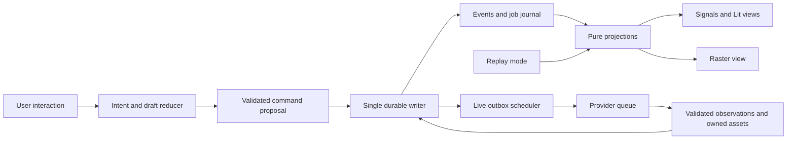
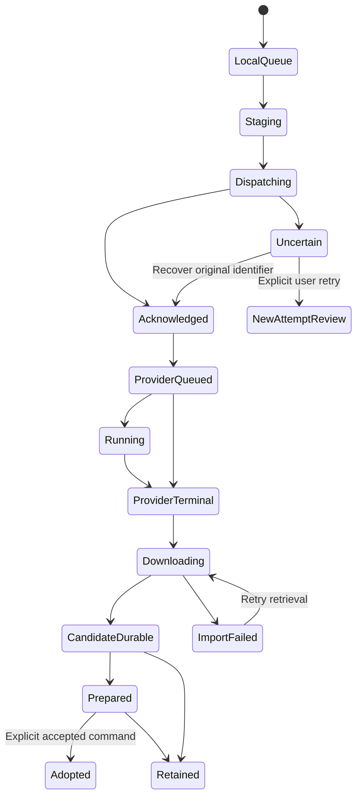

# Architecture — Action Model and Event Log

Revision ARCH-1.4 • 2026-09-25 • Task 4 • Limited PERF-7 reference/campaign reconciliation; V4-verified behavior preserved, independent performance and mirror review required. No implementation or measured compliance.

Canonical inputs: [Spec and accepted decisions](intent://local/note/spec), [corrected compatibility v1](intent://local/upon-build/note/6df7045b-6f0a-42c5-a32d-879b38d54c51), [API-1.2](intent://local/upon-build/note/2728dafd-4209-4558-a762-3a0192e0610f), [DS-1.1 with accepted addenda](intent://local/upon-build/note/bf7b9cc0-391c-4fce-97a8-5da1a660a4a2), [PERF-7](intent://local/upon-build/note/1b7b659d-d577-4257-b677-4850bbf86143), [Editor UX — UX-2.2](intent://local/upon-build/note/3febb57d-ea57-42de-a098-b12fb4e010e4). Technical contract owner: Architecture. Interaction, confirmation and placement presentation owner: UX. API owns provider evidence; Performance owns numerical budgets. Illustrative TypeScript below specifies contracts, not implementation code or claims of installed dependencies. App engineering choices are proposals within the accepted product policies, not provider facts or additional user approvals. Current performance source is PERF-7; its added budgets are proposed and awaiting independent review, while historical PERF-4 approval remains scoped to its baseline.


## Current revision scope — ARCH-1.4

ARCH-1.4 changes current performance references and campaign context only (§19). V4 independently verified the ARCH-1.3/UX-2.1 source behavior; full approval remains withheld pending PERF-7 review and limited mirror reconciliation. All verified behavior and per-action clocks remain unchanged.

ARCH-1.3 corrected V3 F04/F05 at operative §§3.4,16.2,16.6 and17.1; §18 records focused regression evidence and reconciliation. V3 did NOT APPROVE ARCH-1.2/UX-2. The previous author claims of no remaining contradiction were disproved and are retained only as historical receipts. Current-document native-overlay replacement is restricted to one original K at its exact rendered slot; multi-layer background grouping is excluded. One connected app-owned native textarea serves both editor presentations. No full-canvas equality scan, private EnTextarea access or new product scope is introduced. [Independent V2 review](intent://local/upon-build/note/176843a5-c21b-4de6-84a6-53ef5b9ca804) verified F01/F02 source corrections and approved API-1.2 E1–E9; it did not approve the whole architecture. CP-1 and pre-freeze feather/reconstruction containment in §3 remain normative and unchanged. Historical author receipts §§14–15 retain their original scope and superseded pending statements.

All seven latest user choices are accepted: native editable text and composition authoring;25MP/8192-side/100 combined IMAGE+TEXT layers; new-document default for interleaved selected composites; full-history portable copies; local-file adapter imports first; Fast initially and tiling later; guided training limits1–100 images,800MiB original bytes,201MiB prepared package,4KiB UTF-8 per caption. These limits are app policies, not provider limits or measured capacity. §§16–17 define the native-text/composition extension without treating prompt content as provider-native layers. Numerical resource proposals remain subject to the Performance source and independent review. No downstream implementation starts here.

## 1. Authority and hard invariants

The browser sends actions to an app-owned dispatcher. One localhost backend owns durable acceptance. It appends immutable events and updates its transactional indexes/journal; read projections feed Lit/Signals and the raster renderer. Commands express intent; events record accepted facts. A successful DOM event, pending paint, provider acknowledgement, provider completion, owned result and adopted layer are different facts.

1. **I-AUTH:** Only the backend writer can advance authoritative domain sequence/revisions. Signals and component properties are read views or explicitly scoped drafts. No view directly edits the canonical document.
2. **I-DURABLE:** An accepted receipt means all referenced mandatory bytes already have durable identities, and the event batch, command receipt, history links and any outbox/journal change committed atomically. A failed append produces no accepted mutation.
3. **I-FROZEN:** Source, mask, adapters, operation, route, resolved settings and approved conversion plan are immutable per accepted job. Subsequent edits cannot retarget it.
4. **I-REPLAY:** Projection replay executes zero provider requests, uploads, polls, cancellations or other remote effects. It uses recorded identities/assets/outcomes and pure reducers. Starting the live recovery scheduler is an explicit separate runtime step.
5. **I-PIXELS:** At every canonical source-grid pixel with effective edit weight zero, prepared masked-result RGBA bytes equal the frozen original source bytes exactly. Section 3 defines alpha, color, placement and the stronger current-document promise.
6. **I-ADOPT:** Provider results become retained candidates. Only an explicit revision-checked adoption command changes document layers. Cancelled, stale, partial or late outcomes never silently replace current content.
7. **I-ATTEMPT:** Local command delivery is deduplicated. Remote paid execution is not claimed exactly once. An uncertain submission is never automatically resubmitted.
8. **I-RETAIN:** Unused candidates persist until explicit deletion; all document, saved-version, history, job, dataset and adapter roots protect their referenced bytes.
9. **I-FEEDBACK:** Painted acknowledgement is honest pending feedback, separate from durability, preparation and completion. PERF-4 clocks are retained in full.
10. **I-SECRET:** Provider secrets exist only in server configuration/transport, never events, browser modules, drafts, exports or diagnostics.



## 2. Concrete local runtime and identities

Choose a client-rendered Lit/TypeScript application and Node ESM localhost server, aligned with DS-1.1’s proposed Node 26.10.0 qualification toolchain and coherent vendored en-reve archives. Pin exact Node, SQLite library/driver, raster codec/color pipeline, browser and fal transport identities in the future implementation manifest. Use Node's SQLite API in a dedicated writer worker, with SQLite WAL, synchronous FULL, foreign keys enabled, bounded busy timeout, explicit transactions and prepared statements. Its synchronous calls must not block browser rendering or the server HTTP event loop. Native Node SQLite is a proposed dependency choice; qualification must check its documented stability and exact bundled SQLite version before shipping. No install or runtime test occurred here. [Node SQLite documentation](https://nodejs.org/api/sqlite.html), read 2026-09-25.

One local storage root contains metadata.sqlite, immutable objects/sha256 shards, staging files and verified snapshots/backups. Default is the OS user's application-data directory under ideogram-edit, not the source repository or browser cache; startup exposes the resolved path and a deliberate relocate/backup workflow. Only local filesystems with qualified locking/flush behavior are supported; shared/network-mounted storage is excluded initially. SQLite WAL supports concurrent readers with serialized writes; this design adds a single process owner and writer queue. FULL commit and file/directory synchronization still depend on OS/filesystem/device behavior; power-loss durability must be fault-tested rather than assumed from an HTTP response. [SQLite WAL](https://www.sqlite.org/wal.html), [atomic commit assumptions](https://www.sqlite.org/atomiccommit.html), read 2026-09-25.

Acquire an OS-held exclusive storage-root lock before opening the writer/scheduler; a second server attaches to the existing server or refuses writable startup. The lock is released on process death, not by a guessed TTL. On ownership acquisition increment a durable writerEpoch. Transactions verify that epoch; callbacks from an old owner cannot update state. SQLite’s own lock/transaction boundary is the final write serialization. Tabs are clients, never leaders: each has sessionId/clientId and acknowledged sequence. No BroadcastChannel or Web Lock is relied on as authority.

```ts
type Id<K extends string> = string & { readonly kind: K };
type Seq = string; // unsigned decimal integer, no JS precision loss
type Hash = string; // algorithm-qualified sha256 digest
type BlobRef = { hash: Hash; byteLength: string; mediaType: string };
type AssetVersionId = Id<"assetVersion">;
type RasterRef = {
  assetVersionId: AssetVersionId; manifest: BlobRef;
  width: number; height: number;
  pixels: "RGBA8-sRGB-straight-v1"; pipelineVersion: string;
};
type Affine = readonly [number, number, number, number, number, number];
type LayerBase = {
  id: Id<"layer">; version: Seq; name: string; layerToDocument: Affine;
  opacity: number; visible: boolean; locked: boolean;
  blend: "normal"; mask: null | Id<"layerMaskVersion">;
};
type Layer = LayerBase & (
  | { kind: "image"; raster: RasterRef }
  | { kind: "text"; textVersion: Id<"textVersion">; renderVersion: Id<"textRenderVersion"> }
); // §16 specifies immutable editable source, fonts, layout and raster contribution
type Document = {
  id: Id<"document">; revision: Seq; branchId: Id<"branch">;
  width: number; height: number; color: "sRGB"; depth: 8;
  orderedLayerIds: readonly Id<"layer">[];
  historyHead: Id<"historyNode">; checkpoint: null | Id<"checkpoint">;
  compositionVersion: null | Id<"compositionVersion">; // app semantic sidecar, never layer order
};
type SourceSnapshot = {
  id: Id<"source">; documentId: Id<"document">; documentRevision: Seq;
  scope: "single-layer" | "selected-composite" | "merged-visible";
  dependencies: BlobRef; // exact ordered layer versions/masks/transforms/visibility
  documentGridSource: RasterRef; crop: { x: number; y: number; w: number; h: number };
  sourceToDocument: Affine; sourceFingerprint: Hash;
};
type EditMask = {
  id: Id<"maskVersion">; sourceId: Id<"source">;
  coverage: BlobRef; // R16 unsigned coverage tiles on frozen source grid
  geometry: BlobRef; featherRadius: number; algorithm: "mask-v1";
};
type Candidate = {
  id: Id<"candidate">; jobId: Id<"job">; attemptId: Id<"attempt">;
  outputIndex: number; rawAsset: AssetVersionId;
  workingRaster: RasterRef; prepared: null | RasterRef;
  provenance: BlobRef; disposition: "retained" | "set-aside" | "adopted" | "deleted";
};
type AdapterVersion = {
  id: Id<"adapterVersion">; adapterId: Id<"adapter">;
  weights: BlobRef; config: null | BlobRef;
  origin: { kind: "import"; provenance: BlobRef } |
          { kind: "training"; jobId: Id<"job">; datasetVersion: Id<"datasetVersion"> };
  declaredFamily: string; declaredFormat: string;
  qualification: "unverified" | "structurally-valid" | "incompatible" | "runtime-verified";
};
```

Logical IDs distinguish two entities containing identical bytes; byte hashes deduplicate storage without conflating ownership or provenance. Asset versions and masks never mutate. Layer IDs survive edits; their versions advance. Delete tombstones identity; restore reuses it through history, never silently recycles it. Job is user intent; attempt is one possible remote submission; providerRequestId is an external correlation key, not either local ID. Dataset versions reference original image identities, captions/crops, prepared images, manifest and archive; adapters reference immutable weights/config and lineage. Relationships are explicit, not inferred from filenames or current selection. Large manifests/text/geometry use blobs; events hold references.

## 3. Raster contract and exact masked preservation


### Additional raster preconditions for joint review

For safe replacement, documentGridSource is the full captured document extent; the provider crop is a separate view. A crop-local authored hard mask H is translated onto that grid with zero coverage outside its geometry; feathered F is unresolved until §3.3 explicitly resolves crop/halo containment and freezes final effective M. Do not treat H’s bounds as proof that feathered M fits the request. Retain full source contribution so adoption cannot discard pixels outside the request rectangle. Zero-area/outside-only/fully transparent sources are blocked as the initial app usability policy, preserving the source draft; no provider limitation is inferred. Layer locks permit read-only capture but forbid adoption’s visibility/version mutation unless the user explicitly unlocks the affected layers in a prior accepted command (invalidating/reviewing placement) or chooses a new document. Never silently bypass a lock. Hidden-layer captures likewise require separate placement/new-document review; they cannot claim unchanged visible-document exterior.

### 3.1 Envelope, imports and one canonical contribution pipeline

Accepted document limits are ≤8192 pixels per side, ≤25,000,000 pixels and ≤100 IMAGE+TEXT layers total; they are app limits, not provider constraints or measured capacity. Text layers in §16 retain editable source and supply versioned canonical native RGBA8 pixels to this same contribution boundary. They count with image layers toward the accepted total; generated results remain raster. Normal blend and sRGB RGBA8 remain the baseline working-color proposal.

Original imported PNG/JPEG/static WebP bytes, EXIF orientation and ICC profile are retained. Reject animation and unsupported formats explicitly. Normalize orientation once; convert supported profiles to sRGB using a versioned codec/color pipeline, preview material conversion, and save canonical pixel/tile bytes. Unknown profiles or failed decodes block import with retained diagnostic/retry state. Historical canonical bytes are never reconstructed by an unpinned browser JPEG decoder.

**Normative pipeline CP-1 (F01 correction).** Ordinary canonical document rendering, export, source capture, comparison and replacement MUST use the following same stages:
1. Native raster asset stores straight-alpha sRGB RGBA8 samples. Decode sRGB to linear light, premultiply alpha, resample through the recorded layer-to-document transform using the pinned kernel/edge rule, and apply layer-mask coverage and layer opacity in that representation. Perform these operations in the fixed order transform → document-aligned layer-mask coverage → opacity. Mask sampling has its own recorded layer/document transform; do not reinterpret source/edit masks as layer masks.
2. Materialize the resulting **document-grid layer contribution K** as straight-alpha sRGB RGBA8 BEFORE blending it with other layers. For nonzero alpha, unpremultiply color, encode linear color to sRGB, and quantize each channel and alpha with Q8(x)=clamp(floor(255x+0.5),0,255). When computed alpha is zero, write RGB zero on this arithmetic path. Keep original asset hidden-RGB bytes separately. This quantization is part of ordinary rendering, not a special lossy capture operation.
3. Ordinary stack composition reads these exact K bytes for every included layer in recorded order, converts them to linear premultiplied values, folds Normal source-over bottom→top, then quantizes the final document to RGBA8 with the same rule. Intermediate stack accumulators retain the pinned arithmetic precision; do not insert extra quantizations for source capture or replacement. An empty stack is transparent zero. A stack with exactly one visible contribution returns that contribution byte-for-byte (including hidden RGB); this exact passthrough makes merged-visible replacement identity-preserving too.
4. Single-layer capture S is K itself (or immutable tile references to K), not a second rendering/bake. Merged-visible capture S is the exact canonical document composite from stage3. A selected subset uses the same K contributions and stack algorithm with the explicit included order; it still defaults to a new document when interleaved.
5. A prepared replacement layer has identity document-grid placement, opacity1, no layer mask/effects, and native raster bytes equal to Prepared. Its stage1–2 **identity passthrough** reads those bytes directly without resampling, decode/encode, alpha multiplication or quantization. An integer-grid identity layer with no mask/opacity adjustment uses this same passthrough in ordinary rendering as well; it is not a replacement-only shortcut. Any later transform/mask/opacity mutation deliberately leaves passthrough and creates a new K/version.

Canonical contribution identity is the hash of its immutable RGBA8 tile bytes plus document extent and CP-1/pipeline version, with dependency manifest naming native asset, transform, layer mask/version, opacity and sampling/color versions. Views may cache K; capture pins the exact version it used. Rendering may materialize only required tiles, but ordinary full-resolution composition/export must be equivalent to the same full K grid; no alternate direct high-precision native-layer path may bypass stage2. Viewport approximations are display-only, not exact-preservation evidence.

**Why this repairs F01:** white at opacity0.1 becomes K=(255,255,255,26) before either ordinary stack composition or capture. Over opaque black, both pre-adoption and replacement paths therefore produce (90,90,90,255). The previously permitted direct pre-path producing89 is no longer normative. For any M=0 pixel, Prepared=S=K; the ordered stack has the same contribution bytes at the same slot, hence the same canonical output. This is an equality of document outputs, not merely source bytes. Merged-visible replacement reduces the old canonical composite S to one visible identity-passthrough layer, returning S exactly.

Retain native originals (including original hidden RGB), captured contributions and prepared assets. The edit compositor’s M=0 branch copies all four S bytes exactly, bypassing arithmetic even when alpha is zero. Nonidentity processing may normalize hidden RGB to zero as explicitly stated above; it must not run again during unchanged identity replacement. GPU/browser display differences are not the byte-equality oracle. Lossless PNG export of the unchanged canonical document uses the same stage3 samples; JPEG/matte/export resampling is separately approved processing and cannot claim byte-equal output.

### 3.2 Coordinates and source capture

Pixel edges use continuous coordinates, origin top-left, x right/y down; integer pixel (i,j) is sampled at (i+0.5,j+0.5). Layer coordinates map to document by the recorded invertible affine L; document to viewport CSS pixels by V (pan/zoom); backing pixels are DPR × V × L. Pointer conversion uses inverse V and then inverse L where needed. DPR only controls display backing allocation: it does not change source bounds, brush radii in document pixels, request dimensions or exports. Singular transforms and nonfinite numbers are rejected; negative scales/flips are explicit previewed transforms.

Source capture is a command with the exact ordered included layer IDs/versions, visibility inclusion choices, transforms, opacity and masks. Selected-layer and merged-visible captures produce ONE raster through an explicit preview; lock affects mutations, not read-only source capture. Active-layer capture includes its rendered transform/opacity/mask, with its layer visibility treated as included only when explicitly chosen. All captures use the exact CP-1 stage2 document-grid RGBA8 contributions and stage3 Normal compositor. Capture never applies native transform/mask/opacity or quantization a second time. The ordinary stack already uses these same contribution bytes before capture. Save the full pre-edit source contribution needed for safe replacement, plus the request crop; requests send only the approved crop. A selected arbitrary subset can be captured, but it is not automatically safe to replace that subset within an interleaved stack.

Crop bounds are integer document pixel edges; fractional UI bounds show the proposed floor(left/top)/ceil(right/bottom) expansion for approval. Crop is intersected with document bounds unless explicit padding was chosen; no silent clamp. Plain document Crop changes bounds and translates layer transforms, retaining underlying assets; Canvas resize changes bounds/anchor only; Image resample generates new derived raster versions. Each is an undoable command. A mask remains bound to its source version; source refresh or crop/size change invalidates its request/placement approval until explicitly remapped and previewed.

Let a source crop have origin (cx,cy), size Wc×Hc, explicit padding (pl,pt,pr,pb), then approved scale sx,sy to Wr×Hr. For document position d,
request coordinate q = (sx × (dx−cx+pl), sy × (dy−cy+pt)).
Record the complete affine, all integer extents, crop/padding policy, sampling kernel, source dimensions, request dimensions and approval ID; inverse mapping positions returned pixels back on the original source grid. Preserve aspect ratio by default. Nonuniform scaling or changed crop requires an explicit preview. No endpoint metadata rounding is silently applied.

Source/image resampling uses a versioned separable triangle/bilinear reconstruction with area integration for minification, linear premultiplied color and transparent padding. CP-1 applies this resampling only when producing a nonidentity contribution; identity passthrough must not re-filter retained contribution pixels. The implementation must seal coefficients/edge/rounding conventions with golden fixtures before qualification. RequestRasterPlan must record a conservative finite reconstruction footprint before approval; unknown footprint means not submission-ready. This proposed algorithm favors predictable edges and bounded tile work; it is not a claim about provider resampling. Tile seams use required filter halo, never independently clamped tile edges. Output sizing is validated from decoded bytes; if actual dimensions differ from the approved expected mapping, retain candidate and require a new mapping preview/approval before preparation/adoption. An approved mapping may resize the returned image into the frozen request rectangle; it never resizes the original for preservation.

Transparent input remains retained with its alpha. Default provider preparation uses lossless PNG; provider handling of input alpha is unknown. If an opaque source is needed, an explicit matte approval creates a separate provider-input asset. The original S remains the preservation baseline; no input flattening changes it. Padding is transparent or an explicitly approved matte. AI outpaint is a deferred candidate, not activated by these local padding primitives.

### 3.3 Mask, feather, request-domain containment and exterior invariant

Layer masks modulate K; edit masks control regeneration; document selection is separate UI/geometry state. Conversion is an explicit command. Edit coverage H is R16 unsigned on the frozen document/source grid:0 keep,65535 fully edit. Retain final immutable coverage bytes and stroke geometry. Imported PNG luminance/alpha/inversion are previewed (proposed linear-sRGB luminance × alpha then R16 quantization). A crop-local authored mask is translated onto the full document grid; hard coverage is zero outside its authored geometry. Feathering can extend beyond that geometry and MUST pass containment below.

**Feather policy mask-v1.** Radius r≥0 is in document pixels. At r=0 the kernel is identity. At r>0 use discrete finite triangle weights w(k)=max(0,1−abs(k)/r), normalized by their sum over integer k with abs(k)<r. In2D use the product of the normalized x/y weights and quantize ONCE after the complete2D weighted sum: Q16(x)=clamp(floor(x+0.5),0,65535), where x is already in R16 units. Thus r=2 has sampled1D weights [0,1/4,1/2,1/4,0]. Radii≤1 have only the center sample in this initial pixel-grid algorithm; UI must preview that quantized behavior. No infinite Gaussian tails or tile-local edge renormalization.

**Document boundary is separate from request crop.** Extend hard coverage H by zero outside document D, apply the globally normalized kernel without renormalizing at D’s edge, then set final feather coverage outside D to zero. Display the resulting fade/clipping at document edges in the approval preview. This fixed policy never creates editable support beyond D or expands the document. It is not an implicit outpaint operation. Padding may supply sampling context only after explicit approval; its edit coverage is always zero outside D. Original content inside D still obeys M=0 exact copy.

Let F be this feathered R16 coverage on D, E=support(F), C the previously selected request crop, and A the full approved request domain including any approved padding, all expressed in original document-grid coordinates. F is **unresolved coverage**, not yet an accepted effective mask M. Before acceptance, compute the finite required reconstruction footprints from the chosen source→request resampling and expected result→document mapping. For each p with nonzero coverage, every request/output sample required to reconstruct G(p) must lie in A. Record the actual footprint rule/kernel/scale/expected output grid; a conservative integer halo h may bound it, but cannot understate it. Identity aligned sampling has h=0; the r=2 feather is NOT itself the reconstruction halo. Expanded request dimensions and changed scaling require recomputing footprints until the approved plan is consistent.

If support plus required reconstruction footprints leaves A, state **MASK_DOMAIN_REVIEW_REQUIRED**. QueueInference rejects; no accepted JobQueued, upload or provider submission may proceed from that invalid plan. Offer two explicit resolutions, preserving the previous draft:

- **Expand and reapprove:** derive a proposed integer crop/padded request domain covering all F support and reconstruction needs. Show new bounds, original/request dimensions, padding values, resize effects, source preview, mask preview and revised estimate assumptions. Within D capture the additional original source pixels; beyond D propose explicit transparent or matte padding for sampling context (never extrapolate provider result pixels later). Keep F unchanged on D and zero outside D. Approve a successor source/request plan and effective-mask version; all previous crop/resize/placement approval IDs are invalidated. If provider/app size eligibility requires resizing, preview and explicitly approve that too, then recompute containment with its halo. No automatic dimension growth or provider call.
- **Clip and repreview:** keep approved domain A and mapping, compute its **reconstruction-safe interior** B={p∈D: the full recorded reconstruction footprint for p is inside A}. Set proposed M(p)=F(p) for p∈B and0 otherwise. Display exactly which feather/edit pixels disappear and the final hard edge/clipped feather. Only an explicit approval commits this successor mask version and plan; do not blur again after clipping, which would recreate out-of-domain support. With h=0 B is D∩A; with h>0 it is the correspondingly eroded safe interior. If M is empty, submission remains blocked.

After either choice, freeze SourceSnapshot/version (full CP-1 contribution retained), final M bytes/hash, original authored H/feather policy, resolved domain/padding, both transforms/kernels, expected output grid, footprint/halo bound and approval identity in one RequestRasterPlan. Server recomputes/validates containment and dependency hashes at command acceptance; client preview alone is not authority. Editing source, crop, feather, padding, dimensions, mapping or relevant masks invalidates that approval. Unresolved or stale approval never silently clips a mask during submission.

Illustrative added reference contract:
```ts
type RequestRasterPlan = {
  id: Id<"requestRasterPlan">; source: Id<"source">;
  authoredMask: BlobRef; effectiveMask: Id<"maskVersion">;
  documentExtent: { width: number; height: number };
  requestDomain: { x: number; y: number; width: number; height: number };
  padding: BlobRef; sourceToRequest: Affine;
  expectedOutputGrid: { width: number; height: number };
  reconstruction: BlobRef; // versioned finite footprint, kernel, halo and edge policy
  resolution: "already-contained" | "expanded-and-approved" | "clipped-and-approved";
  approvalId: Id<"requestApproval">; dependenciesHash: Hash;
};
```

Provider mask is aligned to the approved request raster Wr×Hr, opaque black/white PNG. White for any request pixel whose inverse sampling footprint intersects final nonzero M (conservative support mapping so downsampling does not lose thin edits), black otherwise; padding outside D stays black. Source and mask share the exact recorded request transform/domain. Do not assume this binary mask solves a missing output reconstruction halo: containment is checked independently. Editor feathering uses retained original-resolution M, never an upsampled provider mask, and does not depend on unverified provider grayscale/alpha semantics. Empty effective support blocks. If effective support covers every intended editable pixel of the selected source crop (excluding context-only padding), require an “Entire source crop can change” confirmation; if it covers D, label “Entire document can change”. Perform this check after finalization and show the final feather/clipping preview, never infer approval from the earlier hard mask.

Returned dimensions/mapping are checked from actual decoded bytes. If they differ from the plan, retain the candidate and block preparation/adoption until an explicit actual-output mapping review recomputes containment. Do not stretch or extrapolate beyond available G. Existing provider pixels cannot be created by merely approving a larger domain after completion: use a contained mapping or explicitly clipped/repreviewed successor mask for this candidate, otherwise retain it and offer a distinct new request. No automatic regeneration; original accepted job provenance remains immutable, with new preparation approval linked as a successor.

For a resolved plan, let S be frozen canonical CP-1 source RGBA at original document-grid resolution; G the normalized provider result mapped there using the contained approved reconstruction; m=M/65535. At M>0 compute linear premultiplied interpolation Aout=(1−m)As+mAg and CoutPremul=(1−m)CsPremul+mCgPremul, then quantize as §3.1. At M=0 copy all four S bytes directly, including hidden RGB. Because finalized M has no support outside the reconstruction-safe request domain, “outside A copy S” and “blend wherever M>0” now agree; no special post-approval clipping branch exists. At M=65535 use mapped G; transparent G may reduce alpha within edit support.

Prepared identity includes S, final M, raw/working G, complete RequestRasterPlan, any explicit successor output-mapping approval, CP-1/mask/kernel/color/codec versions and final output hash. Retain original/provider/prepared bytes separately. **Exact invariant:** ∀p∈D where M(p)=0, Prepared(p)=S(p) in all four8-bit channels, regardless of approved request resize, provider-wide changes or input matte. Compare at original resolution, never a downsample/upscale of S. §3.4 additionally guarantees current-document equality when its unchanged-contribution/visibility/placement preconditions hold. Provider behavior, JPEG export and monitor display equality remain separate claims.

### 3.4 Alpha-safe adoption and unchanged-document exterior

Initial safe masked replacement modes:
- **Single-layer source:** prepared raster represents the exact CP-1 stage2 RGBA8 contribution already used by the ordinary stack, including its once-applied captured opacity/mask/transform. Create a new layer at the original stack slot with identity transform, opacity 1 and no reapplied source mask; atomically hide the original. Keep the original native layer/source, transform, mask and, for text, editable text/font/layout/render identities. Its contribution is replaced exactly once using CP-1 identity passthrough; it does not enter native transform/mask/opacity processing or a second lossy conversion.
- **Complete merged-visible ROOT source:** retain the exact CP-1 stage3 frozen composite of ALL visible document contributions outside finalized M, including beyond the request crop. Atomically hide ALL captured visible original layers and insert one prepared composite as the ONLY visible root contribution; previously hidden originals remain hidden. There is no separately retained visible native overlay. Preserve originals (including editable native text), visibility states and ordering in history. This singleton-output rule does not permit flattening a subgroup below an overlay.
- **Multi-layer selected/background composite:** initial default is a new document containing the prepared composite; contiguity does not authorize subgroup replacement beneath retained overlays, and interleaved subsets likewise have no existing-canvas preservation claim. A future isolated-group mode needs its own compositing proof. Explicit additive current-document placement can be offered only as a distinct previewed placement that makes no current-document exterior guarantee.

The prepared candidate may be displayed in a cropped comparison, but safe replacement uses its full source contribution, so pixels beyond the request rectangle are not lost. Single-layer and merged-visible adoption validate the capture dependency fingerprint, document bounds and stack/placement at commit. For single-layer current-document preservation, the captured layer must also have been visible and contributing at capture/adoption; a deliberately captured hidden layer defaults to new-document placement or a separately previewed additive placement with no unchanged-current-document guarantee. If these preconditions are unchanged, canonical current-document pixels outside M also remain identical: CP-1 sees the same already-quantized K at the same stack slot for single-layer replacement; merged-visible replacement is one visible contribution and uses CP-1’s exact singleton passthrough. The proof relies on equal stack inputs or exact singleton output, never on algebraic equivalence between separately rounded float and RGBA8 paths. If any dependency changed, default adoption rejects as stale, preserves candidate and offers a fresh preview/new document. Merely rebasing a revision number cannot restore the preservation guarantee. An explicit retarget creates a new placement approval and clearly identifies which original-context guarantee applies.

One adoption transaction includes new layer, hiding originals, selection update and inverse/history references. No intermediate double-visible frame is an accepted state. Undo restores the prior layer/visibility state; redo reuses the recorded prepared pixels. Move, opacity or mask edits after adoption are normal user mutations and may intentionally change the exterior; the guarantee is at adoption. Task 5 must test translucent sources, transformed layers, crop borders, feather support and resized requests against canonical bytes.

## 4. Operation-specific command and routing contracts

Drafts may contain invalid text and incompatible inactive values. Commands cannot. API-1.2's exact per-route schema/evidence digest and app allowlist jointly validate each frozen request; schema defaults are resolved explicitly and recorded. No unrestricted optional-field bag is sent. Known S bounds are hard validation; M/P size restrictions are separately source-labelled app eligibility policies pending runtime evidence. Concrete active size policy: base/text-LoRA custom sides512–3840 and divisible by16; Instant/Fast512–2048/divisible by16 (M). Dedicated editing auto describes source matching with approximately25MP and8192-per-side cap (P), with exact rounding unknown. Generic ImageSize S allows optional sides/default512 with0<integer≤14142; that broad schema bound never overrides the stricter app25MP/8192 envelope or route-labelled policy. Custom request sizes must include both explicit dimensions in app commands; presets retain labels until actual size is established. App preparation/approval chooses eligible explicit dimensions and cannot advertise these M/P constraints as runtime-verified provider limits. Unknown presets/auto behavior are not invented; preview uses observed source/declared expectations and actual output dimensions are checked later.

```ts
type Size = { kind: "preset"; value: "square_hd"|"square"|"portrait_4_3"|
  "portrait_16_9"|"landscape_4_3"|"landscape_16_9" } |
  { kind: "custom"; width: number; height: number };
type EditSize = Size | { kind: "auto" };
type Seed = { kind: "provider-random" } | { kind: "integer"; decimal: string };
type Core = { prompt: BlobRef; promptProjection: Id<"promptProjection">;
  seed: Seed; count: 1|2|3|4; format: "png"|"jpeg" }; // exact UTF-8 string and §16 sidecar
type Regular = Core & { expansion: "None"|"Medium"|"Large";
  speed: "TURBO"|"BALANCED"|"QUALITY"; acceleration: "none"|"low"|"regular"|"high" };
type AdapterUse = { version: Id<"adapterVersion">; scale: number };
type AdapterList = readonly [AdapterUse] | readonly [AdapterUse,AdapterUse] |
  readonly [AdapterUse,AdapterUse,AdapterUse];
type InferenceRequest =
  | { kind: "generate"; settings: Regular; size: Size }
  | { kind: "instant"; settings: Core & { expansion: "None"|"Medium" }; size: Size }
  | { kind: "fast"; settings: Core & { expansion: "None"|"Medium";
      speed: "TURBO"|"BALANCED"|"QUALITY" }; size: Size }
  | { kind: "transform"; settings: Regular; size: EditSize; strength: number; source: Id<"source"> }
  | { kind: "inpaint"; settings: Regular; size: EditSize; strength: number;
      source: Id<"source">; mask: Id<"maskVersion">; rasterPlan: Id<"requestRasterPlan"> }
  | { kind: "generate-adapters"; settings: Regular; size: Size; adapters: AdapterList }
  | { kind: "transform-adapters"; settings: Regular; size: EditSize; strength: number;
      source: Id<"source">; adapters: AdapterList }
  | { kind: "inpaint-adapters"; settings: Regular; size: EditSize; strength: number;
      source: Id<"source">; mask: Id<"maskVersion">; rasterPlan: Id<"requestRasterPlan">; adapters: AdapterList };
type TrainingRequest = { kind: "train-adapter"; datasetVersion: Id<"datasetVersion">;
  archive: BlobRef; steps: number; learningRate: number;
  resolution: string; defaultCaption: null | BlobRef; outputFormat: "fal"|"comfy" };
type CommandBody =
  | { type: "QueueInference"; request: InferenceRequest; approval: Id<"requestApproval"> }
  | { type: "QueueTraining"; request: TrainingRequest; approval: Id<"datasetApproval"> }
  | { type: "CancelJob"; jobId: Id<"job"> }
  | { type: "RetryUncertainAsNewAttempt"; jobId: Id<"job">; uncertaintyAck: Id<"ack"> }
  | { type: "AdoptCandidate"; candidateId: Id<"candidate">; placement: BlobRef;
      placementApproval: Id<"placementApproval"> }
  | { type: "Undo"; historyHead: Id<"historyNode"> }
  | { type: "Redo"; historyNode: Id<"historyNode"> };
```

This is an illustrative subset; the same envelope covers NewDocument, ImportAsset, CreateSourceSnapshot, CommitStroke, ApplyTransform, CropDocument, ResizeCanvas, ResampleImage, SetLayerProperties, MoveLayers, Delete/RestoreLayer, ApproveRequestResize, SaveCheckpoint, SaveCopy, Export, SetJobConcurrency, ReorderLocalQueue, ImportAdapter, CommitDatasetVersion and DeleteCandidate. Each has a narrow typed payload and validation, not a generic set arbitrary JSON command. Server rejects unknown discriminators/properties, invalid numeric values, unavailable IDs and unauthorized scope.

| Command discriminator | Frozen endpoint | Endpoint-specific validation and internal fields |
| --- | --- | --- |
| generate | ideogram/v4 | Prompt, no source/mask/adapters; explicit resolved speed/acceleration/expansion; no auto size |
| instant | ideogram/v4/instant | No source/mask/adapters/speed/acceleration; expansion None/Medium; no auto; Instant M size cap, not base cap |
| fast | ideogram/v4/fast | No source/mask/adapters/acceleration; explicit rendering_speed TURBO/BALANCED/QUALITY, default BALANCED; expansion None/Medium; no auto;512–2048 multiple-of16 app eligibility from M; separate endpoint from base TURBO and Instant |
| transform | ideogram/v4/image-to-image | One source, no mask/adapters; strength 0–1 default .8; auto allowed |
| inpaint | ideogram/v4/inpaint | One source and matching mask; strength 0–1 default 1; auto allowed |
| generate-adapters | ideogram/v4/lora | App 1–3 ordered adapters, scale 0–4; no source/mask/auto |
| transform-adapters | ideogram/v4/image-to-image/lora | Source plus adapters, no mask; transform strength/default |
| inpaint-adapters | ideogram/v4/inpaint/lora | Source, mask and adapters together; inpaint strength/default |
| train-adapter | ideogram/v4/trainer | Separate six-field payload: images_data_url, steps 100–40000, learning_rate 1e-6–.01, resolution, optional default_caption, output_lora_format fal/comfy |

All inference uses queued finished results, sync_mode=false and enable_safety_checker=true initially; these are visible internal policies/provenance, not omitted unknown defaults. Random seed omits seed; explicit seed is serialized losslessly as an integer after range/runtime capability checks, never rounded through unsafe JS Number. No seed-based pixel guarantee. Default UI output can be PNG for alpha preservation; record it explicitly, without claiming transparent generation. Match UX’s proposed nonempty-prompt usability rule (not a provider minLength): keep empty prompt draft editable but reject submission. Reject duplicate adapter-version entries as app policy; do not silently deduplicate or change weighting.

Payload examples (illustrative provider-readable URLs, never actual staged credentials):
```json
{"endpoint":"ideogram/v4/inpaint/lora","input":{"prompt":"Replace the sign lettering","image_url":"https://media.example/source.png","mask_url":"https://media.example/mask.png","loras":[{"path":"https://media.example/v4.safetensors","scale":1}],"strength":1,"image_size":"auto","num_images":1,"expansion_model":"None","rendering_speed":"BALANCED","acceleration":"none","output_format":"png","sync_mode":false,"enable_safety_checker":true}}
```
```json
{"endpoint":"ideogram/v4/instant","input":{"prompt":"A ceramic bowl","image_size":{"width":1024,"height":1024},"num_images":1,"expansion_model":"Medium","output_format":"png","sync_mode":false,"enable_safety_checker":true}}
```
```json
{"endpoint":"ideogram/v4/trainer","input":{"images_data_url":"https://media.example/dataset.zip","steps":1000,"learning_rate":0.0001,"resolution":"1024x1024","output_lora_format":"fal"}}
```

Freeze requested draft revision/reference separately from resolved request, approvals, schema digest, endpoint and canonical payload-template hash. Asset URL placeholders in the accepted request name immutable staged byte identities; dispatch resolves those into provider-accessible transport URLs, stores the exact sent payload hash and protected transport receipt BEFORE the network attempt. URL refresh creates a new transport envelope only before dispatch; it cannot change pixels/settings or silently retry an uncertain attempt. Tokens/signed URL query secrets live in a restricted transport table, not public event payloads, exports or ordinary logs. Redacted canonical provenance retains asset hashes and URL origin/path identity without credentials.

Fast is an initial operation with its own frozen route, enum validation, size eligibility and estimate. Changing to Fast requires explicit operation choice and compatibility review; it never silently drops source, mask or adapters. Fast does not mean base rendering_speed=TURBO. Tiling, tiling/lora and six model-stream routes remain deferred; no active command in this baseline routes to them. Health is not a creative operation. Outpaint is an unqualified composed candidate; upscale and adjacent V3/character routes have no active inference commands. Prompt aids produce explicitly approved visible prompt text, not invented API fields. Unsupported attachments, Large→Instant/Fast, size mismatch, mask without source and extra adapters retain the originating draft and reject until explicit resolution; no context dropping, parameter downgrades or older-model fallback.


## 5. Action recording, event envelopes and projections

### 5.1 Every interaction has an owner and a recording rule

“All interactions through actions” means every event handler delegates to a named app action category. It does not mean every pointermove is a durable document event. Native text selection/composition remains owned by the text-editing controller; the app adapter records its meaningful draft boundaries without replacing native editing. Browser/OS actions outside the application are not fabricated as document history.

| Action class | Recording and coalescing | Durability/retention and reconstructible state |
| --- | --- | --- |
| Discrete UI intent: tool, panel, layer selection, menu, zoom preset, focus request, shortcut, compare, help | Action dispatcher emits UIIntent with session/generation/correlation. Settled persistent UI changes append a UI event; transient open/hover/focus actions enter only bounded session trace. Rejected/disabled intents get reason codes. | Workspace UI projection persists selected IDs, tool, viewport, panel/split preferences, expanded rows and candidate selection at semantic boundaries. Per-session focus/hover is not restored as if user focus. UI records are separate from document undo. |
| Pointer/pen/touch samples and continuous pan/zoom/slider | Samples routed to gesture reducer, bounded in-memory preview buffer; drawing retains all geometry needed for final coverage, pan/slider coalesce intermediate positions. One GestureCommitted or GestureCancelled summary per gesture, pointer capture loss or Escape handled explicitly. | Final stroke geometry/coverage is a referenced immutable blob and one document transaction. No synchronous storage per sample. Optional diagnostic samples: memory ring ≤60s/8MiB, disabled by default; never needed for replay. |
| Prompt/inspector/dataset caption drafts and IME | DraftStarted/DraftChanged/DraftCommitted/DraftCancelled application UI events. Debounced latest draft snapshots at ≤1s cadence while active, semantic flush at blur/Apply/compositionend; no accepted submission during composition. Discarded intermediate text revisions coalesce, never truncate the current text. | Draft blob+generation checkpoint is durable asynchronously; UI shows draft pending/saved. Abrupt crash may lose the explicitly unsaved latest draft interval. Final accepted command references exact committed text version. Local text undo retains semantic edits during session; persisted draft restores current text, not every keystroke. |
| Accepted document mutation | Validated command → one atomic event batch with transactionId and history node; intermediate drag positions never enter this stream. | Retain for document lifetime/history policy. Complete canonical document/layers/masks/assets/history reconstruct from snapshot+events+blobs. |
| Accepted job, asset, adapter or dataset mutation | Narrow domain events at local queue, attempt, cancel intent, result import, adoption, adapter registration and version changes. | Retain with jobs/provenance/library roots; separate document and job revision counters. Provider observations cannot impersonate user intent. |
| Rejected authoritative command | Durable receipt with command hash, expected/actual revision and sanitized rejection code; bounded audit summary, no domain revision advance. Validation errors before command construction are UI events. | Reject receipt retained with command dedup ledger for workspace lifetime; large/private draft content remains in draft blobs, not error logs. If storage fails, even audit durability is unavailable and UI says so; prior accepted state remains. |
| External observations | Validate provider request/attempt linkage; record semantic state transitions, terminal results, new errors and changed useful progress. Repeated identical polls update lastSeen, counts and compact interval summary, not repeated full JSON events. | Journal has latest observation and bounded diagnostics; durable terminal/outcome/provenance survives. Exact network transcript is not needed for replay. |
| Background IO, save/import/export, lazy-load, reconnect/failure | Named internal actions with causation IDs; progress byte/file counters are coalesced read views, durable completed milestones and errors recorded. | Reconstruct durable outcome/status, not every progress animation. No mutation from render, Signal subscription or replay. |

UI stream uses its own uiSeq per workspace/session and latest checkpoint; it is not a second document authority. Retain current UI/draft checkpoints until explicit clear/document deletion, plus at most1000 semantic UI events per session for7 days; compact older UI transcript into the current checkpoint. This restores current UI/draft state, not an entire historical focus/menu/keystroke movie. Required domain/history/job events are excluded from that UI retention limit. Valid selected-layer IDs are derived against the domain projection; missing IDs are cleared by a deterministic reconciliation UI event. Durable pixel selections/mask geometries have their own identities; layer selection/focus alone has no inference meaning. On reopen restore deliberate UI preferences/drafts, then repair unavailable targets visibly; dialogs/native focus are not reopened blindly.

Default diagnostic retention proposal: sanitized intent/rejection summary ring ≤10MiB and 7 days, whichever first; no prompt text, URLs with tokens, pixel samples or captions. Final rejection receipts and accepted-domain history are excluded from that ring and preserved as above. Repeated long-job logs are stored as capped separate blobs with dropped-count/range markers, not silent truncation of domain facts. PERF T07 metadata limit 1/4MiB per 24h job applies to observations; terminal events/errors/reference metadata must not be discarded to fake the cap. If required evidence exceeds it, retain evidence and report a budget failure/amendment. User-facing current draft text and required event blobs do not expire under diagnostic retention.

### 5.2 Envelope, order and atomic acceptance

```ts
type Command = {
  schemaVersion: 1; commandId: Id<"command">; clientId: Id<"client">;
  sessionId: Id<"session">; correlationId: Id<"correlation">;
  causationId: null | Id<"command"> | Id<"event">;
  transactionId: Id<"transaction">; documentId: null | Id<"document">;
  expectedDocumentRevision: null | Seq;
  expectedEntityVersions: BlobRef; issuedAt: string; body: CommandBody;
};
type DomainEvent<T> = {
  schemaVersion: 1; payloadVersion: number; eventId: Id<"event">;
  workspaceSeq: Seq; streamId: string; streamSeq: Seq;
  documentId: null | Id<"document">; resultingDocumentRevision: null | Seq;
  commandId: Id<"command">; correlationId: Id<"correlation">;
  causationId: null | string; transactionId: Id<"transaction">;
  writerEpoch: Seq; recordedAt: string; type: string; payload: T;
};
type Receipt =
  | { status: "accepted"; commandId: Id<"command">; fromSeq: Seq; toSeq: Seq;
      documentRevision: null | Seq; transactionId: Id<"transaction"> }
  | { status: "rejected"; commandId: Id<"command">;
      code: "STALE_REVISION"|"INVALID_INPUT"|"MISSING_ASSET"|"CAPACITY"|"INCOMPATIBLE";
      currentRevision: null | Seq; details: BlobRef };
```

workspaceSeq is strictly increasing for committed authoritative events; streamSeq orders document/job/asset streams; transaction boundaries include first/last sequence and are published as indivisible batches. Wall-clock timestamps never determine ordering. Document revision advances once per atomic document transaction, not per pointer sample, UI preference or provider status. Job/entity versions handle observations independently, so a status poll does not make every open document stale. UI selection effects belonging to an adoption are projected with its transaction, while per-tab focus remains UI state.

The writer receives a bounded ≤64KiB command, checks schema/auth/expected revisions/asset existence/eligibility, then begins an immediate SQLite transaction. It rechecks preconditions inside the write lock, assigns captured IDs/time, appends events, stores commandId+canonical-body-hash+receipt, updates rebuildable projections/references and job/outbox rows, and commits. Events target 4KiB/max16KiB; commands target16KiB/max64KiB. Store large prompt, captions, geometry and manifests as immutable blobs with full content, never truncate to fit.

A repeated commandId with the same hash returns the existing receipt and performs no new work; the same ID with different body rejects as protocol misuse. Dedup ledger survives snapshots/compaction. Accepted responses include sequence range. Lost client acknowledgement is resolved by GET receipt or resend SAME commandId/body; this is local delivery retry, not a new paid attempt. After unknown local receipt, UI must not synthesize a fresh ID.

Optimistic previews live in an overlay keyed by command/generation and labelled pending. On receipt, remove overlay and apply complete authoritative batch; on stale rejection, restore current authoritative projection but preserve the user's draft and offer review/reapply. Never rollback unrelated newer work. SSE/stream delivery may repeat or disconnect: clients discard already-applied sequence ranges, fetch gaps from the writer, and never apply a partial transaction. All clients converge to same pure projection at the same high-water mark. A tab offline from the backend can edit drafts, but cannot call its document mutations saved; initial product does not promise offline authoritative editing.

### 5.3 Projection and replay rules

Named pure projections: Documents/Layers, Assets and reference graph, Jobs/Attempts, Candidates, Datasets/Adapters, History/branches, Selection/UI checkpoint and command receipts. Derived query indexes in SQLite are rebuilt or validated against event high-water marks. Signals expose immutable slices with keyed subscriptions; rendering a job or opening a panel cannot enqueue it.

Reducers never read Date.now, random generators, viewport, filesystem, network or mutable globals. IDs, seed choice provenance, recorded timestamps, defaults, schema/pipeline versions and any random inputs are captured before acceptance. Provider-random seeds are recorded from output; a supplied seed is provenance only. Raster replay references retained canonical pixel assets; recomputable previews may be rebuilt with versioned algorithms, but missing authoritative asset bytes produce a missing-asset state, not a new generation. Float/platform differences cannot be papered over by recomputing canonical masks or images differently.

Replay creates no outbox entries. Job journal projection can show previously accepted queued work, but replay mode has no scheduler/provider client attached. Live startup first completes replay/asset verification, then separately resumes the already-journaled safe work under §7. A document/bundle preview always remains replay-only until explicitly opened into the live workspace; imported jobs do not gain dispatch authority.

## 6. Binding en-reve, drafts and undo

Use DS-1.1 §4’s staged-draft adapter and public APIs. One adapter owns each control, tracks lifetime and a monotonically increasing generation on EVERY authoritative write, including same-value echo/reset, document switch, target change and teardown. It checks composedPath to avoid handling descendant proposals twice.

An en-change listener performs cheap synchronous validation, captures a detached proposal and IDs, then waits until dispatch has fully returned. It checks final defaultPrevented, lifetime/generation and current settled public value. Reading tentative FormData or seeing equality is insufficient evidence of acceptance. Reconcile only the eligible settled value into a DraftChanged action; if ownership is ambiguous, retain the app draft. en-input is preview, not accepted mutation. For asynchronous validation that must precede the local default, synchronously preventDefault and launch a separately identified app request; no awaiting can later accept that cancelled DOM event. Central app rules resolve approval rather than using multiple independent veto listeners as an async voting system.

en-action/native button paths are deduplicated; menu action waits for final cancellation and any required accepted dismissal/focus transition. en-reorder is synchronously cancelled when app owns hierarchy, then copied to MoveLayers. Apply/Generate uses the CURRENT app draft, validates expected revision and constructs a command; only durable receipt advances authoritative properties. Irreversible upload/provider dispatch never occurs inside component stage, commit callback, rollback, render or observer. Failure cannot roll back provider execution by resetting a field.

Compositionstart suppresses submit/shortcut and document undo boundaries. Intermediate composition inputs update preview; compositionend plus the native final input are deduplicated by composition/generation token. An authoritative update during composition wins and invalidates stale completion. AbortController helps cancel work, but every async completion still checks command/request ID, target/version, generation and live owner even if abort is ignored. Late validation/upload/prepare results can register retained bytes, but cannot silently apply to a newer draft or document.

| Boundary | Undo behavior |
| --- | --- |
| Brush down→samples→up | One CommitStroke event referencing final mask delta/geometry; one history transaction. Escape/capture loss cancels or explicitly offers recovery, not a half-stroke acceptance. |
| Transform/opacity slider drag | Draft preview per sample; final value one transaction. Keyboard nudge repeats coalesce only within the same key-held gesture; release/selection change closes it. Typed inspector Apply groups its fields atomically. |
| IME/text editing | Native draft text undo during composition/editing; no document undo per keystroke. Applying a prompt/dataset caption version creates one relevant draft/dataset transaction, not image-layer history. |
| Source/mask/resize approval | Approval references exact draft/source/mask/plan hash; later changes invalidate it. Approval itself does not spend or change document pixels. |
| Candidate adoption | One history node containing prepared raster and previous layer/version/visibility state. Undo/redo are new accepted events moving history cursor; historical events are never deleted. |
| Pending generation intent in History | Undo suppresses that intent’s adoption eligibility and requests cancel through the job journal. It does not erase the job or promise refund. No canvas pixels change because none were adopted. |
| UI focus/tool/viewport | UI preference/interaction stream, not document undo. Explicit UI Reset can restore defaults independently. |

History nodes record parent, branch, forward/inverse semantic patches and asset roots. Undo is checked against current historyHead; replay follows recorded history navigation. Redo reuses the same asset identities and visibility patch with no API call. Undo of a pending job followed by redo restores its visibility/eligibility only: if it never dispatched and cancellation removed its outbox, redo does NOT submit it; display “Not run — submit a new request”. If it completed, redo exposes its retained candidate; adoption is still explicit. This avoids turning redo into a paid action.

New mutation after undo creates a new branch and clears the ordinary redo cursor for the active branch. Old branch/history/assets remain inspectable and protected. Switching history branch is explicit, revision checked and restores recorded document state, not provider execution. Results from previous branches remain in Jobs/Results; they do not mutate the active branch. Duplicate adoption retries with the same commandId return the same layer transaction; a deliberate second placement requires a new command.

## 7. Durable job journal, outbox and external recovery

### 7.1 State axes and submission

Use independent axes rather than one misleading completed boolean:
- Local request: preparing → accepted-local-queue → staging → ready-to-dispatch.
- Attempt: not-started → dispatching → acknowledged OR submission-uncertain → provider-queued/running → provider-terminal.
- Result import: none → manifest-received → downloading → encoded-durable → preparing → prepared, or failed/retryable/missing.
- User disposition: eligible/suppressed-by-undo/cancel-requested/set-aside/adopted/deleted.
A provider-terminal success can coexist with download failure or cancel-requested. “Ready” requires durable validated candidate assets; “Adopted” requires a separate document transaction.



Cancellation is an orthogonal durable flag across nonterminal states; the diagram does not pretend it can reverse provider completion. Every transition records jobId/attemptId and monotonic entity version.

QueueInference/QueueTraining acceptance writes JobQueued plus immutable request refs, stage plan, initial attempt and outbox row in one transaction. Required local source/mask/adapter/archive bytes exist first; provider upload may follow. Scheduler reserves one active-request slot durably before dispatch and persists its lease/epoch. Default maximum ONE request total across inference/training, tabs and restart; batch of four images is one request. Locally queued entries target100/max1000; at ceiling preserve draft and reject enqueue, never evict work. Concurrency changes are explicit config events; raising limit requires account-capacity and local-resource qualification per PERF §7, not a claim the configured number is verified.

Hold the conservative active slot from remote dispatch through known remote terminal state; unresolved submissions hold it as possibly running. Download/preparation uses separately bounded IO/raster queues after remote terminal. Unknown cancellation does not release capacity as proven stopped. An explicit user decision to continue despite an unresolved remote request must explain possible overlapping work and record the override; it is not automatic uncertain retry or verified resource capacity. Normal default is wait/reconcile.

Persist frozen transport payload hash, endpoint, asset staging mapping and AttemptDispatching BEFORE sending network bytes. Outbox states distinguish safe-unstarted from dispatched/uncertain; marking dispatching first creates a conservative crash window where no request may actually have left. A crash there is still uncertain, never blindly retried. On provider ack persist request_id, returned endpoint URLs/validated host identity, gateway ID if available and receipt before reporting “Provider queued”. Database commit failure after ack retains uncertainty; try durable emergency journal only if storage is available, without claiming that solves total disk loss. Durable result import is mandatory before candidate-ready.

### 7.2 Lost acknowledgement and retry owners

| Failure window | Recovery |
| --- | --- |
| Browser loses backend command response | Query receipt/resend identical commandId+hash. Same local job/attempt; zero additional provider submit. |
| Server crashes before AttemptDispatching is durable | Outbox remains safe-unstarted; scheduler can later stage/dispatch that same attempt once under recovered writer ownership. |
| AttemptDispatching durable, network response/ID not durable | Mark submission-uncertain on startup. Inspect any durable response/header evidence; use provider-documented lookup only if available. No invented lookup by commandId/hash. If no identifier exists, reconciliation may be impossible. |
| Request ID durable but response lost to browser | Poll using that identity/returned URL; do not POST again. |
| User chooses Retry after uncertainty remains | Record acknowledgement of duplicate work/charge risk and link a NEW attempt to original uncertain attempt. Keep original unresolved and reconcile if it becomes identifiable. Never overwrite it as failed. |

Three retry owners remain separate. Local receipt delivery can safely repeat an identical app command; upload/download/status GET may retry with bounded backoff and retry-after handling. Provider submission uses raw server fetch with automatic POST retry disabled in the initial transport, avoiding an unpinned SDK’s hidden retry policy; any future SDK must be pinned/audited to preserve this. Provider’s own runner retries are external and have documented count inconsistencies retained in API-1.2. Proposed server headers include x-app-fal-disable-fallback:true; V4 applicability remains unverified. Explicit app policy requests X-Fal-No-Retry:1 to minimize hidden paid execution ambiguity, recording its presence; this is a request, not an independently verified no-retry guarantee. Time-to-start deadline, if chosen, is shown/recorded separately from inference duration; no fake job timeout marks provider work stopped.

Known queue/result/status/cancel addresses use validated provider-returned URLs, not guessed paths. API-1.2 retains /response, logs array/object and cancellation-status discrepancies. Transport tolerates documented variants, preserves sanitized unknown fields and distinguishes protocol errors from provider failure. These require later opted-in verification; no provider requests occurred during drafting.

### 7.3 Observations, cancellation and result handling

Poll from backend, not each tab: foreground inference nominal2s/max healthy gap5s; background/training15s/max30s, exponential backoff with jitter for network/429, persisted nextPollAt. Record backoff/offline separately, never claim healthy-gap compliance during it. Reconnect starts within1/2s target/ceiling; page recovered jobs20 per batch. Available-result detection→download start target1s/ceiling3s under healthy conditions. Browser closed does not stop the server; machine/server offline necessarily prevents polling and can outlast provider retention. Preserve that risk in status.

Each observation command checks attempt/request identity, writer epoch and job version. Dedup by provider request + normalized outcome digest/output identity; repeated terminal notification cannot create another candidate or adoption. Out-of-order IN_QUEUE after Running cannot regress phase; stale snapshots are diagnostic observations. Contradictory terminal evidence is quarantined for reconciliation, not a last-write-wins success/failure flip. COMPLETED alone is not success: fetch and validate endpoint output. Record requested versus returned prompt/seed/timings/safety flags separately; unknown timing units remain unknown. Missing/mismatched safety arrays or malformed output stay quarantined, never assumed safe. Match UX’s initial policy: true safety flag blocks/withholds that candidate from ordinary display/adoption/export; unknown correspondence blocks those actions until reconciled. Retained raw bytes/diagnostics remain protected, not rendered as a ready safe image.

CancelJob before dispatch removes eligible outbox entry atomically and records locally-cancelled. During staging, abort transfer where possible, keep owned assets. After dispatch it records CancelRequested and schedules cancel transport; UI paints pending immediately but only durable receipt marks intent saved. 202/ack means requested, not stopped/refunded. Provider completion winning the race yields downloadable candidate with “Completed after cancel” and no adoption. Provider-confirmed cancelled may still have contradictory later evidence; reconcile using recorded identity rather than discarding late assets blindly.

Batch request result manifest gives stable candidate identity by (attemptId, outputIndex, provider-output identity). Download each sequentially within memory caps; ready candidates are usable independently. Partial array success/download failure/missing output/safety failure is explicit per slot, not all-or-nothing false success or a request retry. Expected count is user intent, not provider guarantee; preserve actual count and discrepancy. Retry fetch/import by existing result identity; “Generate replacements” is a new explicit potentially paid command. Never automatically regenerate a missing slot.

Import raw output bytes promptly; validate MIME/signature/dimensions/size/hash and safety metadata before normalized raster preparation. A failed decode retains raw bytes and a failed candidate record. Candidate encoded durability is distinct from prepared/decoded readiness. New candidates never steal focus or alter document layers. Candidate preparation can prefetch when resources permit; cancellation/eviction does not erase raw bytes, and any recompute after Accept remains inside its end-to-end timing.

## 8. Local HTTP, credentials and deployment boundary

Proposed same-origin routes, versioned /api/v1:
| Route | Contract |
| --- | --- |
| GET /capabilities | Nonsecret server/schema/pipeline versions, app limits, credentialConfigured boolean, storage/connection state; never return key fragments |
| POST /commands | Bounded typed command; accepted durable receipt or structured rejection; 202 pending receipt is not accepted if used for long preparation |
| GET /commands/:id | Durable accepted/rejected receipt, or explicitly unknown |
| GET /events?after=seq and GET /events/stream | Complete transaction batches, resume cursor, projection schema/high-water mark; gaps trigger reload |
| GET /documents/:id and /jobs/:id | Versioned projections and safe provenance, no arbitrary table access |
| POST /assets/staging; PUT /assets/staging/:id; POST /assets/staging/:id/finalize | Bounded/resumable byte transfer with expected length/hash/type, verified final import action; staged IDs are not owned-ready assets |
| GET /assets/:version/content | Authorized local retained bytes with MIME/download policy and range support; ID lookup, not filesystem path |
| POST /bundles/import and GET /bundles/:id/content | Validated project archive upload and durable prepared Save copy download |
All mutations enter actions/journal; helper routes cannot bypass validation. Expensive operations return an action/progress identity with final receipt queried separately. Error codes distinguish credential unavailable, server unavailable, storage full, stale revision, missing bytes, unsupported payload, provider uncertainty and protocol failure. Redact sensitive input in errors.

Bind loopback only by default. Production browser assets and /api share origin; development Vite proxies /api to the local server, with exact allowed development origin. Reject unexpected Host/Origin, cross-origin mutations and arbitrary forwarded headers; same-origin alone is not complete local authentication. On startup issue a one-time pairing secret via local launch/browser bootstrap, exchange it for an HttpOnly SameSite=Strict session cookie, remove it from URL/history, and require a per-session CSRF token/custom header for mutations. Pairing/session records and local OS permissions govern app access. Do not place tokens in event logs. This is an app-auth proposal, separate from fal credentials; no multi-user/account system is introduced.

Server reads FAL_KEY from environment at process start through a CredentialProvider interface returning a secret handle to provider transport only. No VITE_/client-prefixed variable; no bundler import into browser; no prompt/input accepting provider keys. Future deployment injects environment or secret-manager value through the same server-only interface; browser authentication may change without changing provider-secret boundary. Missing key: editor opens/replays/imports/exports local work; generation/training dispatch disabled with server setup guidance, draft retained. Already accepted jobs remain blocked-credentials, not failed or silently dropped; no secret setup was required for this specification.

Provider can fetch neither browser blob URLs nor localhost paths. Server stages owned bytes into supported fal storage or an explicitly configured provider-readable object store; transport mapping records byte identity, upload result, access policy and expiry. Ensure URL validity covers deferred provider fetch, whose timing is unknown; short-lived URLs that could expire before execution block dispatch until a suitable staging policy exists. Browser object URLs are only transient previews and revoked on release. Data URIs are not stored in event payloads; large inline outputs, if encountered, are decoded/streamed to staging under size bounds.

No arbitrary URL proxy: validate HTTPS and approved provider/storage hosts, redirect targets and resolved addresses; reject loopback/private/link-local destinations for remote fetch, credential-bearing user URLs and unsupported schemes. Adapter import initially uses local files (optional user-supplied provenance text), not arbitrary remote code/download execution. Uploaded names are metadata; storage paths use validated IDs/hashes. Validate lengths, MIME, dimensions, archive traversal/expansion, parser limits and content before registration. Logs retain safe codes, IDs, byte counts and timings; redact auth, cookies, signed queries, raw prompts/captions and provider error input echoes.

Initial transport is backend polling only. A future deployed webhook endpoint must be publicly reachable HTTPS, authenticate/verify fal’s documented raw-body ED25519 signature/JWKS/timestamp contract, durably accept before ack, deduplicate and retain polling recovery. Loopback is not a webhook target. Webhook reachability, key rotation/replay defense and retention are separate deployment qualification, not supplied by the localhost design.


## 9. Assets, durability, save/open and storage recovery

### 9.1 Two-phase byte registration

Binary/source/mask/result/weights/config/caption/geometry bytes live outside event JSON in content-addressed owned storage. Raster manifests reference immutable lossless tiles; large original encoded files remain streaming blobs. Asset provenance records raw hash, canonical pixel hash, MIME/dimensions/profile, origin job/import, algorithm versions and dependency roots. URL is a retrieval hint, never durable asset identity.

Writer protocol:
1. Stream to an owned staging file on the destination filesystem with incremental length/hash validation and bounded buffers. Pin active staging/reference intents so cleanup cannot race.
2. Flush file contents, close, atomically rename into content-addressed object path, synchronize directory metadata using the qualified platform mechanism, then verify identity. Existing same-hash objects must match length/hash.
3. In the SQLite transaction register the asset version and its dependencies plus the domain event/receipt. A crash between steps 2 and 3 leaves an unreferenced object, not a falsely accepted missing asset. Commit never points to an unfinished staging file.
4. Publish owned-ready only after the database commit. Orphans are inventoried at startup; safe staging/orphan cleanup is separate from retained candidate deletion. No atomic multi-file transaction is claimed between SQLite and filesystem: ordering plus immutable objects/recovery provides the invariant.

Partial transfer records offset, expected length, ETag/validator where available and digest state/checkpoint. Resume with Range only if remote identity/validator confirms unchanged content; otherwise restart retrieval to a new staging object, never append mismatched bytes. Retry retrieval is not a new generation. Download failure leaves provider-completed/import-pending with retry and last observed expiry; result URLs may expire. Retained local bytes render/replay without URL refresh. If bytes were never retained and URL expired, mark missing/irrecoverable unless another verified copy is supplied. Re-link requires matching hash; different bytes are a new asset/version, not a repaired historical identity. Regeneration is an explicit new paid request and cannot reconstruct the old pixels.

### 9.2 Retention and garbage collection

Reference roots include all active documents, named checkpoints, all retained history branches/undo-redo, retained candidates (even set aside), jobs/attempt source and result provenance, datasets, adapters, in-flight staging, bundles being written and explicit pins. Deleting a layer is a tombstone/history mutation; it does not free its bytes. Deleting a candidate hides/tombstones its library entry but cannot remove bytes protected by adoption/history or another identical-byte asset version. Show exact blocking references and storage implications before user deletion.

Physical GC uses a transactional mark generation over the full graph, quarantine/tombstone grace marker, then sweep only zero-root objects after rechecking current references under writer control. Concurrent registration pins prevent collection. No automatic age expiry for unused candidates. Recomputable thumbnails/viewport tiles can be evicted under cache limits; a prepared image that an adoption/history event names is an authoritative asset and cannot be treated as disposable cache. PERF R15 path C may evict only unadopted recomputable preparations while retaining raw S/M/G bytes.

Initial policy retains history; compaction does not silently remove branches. A future explicit “Delete history branch/checkpoint” would require a separate destructive review listing affected recovery and remaining roots; it is deferred from initial UI scope and never hidden behind Save or storage pressure. A user cannot accidentally break an active document by deleting a library row. Dataset/adapter deletion follows the same dependency graph; deleting trainer job visibility does not delete registered weights.

Storage accounting separates encoded originals, authoritative canonical tiles, masks, candidates, adapters/datasets, history metadata, staging and evictable previews. Preflight quota/free-space estimate reserves worst-case known staging+canonical/output work plus a configurable emergency metadata reserve (proposed64MiB); unknown provider output size is disclosed and bounded by the app import envelope. The reserve is a recovery aid, not a guarantee. Per-root configurable quota is an app setting; no provider disk limit is invented. PERF-4 R31 is normative: warn at80% target/by85% used; before each job/import and every30s during transfers reserve predicted new bytes plus25% target overhead (up to100% for uncertain sizes) PLUS1GiB free-space margin; stop admission if that does not fit or disk usage reaches90%. The64MiB emergency metadata reserve is additional internal recovery provision, not a replacement for the1GiB admission margin.

At low disk, stop new uploads/dispatch/preparation, release disposable caches and present cleanup/relocate actions. Never delete retained candidates/history automatically. If result download fills disk, keep job identity/result manifest, partial staging if valid, and “Could not save result”; retry existing retrieval after space is restored, warning that provider expiry may make it unavailable. If even the event journal cannot commit, authoritative state stays at last acknowledged sequence and UI says unsaved/storage error; no false saved/cancelled/adopted state. Keep in-memory error visible and retry safely with same command ID. On restart run journal recovery, object consistency checks and orphan inventory; corrupted snapshot falls back to prior valid snapshot/events, corrupted authoritative bytes remain explicit missing/corrupt assets.

### 9.3 Local checkpoint, portable copy and reopening

**Autosave/recovery:** every accepted domain transaction is durably local already. Status shows Saving/pending until receipt, Saved locally afterward, Disconnected/Unsaved draft when applicable. **Save checkpoint** creates a named document/history root at an exact high-water mark; it is not required to make previously accepted edits durable. **Save copy** prepares a portable .ideogram-project archive; **Export image** produces a flattened PNG/JPEG and is not an editable project save.

Track separately: pendingCommandCount; draftDirty (latest UI text not persisted/applied); documentChangedSinceCheckpoint (semantic document digest/history checkpoint, not simply event count); bundleOutdated (current scoped roots differ from last successful copy). Undo back to exactly saved document content can clear documentChangedSinceCheckpoint while history/job metadata may make a new bundle desirable. Job completion alone does not dirty document pixels; it changes workspace/candidate provenance. Never label a download saved to the user's chosen external destination until the browser/OS workflow confirms that destination write; server-prepared bytes only mean “Copy ready”.

Portable bundle proposal: versioned manifest, canonical event stream/checkpoints/history branches, scoped projection snapshots, asset/dependency manifests and transitive owned bytes, UI draft/preference checkpoint, document-associated jobs/attempts/candidates and selected dataset/adapter lineage. Include all nondeleted retained candidates associated with included jobs, even unadopted/set aside. Default Save copy is self-contained; it refuses success if required bytes are missing, lists repairs and may offer an explicitly labelled incomplete recovery package without claiming reopen completeness. Do not package unrelated workspace documents or unreferenced private datasets automatically. Show scope/size/dependencies before copy; training lineage manifests and referenced artifacts belong to the closure where included.

Bundle export obtains a consistent SQLite read snapshot/high-water mark and pins its object closure while streaming the archive to temporary storage. Check hashes/counts, flush and rename final file, then emit BundlePrepared/SaveCopy receipt. New edits during packaging are outside that captured revision and leave current document changed relative to the copy. Do not copy an open SQLite file without its transaction-consistent backup semantics or assume copying WAL/main separately is safe.

No FAL_KEY, pairing/session secrets, signed transport URLs or executable outbox authority in the archive. Retain safe provider request IDs/endpoint/provenance but mark imported pending jobs observation-only/inert. Opening a bundle validates format/schema, archive paths, compression ratio/total bytes, hashes and all required references before publishing a new document namespace. Same logical IDs from another workspace are namespaced/remapped with provenance; no accidental merge with live jobs. Import/replay sends zero provider calls. Later explicit “Reconnect existing provider job” may attach to an already-known ID only after account/ownership review; it cannot create a new submission. A copied project’s outbox cannot autonomously duplicate paid execution.

Normal browser reload/reopen of the SAME existing local storage root differs from bundle import: it attaches to the same writer/journal, rebuilds views and then allows live scheduler reconciliation of existing jobs under §7. User close document closes its view, not the backend job. Server exit releases ownership; restart recovers the same root. No claim of polling while the machine is off.

### 9.4 Snapshots and migration

Snapshot pure metadata projections at target250 domain events, maximum tail500. Capture exact stream/workspace high-water mark, reducer/schema version, object-root digest and projection checksum. Write and register snapshot atomically; retain previous valid snapshot and event log. While snapshot work lags near500, backpressure new durable mutations visibly rather than losing events or inventing a compliant tail. Raster/binary/data URI count in snapshots is zero.

Replay validates snapshot hash/version, replays complete tail transactions and checks invariants. Full replay without snapshot remains possible; snapshots are acceleration, not a replacement for required history. Event compaction may archive old immutable segments and fold redundant observation/UI records; it cannot remove accepted document mutations, command dedup receipts, required history roots or evidence needed to reconstruct current state. A compressed history segment remains accessible by identity.

Schema evolution is explicit: event payload versions and pure deterministic upcasters; snapshot version mismatch triggers rebuild; DB migration and blob format migration have separately versioned plans. Before destructive migration make a verified backup/manifest, run on a copy, validate event/projection/hash equivalence and atomically activate the new root. Keep rollback copy until confirmed usable. Unknown future versions open read-only with export/recovery guidance, not lossy coercion. New raster conversion creates a new asset; never rewrite old bytes under the same hash. Writer epoch changes on restored root prevent old callbacks attaching to new state.

## 10. Training datasets and adapter lineage

Training is a separate lower-priority command family, fully specified now. Importing V4 adapters and using O5/O6/O7 does not depend on implementing or completing training.

Guided builder:
1. Select local image assets; preserve originals. Create DatasetDraft with stable item IDs, original asset version, caption text version and proposed crop. Page previews20 at a time; keep full dataset manifest on disk.
2. Validate static supported images, duplicate items/names, readable bytes, orientation/profile, captions and proposed resolution. Accepted initial app admission limits:1–100 images, ≤800MiB total originals, per-caption≤4KiB UTF-8, initial prepared package≤201MiB. Excess content stays in the draft with an explicit limit error, never truncation. PERF WT specifically qualifies100 original2048² images≤8MiB each and prepared1024² crops≤2MiB; those per-image shapes/bytes are workload profiles, not universal provider limits. Different requested resolutions must fit the app package limit and get distinct qualification before timing claims. Above supported app envelope preserve draft and explain unqualified size; never silently remove images/captions.
3. Review crop per image and caption, including any default-caption fill. Generate deterministic safe unique basenames from item IDs with same-stem .txt UTF-8 captions; explicit normalization/newline policy in manifest. Flat images+captions archive, deterministic entry order/timestamps, no symlinks/path traversal. Keep app manifest as a sidecar durable blob; do not insert undocumented manifest files into provider ZIP by assumption.
4. Prefer explicit resolution with previewed centered-crop consequences; provider auto is separately supported as a requested policy but its exact output remains provider-owned. API prose lists presets and custom multiples of16; enforce those app eligibility rules separately from the schema’s unrestricted string. DatasetPreparation freezes crop/output resolution and cannot claim provider will preserve all edges. A prepared target ratio prevents an unexpected additional center crop where documented behavior holds; runtime remains unverified.
5. Full decode/crop/encode/archive validation runs sequentially/bounded under T02; quick page validation is not full dataset validation. Approve immutable DatasetVersion with originals/captions/crops/prepared hashes/archive hash, resolution and builder version. Later caption/crop edit creates a new version, never mutates an accepted job.
6. QueueTraining freezes datasetVersion, archive, steps, learning rate, requested resolution/default_caption/output format and estimate source. Missing captions are explicitly filled during builder preparation or left for a clearly requested default_caption policy; no ambiguous silent fill. “Replace all captions” edits/version-packages actual caption files after preview; it does not send nonexistent force_default_caption.

Training lifecycle uses same durable outbox, uncertain submission, cancellation, local capacity and offline reconciliation as inference. Show elapsed time and reported queue state/logs; no invented percentage, duration, resume checkpoint or partial-weights guarantee. Training output requires BOTH diffusers_lora_file and config_file. Download each into owned storage promptly, hash/validate independently, then atomically register an adapter version only when both are durable. One downloaded file is artifact-import-pending, not usable adapter. Late success after cancellation is a retained training result; registering/using it is explicit. Restart/offline recovery fetches the original known job; never repeats training to recover missing outputs.

Adapter library:
- Initial ImportAdapter accepts local files only. URL import is deferred. Provider-readable upload URLs are transport outputs for frozen local bytes, not an enabled remote-import feature.
- Logical adapter ID has immutable versions, weight/config hashes, declared Ideogram V4 family, safetensors format/naming, origin/import metadata, training job/dataset/config lineage if applicable, validation reports and qualified endpoint evidence.
- Stream weights to backend storage; browser receives metadata/thumbnails only, never tensors. Validate file signature/header, bounded metadata length, declared tensor offsets/lengths against actual file, supported dtype/shape constraints once a V4 compatibility profile is qualified, family/provenance and configuration consistency; do not execute pickle/code or accept a renamed incompatible file.
- Trained fal output is the initial proposed inference profile; comfy output remains selectable training artifact format but is not silently relabelled fal-compatible. Exact tensor names/shape/rank/model revision and format compatibility remain API-U05/U08 qualification. For initial local eligibility, require both safe safetensors structural validation and a supported versioned V4 local compatibility profile, using declared provenance/config and known tensor constraints. Mere generic structural validity, filename or declared family is insufficient. Without a matching profile, retain “Stored — compatibility unverified” and block attachment, offering a compatible file/profile qualification path. A profile-eligible import may attach with explicit “Not runtime verified” acknowledgement in request review when only local evidence exists. Runtime-tested status remains separate; no automatic paid validation call.
- An imported V4 adapter may have no trainer config; store that absence explicitly and require an independent supported import manifest/profile, rather than inventing training lineage. Training-origin versions always retain both returned files. Incompatible/unknown format yields actionable rejection/quarantine, not automatic conversion.
- Selection is exact version/scale/order, max3; scale0 is valid and retained. Submission requires locally eligible nonmissing bytes/profile plus clear unverified-runtime disclosure where only schema evidence exists. The implementation must seal a concrete safe parsing/V4 eligibility profile and retained fixtures before shipping the usable path, while preserving the explicit locally-eligible but unverified-runtime distinction above; it must not fabricate tensor interoperability.
- Successful inference may add a compatibility observation for exact adapter/version/endpoint/schema, not a universal guarantee for other combinations. Upgrading weights/config creates a new version and does not affect running/frozen jobs.

## 11. Performance-sensitive processing and measurement ownership

Adopt current PERF-7 for workload/environment/sample/campaign definitions; it retains PERF-4 baseline clocks and adds the expanded scope in §16.9. No budget is replaced by illustrative examples here. W1=2048²/20 raster layers, W2=5000²/100; 25MP max app envelope is not simultaneous decoded allocation. Tiled canonical storage, viewport-only decode, bounded worker queues, sequential result download/decode and conservative allocation ledger are necessary architectural constraints, not measured proof they meet caps.

Use dedicated raster workers/OffscreenCanvas where qualified; pure versioned CPU path is canonical for exact-pixel preparation, accelerated display may be approximate within documented display limits. Do not keep full decoded images for every layer/candidate/history node. Transfer buffers with ownership rather than clone them; cap CPU buffers target384/max512MiB, GPU estimate256/384MiB, derived previews64/128MiB as subsets, and textures≤min(2048, device limit). Dirty-region invalidation changes only affected tiles; viewport/display zoom may use reduced-detail previews labelled as such, never reduce source/export or discard mask samples to fit a budget. Canonical full-resolution output streams through tiles with filter halos.

Signals subscribe to stable keyed projection slices, batch updates per complete transaction, virtualize/paginate metadata; mounted rows target60/max100 including focused ancestors. Keep accessible paginated/full reading alternative and do not remove focus to hit row budget. Pure replay incrementally yields; no DOM per-event rebuild or O(history length) duplication on every command. History holds references/semantic patches, not full image buffers. Release unused object URLs, subscriptions, worker handles and decoded tiles target1/max5s after last consumer, including worker restart.

R04 applies to every discrete action and expensive start: input timestamp→actual painted meaningful acknowledgement target50/max100ms, with accessible status. This may be “Preparing”, “Saving”, “Cancel requested — saving intent” or “Checking job”; it cannot say done before durable receipt. R07 active60Hz application work p95≤8/max10ms per slot, pointer→actual paint p95 16.7/33.4ms and drop target1/max5% are independent gates. R08 active main-thread fallback slices4/6ms; non-animation8/16ms. Multiple yielded slices still share a frame’s total budget. Browser presentation evidence is required; updateComplete/rAF alone is not proof.

| Local boundary | Target/ceiling retained from PERF-4 | Required ownership |
| --- | --- | --- |
| Commit-ready writer command→durable transaction AND client receipt | R20 20/50ms | State; WAL FULL/flush semantics §2/9, raster preparation outside child span but inside parent action |
| Event/command size | R21 4/16KiB event;16/64KiB command | State; large data blob refs, no truncation |
| Snapshot tail/replay | R22 W1 250/750ms, W2 1/2s, full100k5/10s; R23 tail250/500 | State; authoritative metadata, zero provider calls; first raster paint separate R05 |
| Local validation/queue acceptance/eligible dispatch | R24 20/50ms,50/150ms,100/250ms | Jobs; upload, intentional wait and provider ack separately observed |
| Result import/preparation/adoption | R15 preparation W1 1/2.5s,W2 5/12s; A W1 100/250ms,W2 250/750ms; B W1 300/750ms,W2 .75/2s; C W1 1.5/3s,W2 6/13s | State/Raster; A durable prepared+decoded viewport, B durable prepared but decode absent, C encoded S/M/G only |
| Save/export/resample | R14 export W1 1/2s,W2 4/8s; R11 preview100/250ms, full W2→2048²1/2s | Raster/Assets; completion unchanged by early feedback |
| Job recovery/status | R29 foreground2/5s,background15/30s; reconnect1/2s; download start1/3s | Jobs; only healthy reachable-service gates, backoff/offline labelled |
| Training/adapter preparation | T02 fullWT30/60s; T05 256MiB import4/8s,1GiB16/30s; selection50/150ms | Training/Assets; early feedback still50/100ms, stream/no tensor decode in browser |

Instrument PERF §8 names unchanged: ui.intent/ui.feedback/component.proposal; frame.app_work/raster.fallback_slice; command.validate/accept,event.append; raster.prepare,asset.stage/upload; job.local_queue/submit/provider_queue/provider_run/observe/reconnect/cancel_requested/reconcile; result.fetch/verify/store/candidate_available/prepare/preserve/adopt; dataset.prepare/training.register; document.snapshot/replay/export. Add document.checkpoint/bundle only with explicit mapping to existing IO/state/export specimens or declare new affected fixture/cost before qualification. IDs correlate command, transaction, job, attempt, provider request, asset, dataset/adapter versions. Use monotonic local spans; do not subtract browser and server wall clocks as exact durations.

For R15, preparation begins with encoded S/M/G available and includes read/decode/preserve/encode/durable store+viewport decode. Accept clock starts at explicit input and ends only when BOTH correct pixels are presented and durable adoption acknowledged. Every post-click task stays inside it. A prefetch receipt records its full cost; B does not become A because file bytes are warm; C does not hide recomposition before the timer. Conflict is separate outcome with detection→paint50/100ms, zero adoption event; no success-only statistics.

PERF-4’s canonical per-visit LCP/INP/CLS and field p75 remain separate from lab/smoke maxima and interaction p95. Preserve P/Q3 finite campaign, one-C/one-H default, optional AX and all failed/censored/missing evidence classifications. No new hardware or telemetry export is authorized. Proposed memory/raster/runtime feasibility remains unmeasured; RGBA8 tiled canonical storage plus R16 mask/halos/copies must be included in actual ledger and R17/R18 qualification. Any change to format/limits/blends/bundle fixtures uses PERF §9 amendment at source, not silent budget inflation.


### F01/F02 resource consequences — ARCH-1.1

CP-1 adds an explicit RGBA8 contribution-materialization boundary to ordinary rendering/export, not merely to adoption. Cache by full dependency/version; recompute only dirty tiles. Do not allocate100 full-document contributions:25,000,000×4=100,000,000 bytes per RGBA8 surface (95.37MiB), or10,000,000,000 bytes for100 (9.31GiB), beyond PERF caps. Stream layers/tiles and retain source-captured K tiles durably only when required by source/history/job roots; other derived K caches remain bounded/evictable under their versioned recomputation contract. Identity replacement can share Prepared’s tile references, with no second full-size decode/filter/materialization buffer.

A proposed512×512 compute tile uses1MiB for each RGBA8 surface,0.5MiB for an R16 mask, and8MiB for a four-channel Float64 premultiplied accumulator. One input+one output K+one mask+one accumulator is10.5MiB BEFORE decoder, provider result, transfer copies, other masks and halos; this is arithmetic, not measured resident memory or an added allowance. Larger feather/resampling halos must be included in the R18 reservation ledger and processed with bounded strips/tiles without renormalizing at tile seams. If a requested operation cannot fit, preserve the draft and block with explicit recovery; do not alter pixels/radius/quality to pass.

F02 expansion can enlarge source/mask/request bytes and invalidate request size eligibility/cost estimates; recompute footprints, reservation and approval. For example5002²=25,020,004 pixels exceeds the accepted25MP document/source envelope if represented as an enlarged document; context padding never enlarges the document, and the proposed request still needs its own app/provider size/resource eligibility and any explicit resize. No silent exception permits oversized buffers or outpainting. Clip-and-repreview may reduce actual edit support only by explicit user choice, not a performance fallback.

R05/R07 ordinary rendering, R09 mask finalization, R10 composite, R11 resample, R14 export, R15 preparation/adoption and R17/R18 allocations must include CP-1 work and F02 validation/previews/halos in their parent clocks. R15’s early feedback and A/B/C boundaries remain unchanged; pre-capture/preparation work is separately retained, not hidden. Mask-plan commands persist hash/metadata only, not samples. PERF-7 retains baseline feedback/frame/completion semantics and adds affected text/Fast/copy/source/WebP fixtures with explicitly expanded P/Q3 inventory and accounting. §16.9 binds those budgets; §17 supplies scenarios. These are specification amendments, not measured native-text/Fast qualification.


## 12. Scenario walkthroughs for testing handoff

These are deterministic paper acceptance scenarios, not executed tests. Event names denote semantic payloads under §5; seq/rev values are illustrative captured inputs. Task 5 owns test realization and fixture hashes. Provider emulator call counts are assertions about future tests, not live fal measurements.

| Scenario and starting state | Input/event sequence | Resulting state and required assertions |
| --- | --- | --- |
| S1 Masked edit + undo, translucent source, approved request resize | D rev10/L v3; CP-1 captures already-quantized K as S. Resolve §3.3 request domain first: unresolved feather/halo rejects Queue; approve expanded domain or clipped-and-repreviewed M, then freeze source/M/plan/resize. QueueInference C1→JobQueued J→AttemptDispatching→ProviderAcknowledged→CandidateImported; Prepare stores Q; revision/dependency-checked Adopt C2→rev11 creating L2/hiding L; Undo C3→rev12 | White opacity.1 over black is canonical90 before and after (K alpha26), not old89→90. Q=S at M=0; ordinary stack consumes equal K bytes at same slot without double transform/mask/opacity or quantization. R2 crop[4,8) first blocks; expand[3,9) or explicitly clip M to[4,8) for identity mapping, recomputing halo for resized mapping. Undo restores exact prior K/order/visibility; K/Q/history remain retained. Redo uses Q, zero provider calls. |
| S2 Undo pending request then success | Queue J accepted at history H; Undo pending intent→JobIntentSuppressed + CancelRequested (or local cancel if not dispatched); provider P succeeds→CandidateImported K | Original document unchanged; J suppressed; K labelled completed after undo/cancel, retained and inspectable. No adoption. Redo exposes candidate/intent only; never resubmits if job was locally cancelled. |
| S3 Cancel/completion race in both orders | A: CancelRequested v4 then success observation v5. B: success v4 then Cancel command v5 sees terminal; cancel response later says requested/not found/already completed | Both keep actual result and truthful cancellation outcome; no terminal regression or false stopped/refunded message. K retained, explicit adoption only. Repeated cancel commandId has one receipt. |
| S4 Edited/deleted/reordered target and changed canvas | Freeze S at Drev10/Lv3; layer edit, reorder, crop or delete→rev11; K becomes durable; Adopt expected10 rejects; user views conflict | No adoption event or overwrite. New explicit placement approval with current expected revision may use new document or previewed retarget; original S still preservation baseline. Deletion never makes another reused ID the target. Preparation finishing late cannot bypass commit recheck. |
| S5 Duplicate/out-of-order completion and partial batch | P Running; duplicate success manifest for indices0..3; later IN_QUEUE; slot0/1 durable,2 download failure,3 missing safety/invalid | One candidate per output identity, latest phase not regressed; ready slots separately usable, others import-pending/quarantined. Retry GET for2 no POST; generation replacement is explicit new request. Duplicate notification/adoption retry cannot create extra layer. |
| S6 Uncertain submission + backend restart | JobQueued→AttemptDispatching durable; provider accepts P but connection/commit loses ID; server dies; new writerEpoch replays | Attempt submission-uncertain, active slot reserved; no automatic POST. Reconcile known durable evidence only. If no P recoverable, UI asks explicit new-attempt choice with duplicate-charge risk. New attempt links old; its explicit confirmation must also acknowledge any still-uncertain capacity reservation before it becomes dispatchable. That recorded exceptional override means actual remote concurrency is unknown, not proven within the default cap; no exactly-once assertion. Control case: ID durable → GET P only. |
| S7 Save/reopen/replay zero API calls | Drev20 checkpoint, K/adapters/history closure durable; SaveCopy highwaterS; import copy or replay local log with remote clients disabled | Projection state/hash equals captured state; all immutable assets resolve; network recorder provider calls=0, including polls/uploads. Pending imported jobs inert. Separately starting same-root live scheduler may poll known jobs; that is recovery, not replay and is independently counted. |
| S8 Expired URL retained versus missing bytes | Candidate points to expired URL U. A owned hash H exists; B import never completed and H absent | A renders/replays/adopts using H without remote fetch. B marks missing/import failed, attempts safe retrieval only when explicitly recovery-enabled; expiry cannot be repaired by a seed. Verified identical-file relink can repair; new generation is distinct. |
| S9 Training completes while offline, then inference | DatasetV4/archiveA→Train J/P; backend offline; provider finishes weightsW/configC; restart with known P→fetch outputs→both durable→AdapterVersion AV | No new trainer POST. AV has dataset/config lineage, format qualification and retained bytes. Explicit selection AV/scale/order→new QueueInference to /lora or dedicated editing/lora route. If only W imported, AV not usable; if expiry lost C, retain partial artifacts/error without false registration. |
| S10 Writer race/two tabs/lost local receipt | Tabs A/B share rev5. A ApplyTransform C1 commits rev6; B ApplyTransform C2 expected5 rejects; A loses response and resends C1 | One transform, one durable receipt reused, no extra history. B draft preserved for review. Server restart/epoch fencing cannot duplicate A or accept stale callback. |
| S11 Storage full during adoption/result save | K raw bytes durable, Q preparation reaches disk-full before asset registration or adoption transaction | Honest pending/error; no CandidateAdopted or saved receipt. Original layers remain authoritative; valid staging/raw bytes retained per recovery policy. Restore space→retry same unaccepted command safely; provider expiry may still affect missing slots. |
| S12 Component veto/supersession/composition | en-change B later vetoed; or authoritative same-value write invalidates generation; async validation returns after document switch; IME emits final input twice | No domain event/provider request from stale proposal; current draft/authority wins. One semantic composition commit, no per-sample durable writes. Explicit valid Apply later follows normal command acceptance. |
| S13 Branch, GC and deletion | Adopt K→undo→new mask stroke on branchB; user Delete candidate K; old branch/checkpoint still references Q/K | Main redo unavailable for abandoned branch; old branch inspectable. Candidate hidden/set deleted but protected bytes retained with explanation; no broken old undo/reopen. Explicit branch/checkpoint pruning would require separate dependency review. |

Verification ownership: domain unit tests for route unions/allowlists, revision/identity rules, pure reducers, history branches and mask math; local integration for real SQLite/file transactions, two-tab commands, lost ack/crash/disk-full/GC/bundle import; browser integration for en-reve veto/composition/authority, actual painted feedback and accessible conflicts; provider emulator for remote races/uncertainty/expiry/partial batches. Complementary layers test different risks; no brittle source-string or coverage-only proof. Paid provider checks remain opt-in API unknown qualification, not required to execute this specification task.

## 13. Policy bindings, open decisions and review handoff

| Accepted decision | Command, durable identity and transition |
| --- | --- |
| Previewed resize with explicit approval | ApproveRequestResize references source/mask/transform hash; QueueInference freezes it; prepared result copies original-resolution exterior; changed plan invalidates approval |
| Queued finished results first | QueueInference→JobQueued/outbox→CandidateImported; no active model-stream route |
| Reconcile uncertainty before retry | ReconcileAttempt on original attempt; RetryUncertainAsNewAttempt requires explicit risk acknowledgement/new attempt; no automatic POST |
| Guided dataset builder | CommitDatasetVersion→PrepareDatasetArchive→ApproveDataset→QueueTraining; original/caption/crop/archive lineage |
| Native image and text editor layers | CreateTextLayer/CommitTextEdit retain editable text/font/layout/render versions; AdoptCandidate creates raster plus explicit visibility/history patch; provider lettering remains pixels; §16 controls duplicate text |
| Labeled cost estimates | RequestEstimateRecorded references price source/retrieval/hash/assumptions/unknowns; approval/submission freezes estimate; ChargeObserved is separate evidence |
| Configurable concurrency initially one | SetJobConcurrency config event; durable slot journal across tabs/restarts; higher verified eligibility requires qualification |
| Retain unused candidates until deletion | CandidateImported roots bytes; SetAside changes disposition only; DeleteCandidate checks all history/document/dataset/adapter references |
| Preserve outside masks in editor | SourceSnapshot/EditMask/Q composite identities and I-PIXELS; safe adoption visibility transaction plus dependency check |
| Trained and imported V4 adapters | Local-file ImportAdapter/TrainingArtifactsImported→versioned profile validation→AdapterRegistered; inference freezes versions/scales/order without waiting for trainer feature |
| Fast initially; tiling later | QueueInference kind fast freezes /fast with its own fields; tiling has no active command |
| Full-history portable copies | SaveCopy roots complete editing history, native text/fonts/layout/render assets and retained candidates; imported jobs inert |
| Combined100-layer envelope and interleaved placement | Create/restore/adopt validate total image+text count; interleaved source adoption defaults new document |
| Accepted training admission | CommitDatasetVersion validates1–100/800MiB/201MiB/4KiB; fitting requires reviewed versions, never truncation |

Cost records store currency, unit/rate/source timestamp/hash, dimensions/count/steps assumptions and known subtotal versus unknown expansion/rounding/batch/cancel fees. No numeric “total” or upper bound if evidence does not support it. Provider billable units/usage/actual charges are distinct optional observations with source and reconciliation status; no observed charge becomes zero merely because absent. Retry/cancel do not erase possible charges. Placeholder stream pricing never means free. No spending occurred in drafting.

| ID | Genuine unresolved qualification or design consequence | Owner and next action |
| --- | --- | --- |
| ARCH-U01 | Exact provider size/preset/auto/alpha/mask/queue/expiry/billing behavior remains API-U02–U09; binary mask app policy does not prove provider compliance | API implementor + Task5 plan controlled fixtures/opt-in checks; do not promote candidates or unknowns into guarantees |
| ARCH-U02 | Concrete V4 tensor/profile compatibility and imported/trained fal/comfy interoperability not established | Adapter/API owner seal supported V4 local compatibility profile and retained fixtures before attachment eligibility; missing profile blocks use, local eligibility and runtime qualification remain distinct |
| ARCH-U03 | Native SQLite API/toolchain version, OS lock/flush behavior, codec/color/mask kernel fixtures and tile pipeline need implementation qualification | State/Raster/Build owners pin and fault-test; no durability/performance certification from this paper design |
| ARCH-U04 | Bundle/Save copy scope and archive IO introduce an operation not explicitly qualified by naming R14 export-image alone | Task5 identifies archive fixtures and full closure sizes; Performance owner records affected budget/campaign amendment if needed; do not reuse image-export8s as guaranteed archive limit |
| ARCH-U05 | Accepted25MP/8192-side/100 IMAGE+TEXT total limit; CP-1 K materialization, R16/halo costs and §16 text contributions still need performance qualification | Architecture/UX/Performance reconcile fixtures and ledgers under PERF-A02/A03/A06; numerical document limits are settled; text/font/caption budgets are app proposals in the current PERF amendment and measurements remain unqualified |
| ARCH-U06 | New-document default for interleaved selected composites is accepted; broader isolated-group replacement remains deferred | UX mirrors CP-1/containment behavior; Architecture owns byte proof, F01/F02 source repairs independently verified in V2; complete integrated re-review still required |
| ARCH-U07 | Desktop browser/AT/physical IME, DS archives and independent app package pins remain unqualified | DS/Build/UI + Task5 consumer qualification; browser-rendering choice does not establish working behavior |

No blocking user policy decision is invented: all ten accepted policies are bound above. Unknown provider facts and unmeasured engineering qualification stay explicit. Shared technical contracts are proposals for joint independent review; only coordinator/user review can establish acceptance.

Coverage: R03/R04 §4; R07 §2–3; R08 §5–6; R09 §6–7/12; R10 §7/9; R11 §8; R12 §10; R13 §6; R14 §2 and DS-1.1 consumption boundary; R17/R18 §11 and PERF-4. Requirements REQ-STATE/LOCAL/TRAIN/OPS/PERF are directly covered; UX and API remain authoritative for their own contracts.

Review card ARCH-1: inspect (1) source-grid exterior invariant and alpha-safe replacement, (2) command receipt versus remote uncertain attempt, (3) save/bundle/asset graph recovery, and (4) replay without provider calls. Current author evidence is source cross-read plus paper scenario checks only; no repository edits, installs, builds, tests, benchmarks, credential access or paid calls. Independent joint UX/architecture review is required before Task5 handoff. Reading this note is not user review approval.


## 14. Historical ARCH-1 author verification and joint reconciliation receipt

2026-09-25 20:24 UTC. ARCH-1 full section is ready for joint independent review. Read API-1.1 endpoint/lifecycle evidence, corrected compatibility v1, DS-1.1 tentative-event adapter, PERF-4 exact raster/state/job/training budgets, current Spec policies and UX-1 §§1–12. Public Node SQLite/SQLite WAL/atomic-commit references support the proposed local-storage rationale; they are not implementation durability evidence.

Executed read-only saved-note audit using workspace JavaScript: thirteen numbered technical sections before this receipt, all thirteen named scenario rows S1–S13, nine consistently shaped tables (92 rows including headings/separators), sixteen balanced fence lines/eight code blocks, and all six canonical note links resolve. Re-read saved changes after edits. Paper walkthroughs cover every required scenario plus two-tab/lost-local-ack, storage-full, component/IME and branch/GC cases. These checks establish document structure and specified outcomes, not passing app tests, rendered diagrams, provider behavior or measured timing.

Git read-only checks: git status --short returned empty; git rev-parse HEAD returned7c41c8e708b08b458ebf0f4fc369e2621ad7cd4a. No repository files touched, branch switch, commit, PR, install, build, test suite, benchmark, credential access or paid provider call. App verification commands cannot run because this wave is notes-only and no editor implementation/test harness is provided; future acceptance checks are specified in §12 and PERF-4.

Joint author checkpoint: UX author cross-read full ARCH-1 §§1–13 and confirmed agreement on raster/adoption/queue/replay/save closure; Architecture cross-read final UX-1 save and supported-profile paragraphs plus reconciliation §12. Resolved shared details at source: full source-grid exterior preservation and alpha-safe replacement;25MP/8192/100-layer app envelope; exact R31 admission; asynchronous draft checkpoints and pending-job undo; self-contained .ideogram-project closure with inert copied jobs; supported V4 local profile before adapter attachment;1–100/800MiB/4KiB/201MiB dataset proposal; history-prune UI deferred. Final lock/hidden-layer caveats in §3 were sent to UX for matching placement wording. Technical definitions belong here; visible flows belong to UX, linked at the top. This is author agreement, not independent approval or a new user policy choice.

No open comments on architecture/progress at final check. Remaining genuine evidence gaps are ARCH-U01–U07, API-U02–U09 and PERF qualification, with owners/triggers in §13; no fabricated runtime result resolves them. Bundle/WebP timing fixtures and canonical R16/tile memory costs require later affected-workload reconciliation without changing PERF-4 numbers here.

Next owner: coordinator records joint checkpoint in Spec and commissions independent UX/architecture review, including lock/hidden-layer caveats and the exact command/job/asset scenarios. Task4 stays review_required; Tasks5/7 do not start. User review cards remain unmarked. Current deliverable and task/progress/PR-context handoffs are persistent notes.


Final example check: all three JSON payload examples parse successfully; field/requiredness/enums/ranges were cross-read against API-1.1 A08 inpaint/lora, A09 Instant and A17 trainer. No live validator/provider request was run. Exact route size policy and UI transcript/checkpoint retention are now explicit in §§4–5, with no changed accepted policy.


Final joint checkpoint —2026-09-25 20:26UTC: UX author confirmed UX-1.1 §3 now mirrors the full-document source/crop-local mask, locked-original and hidden-source caveats. Architecture read those saved paragraphs and confirmed agreement. All shared contracts are reconciled at author level; no pending wording conflict remains. Current peer deliverable: [Editor UX — UX-1.1](intent://local/upon-build/note/3febb57d-ea57-42de-a098-b12fb4e010e4). Joint independent review is next, not yet approved.


## 15. ARCH-1.1 F01/F02 correction receipt and handoff

2026-09-25. This is a partial correction pass under the coordinator’s instruction; Task4 must remain review_required. [V1 NOT APPROVED review](intent://local/upon-build/note/176843a5-c21b-4de6-84a6-53ef5b9ca804) and §14 ARCH-1 history remain preserved. No independent approval, native-text/Fast completion, training-cap acceptance or measured compliance is claimed.

### Changed canonical clauses

| Finding | Exact source change | UX mirroring / reviewer check |
| --- | --- | --- |
| F01 | §3.1 CP-1 stages1–5; §3.2 capture consumes K; §3.4 exact stack/singleton proof; §12 S1 | Ordinary stack/export already consumes quantized K; capture references it; identity replacement bypasses transform/mask/opacity/requantization; compare canonical document output, not just source bytes |
| F02 | §3 preconditions distinguish H/F/M; §3.3 finite mask kernel, document boundary, reconstruction-safe domain, explicit resolve/approve/freeze, actual-output check; §12 S1 | Before approval show MASK_DOMAIN_REVIEW_REQUIRED, block submit, offer expanded crop/padding with renewed resize/estimate/approval OR explicit clipped feather preview; preserve draft. Never silently clip or extrapolate G |
| Consequences | §11 F01/F02 resource subsection; top current-scope disclosure | Include K materialization/halo work in existing parent clocks and allocation ledger; accepted100 IMAGE+TEXT limit; native-text/Fast and prompt mapping remain pending next amendment |

### R1 executed bounded arithmetic

Ran pure JavaScript in the tool runtime, no files or application harness. First reproduced the reviewer’s original89/26/90 counterexample. Then used CP-1’s canonical K BEFORE both ordinary stack and replacement, standard sRGB transfer functions, linear premultiplied source-over and Q8 rounding. Five representative contributions were compared before/after/undo; all four output channels matched. Singleton passthrough, merged-visible and a12-pixel partial crop were also checked.

| Case | Captured K RGBA | Canonical before = after = undo RGBA |
| --- | --- | --- |
| Opaque white, opacity0.1, opaque black background |255,255,255,26|90,90,90,255|
| Native210,100,42,191; mask21845/65535; opacity.73; background34,70,140,117 |210,100,42,46|129,81,119,142|
| Native235,77,126,128; mask.57; opacity.81; background12,90,180,96 |235,77,126,59|164,85,159,133|
| Bilinear edge: white opaque ×.375 plus hidden-color transparent ×.625; mask.83; opacity.67; background15,45,90,153 |255,255,255,53|151,154,165,174|
| Identity hidden RGB231,17,99,0 over11,42,100,80 |231,17,99,0|11,42,100,80|

Additional outputs: singleton hidden-RGB passthrough before/after=(231,17,99,0); merged-visible before/after=(157,57,91,157);12-pixel source with edits only[4,8) preserved all8 exterior document pixels in all channels. Undo comparison reinstated original K/order (not a newly rounded direct native path). Nonzero mask interpolation remains intentional change; zero-M byte copy remains exact.

Reproducible arithmetic core (same operations used in the executed check; fixtures above specify inputs):
```js
const q8=x=>Math.max(0,Math.min(255,Math.floor(255*x+.5)));
const dec=b=>{const x=b/255;return x<=.04045?x/12.92:((x+.055)/1.055)**2.4};
const enc=x=>x<=.0031308?12.92*x:1.055*x**(1/2.4)-.055;
const lin=p=>{const a=p[3]/255;return [dec(p[0])*a,dec(p[1])*a,dec(p[2])*a,a]};
const pack=p=>p[3]===0?[0,0,0,0]:
  [...p.slice(0,3).map(v=>q8(enc(v/p[3]))),q8(p[3])];
const materialize=(pixels,weights,mask=1,opacity=1)=>{
  let p=[0,0,0,0];
  pixels.forEach((v,i)=>lin(v).forEach((c,j)=>p[j]+=c*weights[i]));
  return pack(p.map(v=>v*mask*opacity));
};
const stack=xs=>{
  if(!xs.length)return [0,0,0,0];
  if(xs.length===1)return [...xs[0]];
  let a=[0,0,0,0];
  for(const x of xs){const s=lin(x);a=s.map((v,i)=>v+a[i]*(1-s[3]));}
  return pack(a);
};
const K=materialize([[255,255,255,255]],[1],1,.1);
const before=stack([[0,0,0,255],K]);
const after=stack([[0,0,0,255],[...K]]);
// K=[255,255,255,26]; before=after=[90,90,90,255]
```

This core tests arithmetic representative pixels after specified sampling weights; it is not an implemented full rasterizer/codec/transform engine. Mathematical preservation follows because CP-1 supplies identical ordered K bytes at every untouched pixel, and merged-visible adoption invokes exact singleton passthrough. Future actual transform/tile/codec fixtures must establish that implementation follows CP-1.

### R2 executed bounded arithmetic and plan outcomes

Ran reviewer R2:12-pixel document, hard crop[4,8),r2 triangle. It still yields F(3)=F(8)=16384; the correction does NOT pretend feather ceased to expand. The contract now rejects the unresolved plan and resolves it explicitly.

| Case | Bounded result | Required plan/approval outcome |
| --- | --- | --- |
| Original crop[4,8),r2 | Support3..8; not contained | No JobQueued/upload/submit; show review-required |
| Expand, identity reconstruction | A=[3,9), unchanged F support3..8, containment true | New crop/source/plan/approval; previous approval invalid |
| Clip, identity reconstruction | A=[4,8), M support4..7, F at3/8 removed | New mask/preview/approval; no second blur |
| Downsample4→2 with bilinear reconstruction | Old F not contained; clipped M support5,6 contained | Clip preview shows additional border loss caused by reconstruction needs |
| Expanded downsample context | A=[2,10),outputwidth4 at same.5 scale; unchanged F support3..8 contained | Expanded halo/domain reapproved, transform and output grid frozen |
| Actual outputwidth1 instead of expected2 | Previously safe M5,6 no longer contained | Retain candidate; block preparation/adoption pending contained mapping/mask review; cannot invent samples/new domain |
| Radius0 | Hard mask unchanged, support4..7 contained for identity | No unnecessary feather expansion; full-crop confirmation still required |
| Empty mask | Empty support | Remains blocked before/after clipping |
| Full12-pixel document mask,r0 | Support0..11 | Entire-document confirmation; valid identity domain |
| Fractional crop[4.2,7.6) | Proposed integer[4,8) | Explicit rounding/bounds approval, then recompute F/containment |
| Document left edge hard[0,4),r2 | F(0)=49151, support0..4; no edge renormalization | No edit outside D; halo1 asks approved sampling padding domain[-1,6), or explicitly clip |
|2D document corner hard2×2,r2 | F(0,0)=36863 (=round(65535×9/16)) | Product kernel quantized once; zero outside D, edge/corner fade previewed |

Full-crop/empty/r0, edge/corner, fractional, downsampling and output-mismatch cases are covered explicitly. Approval invalidation/no-submit rows are specified state-machine expectations derived from containment; no actual backend/UI test was run. Document boundary clips coverage only under the fixed previewed zero-extension policy, never silently changes the document bounds.

Reproducible arithmetic core:
```js
const q16=x=>Math.max(0,Math.min(65535,Math.floor(x+.5)));
const tri=r=>{
  if(r===0)return [[0,1]];
  const a=[];
  for(let k=-Math.ceil(r);k<=Math.ceil(r);k++){
    const w=Math.max(0,1-Math.abs(k)/r);if(w>0)a.push([k,w]);
  }
  const sum=a.reduce((n,x)=>n+x[1],0);return a.map(([k,w])=>[k,w/sum]);
};
const feather=(hard,r)=>hard.map((_,x)=>q16(
  tri(r).reduce((n,[k,w])=>n+(hard[x-k]??0)*w,0)));
const support=m=>m.flatMap((v,x)=>v>0?[x]:[]);
const contained=(m,a,h=0)=>support(m).every(x=>x-h>=a[0]&&x+h+1<=a[1]);
const clip=(m,a,h=0)=>m.map((v,x)=>x-h>=a[0]&&x+h+1<=a[1]?v:0);
const footprint=(p,a,outW)=>{
  const z=((p+.5-a[0])/(a[1]-a[0]))*outW-.5,i=Math.floor(z);
  return z===i?[i]:[i,i+1];
};
const mappedContained=(m,a,outW)=>support(m).every(
  p=>footprint(p,a,outW).every(i=>i>=0&&i<outW));
const H=Array.from({length:12},(_,x)=>x>=4&&x<8?65535:0);
const F=feather(H,2);
const expanded=contained(F,[3,9]);
const clipped=contained(clip(F,[4,8]),[4,8]);
const downsampleClipped=mappedContained(clip(F,[4,8],1),[4,8],2);
const expandedDownsample=mappedContained(F,[2,10],4);
// all four true; contained(F,[4,8]) is false
```

### Evidence boundaries and next owner

Arithmetic PASS for the stated CP-1/containment cases is author evidence only. No app test, browser/AT check, codec/full-raster execution, benchmark, install, provider call or repo edit. Existing event/undo/late-result/save semantics are unchanged; S1 now depends on the corrected source rules. Exact kernel precision, decoder/layout, real tile implementation and performance remain future qualification.

Next: coordinator routes §3 and S1 changes to UX author for mirrored preview/blocking/acceptance wording and to independent reviewer for R1/R2 re-verification. Native editable text/composition/Fast integration awaits the API research and next coordinated amendment; do not mark Task4 complete or start Tasks5/7. Expanded wave remains0/9 independently verified. F01/F02 author corrections do not close reviewer findings by themselves.


## 16. Native text, semantic composition and frozen prompt contracts — ARCH-1.3

This section is normative for the expanded initial release. It extends §§2–13 without weakening CP-1, mask containment, durable acceptance, history or job recovery. [UX-2.1 §§13–14](intent://local/upon-build/note/3febb57d-ea57-42de-a098-b12fb4e010e4) owns the visible controls and journeys. [API-1.2 E1–E9](intent://local/upon-build/note/2728dafd-4209-4558-a762-3a0192e0610f) owns the independently reviewed evidence: the Fal prompt is a STRING, the pinned Ideogram model guide supplies nested caption conventions, and hosted Ideogram APIs are separate contracts. Fal forwarding, output fidelity and semantic positioning remain unqualified. Native text is an editor object, never inferred automatically from a caption or generated pixels.

### 16.1 Editable text, font and render identities

Initial support is plain Unicode multiline text, one typography style per frame; explicit font face, size in document pixels, solid sRGB fill/alpha, line-height, left/center/right/start/end alignment, auto/LTR/RTL direction, fixed frame width/height with wrap and clip, and the same affine layer transform/opacity/mask/lock controls as image layers. Text frame resize reflows; layer scaling transforms the existing canonical appearance. Both are explicitly named actions. Empty text after editing retains the layer; initial creation starts as a draft and requires entered content. Rich mixed runs, tracking controls, user language/OpenType controls, variable-axis UI, synthetic bold/italic, path/vertical text and live HTML are deferred. No silent conversion to an image layer is permitted.

Illustrative persisted contracts (bounded arrays/maps are stored in versioned blobs, not inline events):
~~~ts
type FontVersion = {
  id: Id<"fontVersion">; bytes: BlobRef; faceIndex: number;
  familyLabel: string; styleLabel: string;
  format: "static-ttf" | "static-otf";
  parserProfile: string; validation: BlobRef;
  embedding: "permitted" | "restricted" | "unknown";
  licenseRecord: null | BlobRef; origin: "bundled" | "local-file";
};
type TextStyle = {
  primaryFont: Id<"fontVersion">;
  explicitFallbacks: readonly Id<"fontVersion">[];
  sizePx: number; lineHeightMultiplier: number;
  fill: readonly [number,number,number,number]; // RGBA8, not CSS color text
  align: "left"|"center"|"right"|"start"|"end";
  direction: "auto"|"ltr"|"rtl";
};
type TextVersion = {
  id: Id<"textVersion">; layerId: Id<"layer">;
  textUtf8: BlobRef; style: TextStyle;
  frame: { width: number; height: number };
  layoutPolicy: "text-layout-1"; schemaVersion: 1;
};
type TextRenderVersion = {
  id: Id<"textRenderVersion">; textVersion: Id<"textVersion">;
  rendererProfile: Id<"rendererProfile">; dependencyHash: Hash;
  resolvedFonts: readonly Id<"fontVersion">[];
  layout: BlobRef; // app layout-1, retained line/run/cluster/range geometry
  canonicalLocalRaster: RasterRef; // straight RGBA8, opacity=1, no layer mask/transform
  overflow: boolean; missingCodepoints: BlobRef | null;
};
type RendererProfile = {
  id: Id<"rendererProfile">; engine: "canvaskit-paragraph";
  jsHash: Hash; wasmHash: Hash; sourceRevision: string;
  unicodeDataHash: Hash; adapterVersion: string; layoutVersion: string;
  canonicalRasterProfile: string; supportedFonts: BlobRef;
};
type TextCommand =
  | { type: "CreateTextLayer"; textVersion: Id<"textVersion">;
      preparedRender: Id<"textRenderVersion">; placement: BlobRef }
  | { type: "CommitTextEdit"; layerId: Id<"layer">; expectedLayerVersion: Seq;
      draftSessionId: Id<"draft">; draftGeneration: Seq;
      textVersion: Id<"textVersion">; preparedRender: Id<"textRenderVersion"> }
  | { type: "ImportFont"; stagedBytes: BlobRef; proposedFaceIndex: number }
  | { type: "ReplaceTextFont"; layerId: Id<"layer">; expectedLayerVersion: Seq;
      preparedText: Id<"textVersion">; preparedRender: Id<"textRenderVersion">;
      reflowApproval: Id<"approval"> }
  | { type: "RasterizeTextDerivative"; layerId: Id<"layer">;
      expectedLayerVersion: Seq; visibilityApproval: Id<"approval"> };
~~~

Font filenames and family names are labels, not identity. Local imports are explicit; bounded font parsing occurs in an isolated worker before registration, validating container/table sizes, face index and supported static outline profile. No arbitrary URL/font fetching, executable font processing or OS font enumeration participates in canonical rendering. Bundled defaults must have pinned bytes, license/embedding records and script-coverage fixtures; the actual redistributed set is a future implementation deliverable, not downloaded or selected by this paper design. A fallback is allowed only when an ordered, explicitly reviewed list of retained font versions is in TextStyle; it is not an invisible system substitution. Missing/unresolved glyphs are reported with affected codepoints; unreviewed tofu/fallback does not become an accepted render. Font bytes, collections and parser outputs consume the PERF ledger.

Choose a browser-worker CanvasKit Paragraph adapter for shaping, bidi, line breaking and canonical CPU rasterization. This keeps the browser-rendered initial architecture while avoiding reliance on a DOM rich-text engine for image typography. The public API documents supplied font data, paragraph layout, line metrics, glyph-position/range APIs and shaped runs; these support the choice but do not prove this app or every script works. [Official CanvasKit quickstart](https://docs.skia.org/docs/user/modules/quickstart/), [pinned TypeScript API at ae33954b4932e71f2bdfbe58ad3d1cde7980db7c](https://skia.googlesource.com/skia/+/ae33954b4932e71f2bdfbe58ad3d1cde7980db7c/modules/canvaskit/npm_build/types/index.d.ts), read 2026-09-25. No package was installed. The source anchor is evidence, not an assertion that a compatible shipped WASM binary exists. Before implementation qualification, seal the exact JS/WASM/Unicode/font/adapter manifest and CPU raster conversion fixtures; do not use a floating CDN or declare a browser version to be a renderer hash.

App policy text-layout-1 preserves stored Unicode scalar values without NFC/NFKC normalization. Native newlines are LF; imported CR/CRLF conversion is a reviewed import transformation with original bytes retained. Malformed UTF-8/lone surrogate input is not silently repaired into different text: retain an inspectable import/draft issue and require a reviewed conversion. Native selection offsets are UTF-16 indices; layout-1 retains explicit UTF-16↔UTF-8/cluster mappings and index-affinity/range conventions. The adapter must qualify supplementary characters, combining marks, ligatures and bidi offsets rather than treating glyph indices as JavaScript string offsets. Grapheme-aware custom operations never split surrogate pairs/combining sequences. Native textarea behavior owns caret movement; canvas hit geometry is not used to claim a perfect transformed text caret.

Auto paragraph direction uses the first strong directional character per paragraph with an explicit LTR fallback for no strong character, recorded with the pinned Unicode policy; explicit LTR/RTL wins. Physical document axes never reverse. Default font features and line-breaking behavior belong to rendererProfile; no undocumented per-user language or feature setting is inferred. Line-height is a positive finite multiplier of the profile's font line metrics; the adapter records resolved baselines, ascent/descent and wrapping, including its first/last-line behavior. Fixed frame clips overflowing content, retains all text and records overflow; it never shrinks font or truncates content. Positive frame dimensions, finite affine transforms and finite positive size/line-height are checked with the resource envelope; ill-conditioned/noninvertible interactive transforms are rejected while preserving drafts.

Layout coordinates are local document-pixel units with top-left origin, baseline/line/run/cluster geometry and frame clip in layout-1. The versioned local raster is rendered on an integer pixel grid covering the full frame with recorded fractional-frame clip, transparent outside. CPU raster readback/conversion produces explicit straight RGBA8 sRGB bytes, then persists them; antialiasing/hinting and any premultiplication conversion are versioned. It includes text fill alpha but NOT layer opacity, layer mask or layerToDocument. Those are applied once by CP-1 to produce K. The renderer must not blend text directly into the image stack through a second color pipeline. Transform changes apply to the stored local raster through CP-1; layout/frame changes prepare a new text/render version. DPR affects viewport presentation only. Frame→document→viewport→device maps match §3.2; source capture reads exactly the same materialized K used in canonical stack/export, including text.

Saved appearance is defined by retained canonical bytes, not by a promise that re-running shaping on another browser/WASM/OS reproduces them. Accepted render identities cannot be evicted as disposable preview caches. Layout blobs contain app-defined finite numeric arrays and references, not live WASM pointers, executable code, or serialized library objects. Capture the actual font collection and layout profile; store shaped-run/line/range data needed for inspection, but pixel replay reads the raster, not a speculative reconstruction from glyph IDs. A new renderer/profile causes an explicit reflow preview and new version; it never mutates historical pixels.

### 16.2 Text action lifecycle, IME and the single writer

~~~mermaid
flowchart LR
  Edit[Open text draft] --> Native[Native textarea and draft preview]
  Native --> Apply[Explicit Apply after composition]
  Apply --> Prepare[Validate fonts and prepare layout and raster]
  Prepare --> Stage[Durably stage immutable dependencies]
  Stage --> Accept[Revision checked writer transaction]
  Accept --> Event[TextEditCommitted with render reference]
  Event --> Projection[Text and layer projections]
  Projection --> View[Canonical appearance]
  Prepare --> Stale[Cancelled or stale preparation]
  Stale --> Recover[Keep draft and old accepted layer]
~~~

**One app-owned native editor (F05 correction).** The upright anchored card and right inspector are two CSS presentations of the SAME app-owned connected HTMLTextAreaElement and TextEditSession, not two editing controls. EnTextarea is reserved for independent prompt/description fields; it is NOT the native-layer text inspector and supplies no selection-range bridge. Keep the native textarea at one stable DOM parent/key in the app's editor host; change presentation geometry and surrounding labels/chrome without detach/reparent/replacement, hiding the active editor, or resetting its value. A presentation change neither commits/cancels a draft nor creates another document authority. Keep its accessible name tied to the edited layer.

The app reads selectionStart,selectionEnd,selectionDirection directly from its OWN textarea and uses that element's public setSelectionRange(start,end,direction) only when restoration is needed. Store normalized start≤end in UTF-16 units plus direction=forward/backward/none, current text revision and session epoch. Preserve backward ranges as backward; preserve an empty selection start=end as a caret (including empty text0,0), not select-all. These are native offsets, not glyph or UTF-8 indices. Native selection is authoritative during active editing; do not overwrite it on every render. Capture selection before presentation chrome takes focus and on relevant selection/input observations, but keep the latest native state after an IME session rather than restoring a pre-composition bookmark.

A stable session ID/epoch identifies layer ID, expected accepted layer version, current draft revision and editor node token. A queued presentation request stores the current session/epoch and requested anchored/inspector target; latest request replaces earlier requests. Cancel switch clears only that queued presentation intent, leaving composing state, draft, current native range and editor focus unchanged; it is distinct from Cancel text edit. Preserve the native textarea scrollTop/scrollLeft as UI session state when geometry changes, constrained only by the new actual scroll extent, without changing text/range or accepting a document mutation. A captured range can be restored only for the SAME session, node and text revision, with0≤start≤end≤current UTF-16 length; if text has changed, read the current native range rather than clamp/replay a stale bookmark onto different content. A ended/replaced session drops its queued request and callbacks. Authoritative target supersession keeps the recoverable draft/conflict state; it cannot push a value/range from an old layer into a new session.

While composing, record a switch intent and retain the existing connected presentation/focus/value. Do not detach, move DOM parents, hide the textarea, write value, call setSelectionRange, force blur, synthesize compositionend or accept text to perform a switch. The presentation control records intent without stealing focus; keyboard/pointer focus behavior must be qualified in real browsers. If the platform nevertheless ends composition, handle that ACTUAL native sequence normally rather than claiming uninterrupted composition. After actual compositionend and its trailing input settle, deduplicate final input under EditingController policy, capture the current native value/range, and apply the latest presentation request only if session/epoch/node are still current. Recheck draft revision immediately before any restore. An explicit Apply is a separate queued intent governed by existing validation/preparation/acceptance; switching alone never dispatches it.

Outside composition, preserve the same node/value; update CSS presentation, then restore editor focus with preventScroll only for the explicit “Continue in inspector/Return to card” command and a still-current session. Do not steal focus from a later user action: a newer focus-intent token cancels that restoration. Restore the matching native range after focus if the browser changed it; recheck tokens before and after scheduled layout callbacks. No transient clone/replacement editor is allowed. On session Cancel, discard pending presentation/apply intents and draft preview without changing the accepted layer; return focus to the opening control or nearest surviving selected layer. If an explicit Cancel button is requested during composition, defer that session-cancel intent without forcing native completion; after the actual native composition end/cancel settles, honor it only for the still-current session, discard the draft and queued switch, and emit no document acceptance. Escape while composing belongs to native composition cancellation and does not enqueue session Cancel or Apply; a subsequent explicit Cancel/Escape when no longer composing ends the session. Unexpected editor removal preserves a recoverable draft and invalidates callbacks; it never fabricates acceptance.

Local typing, selection and composition samples stay in the draft lane under §5; latest draft checkpoints are asynchronous and visibly pending until durable. Current range/presentation may be checkpointed as UI recovery data under that bounded retention, not a durable domain event per selection movement. Explicit Apply creates one semantic undo transaction with text/style/layout/render references. Apply is not invoked on every character or implicit blur; blur may checkpoint without accepting document text. Font-choice/frame-resize Apply remains one undo transaction. Native session undo and document history undo remain separate scopes.

Every prepare request carries document revision, layer version, draft/session generation and renderer/font dependency hash. Prepare work is cancellable/coalescible before acceptance, with early actual painted feedback; no authoritative TextEditCommitted occurs until required bytes are durable and the writer verifies all identities/expected revisions atomically. Completion of an older font load/render cannot replace a newer draft or accepted text. A failed/stale/cancelled preparation retains the last accepted layer and recoverable draft; any unreferenced staging bytes follow normal orphan cleanup. Backend acceptance validates manifest/hash/profile/size and relationship constraints; a browser worker is not another writer. Future implementation must qualify safe preparation integrity under the app session boundary.

During IME, native value and candidate UI remain untouched by authoritative reconciliation. Composition samples can preview but cannot submit, mutate bound semantic state or trigger provider work. An Apply request during composition remains a UI intent until native composition ends; then settle the draft and require the same current session/revision before preparing. Deduplicate final input after compositionend. Cancellation, surface removal or a deferred external value is not evidence of acceptance; retain the draft and resolve conflict after composition. Stale document edits reject Apply without overwriting newer state.

Actual en-reve source audit, read 2026-09-25 from the DS-1.1 working-tree source: EditingController accepts only HTMLInputElement/HTMLTextAreaElement, suppresses sync during composition, guards notification revision supersession, deduplicates final composition input, and retains orphaned composition drafts without synthesizing acceptance. EnTextarea documents its internal native control as private and exposes public draft/change events. EditableFieldElement.select() selects all; neither EnTextarea nor DraftInputDetail exposes arbitrary selectionStart/End/Direction or setSelectionRange. DraftInputDetail carries only value,isComposing,inputType. F05 is resolved by the app-owned native textarea above, not by assuming an undocumented DS range API. Use the public controller for an app-owned native textarea; never reach into EnTextarea's private control or bind its live value separately from its draft model. ProseMirror/token/rich editors do not supply canvas typography. Hashes: editing-controller.ts c36a22cf14440c483e094a3f806b9efe44d0d894e8d28ba08b7a8e9c1b09d112; textarea/element.ts a272f1872cdb0497ad78b58090d9b681946427901faa3ba3888fb41332fd1cc5; state/draft.ts df2e3e8869177fd482da605350f366615c0ed4e7a0a607f59984efee7d35a441. These are read-only source observations, not physical IME/AT test results. Existing §6 tentative event/cancellation/supersession boundaries remain mandatory; all irreversible work follows accepted app commands/outbox, never component stage/rollback.

### 16.3 Semantic composition is a separate versioned graph

A CompositionVersion belongs to a document or request draft and contains stable app element IDs, ordered semantic intent and explicit bindings. Semantic order is NOT document draw order. An object/text element need not correspond to a layer. Creating/deleting/moving an element cannot implicitly create/delete/reorder native layers. Raw imported/returned captions remain immutable provenance; authoring creates a distinct version.

~~~ts
type FieldBinding<T, P extends string> =
  | { mode: "literal"; value: T }
  | { mode: "layer"; layerId: Id<"layer">; property: P;
      lastReviewedLayerVersion: Seq; lastReviewedValue: T };
type SemanticBounds = { frame: "document"; rect: readonly [number,number,number,number] };
type CommonSemantic = {
  id: Id<"semanticElement">;
  bounds: null | FieldBinding<SemanticBounds,"frame-bounds">;
  desc: FieldBinding<string,"appearance-description">;
  palette: readonly string[] | null;
};
type SemanticElement = CommonSemantic & (
  | { type: "obj" }
  | { type: "text"; text: FieldBinding<string,"text-content"> }
);
type CompositionVersion = {
  id: Id<"compositionVersion">; schemaVersion: 1;
  profile: "ideogram-guide-990fe1c-app1";
  scene: string; background: string;
  style: null |
    { kind: "photo"; aesthetics:string; lighting:string; photo:string;
      medium:string; palette:readonly string[]|null } |
    { kind: "art"; aesthetics:string; lighting:string; medium:string;
      artStyle:string; palette:readonly string[]|null };
  orderedElements: BlobRef; // stable IDs, fields and binding sidecars
};
type PromptInput =
  | { kind: "plain"; rawUtf8: BlobRef }
  | { kind: "composition"; version: Id<"compositionVersion"> };
type PromptProjection = {
  id: Id<"promptProjection">; source: PromptInput; serializerVersion: "caption-json-1";
  frame: Id<"requestFrame">; dependencies: BlobRef;
  semanticToRequest: BlobRef; // app IDs, reviewed projected values and approximation flags
  rawRequested: BlobRef; resolvedPromptUtf8: BlobRef;
  profile: string | null; validation: BlobRef; approval: Id<"requestApproval">;
  textTreatment: Id<"textTreatmentPlan">;
};
type ReturnedPrompt = {
  jobId: Id<"job">; attemptId: Id<"attempt">; resultIdentity: Hash;
  rawUtf8: BlobRef | null; presence: "present"|"missing"|"unavailable";
  parseState: "plain"|"supported"|"malformed"|"ambiguous"|"unsupported"|"over-limit"|"not-parsed";
  derived: BlobRef | null; issues: BlobRef | null; parserProfile: string;
};
~~~

Appearance-description is an explicit user-authored per-layer metadata string, not an invented automatic font description or provider font field. Text-content bindings require a text layer. Frame bounds may link to a text frame or chosen image extent. Literal fields remain independent. Layer-derived fields are read-only in the semantic inspector; edit the layer, or explicitly detach to the last reviewed literal. A bound layer edit marks the projection stale; it never rewrites previous jobs. Deletion leaves an unresolved reference and last-reviewed value; submit blocks until explicit detach/relink/exclude. Undo restores IDs/bindings, not a name-matching heuristic. Duplicate native layer does not copy semantic links unless a separate DuplicateWithCompositionLinks command previews and creates fresh identities.

CommitCompositionVersion, Add/Remove/ReorderSemanticElement, SetSemanticBinding, DetachSemanticBinding and ApprovePromptProjection use typed commands and the same expected-revision/history envelope. Object/text discriminator changes preserve inactive drafts but create an explicit reviewed semantic version with allowed fields only. Semantic drag samples coalesce into one bounds transaction referencing full-precision geometry. Raw prompt typing uses draft retention; an accepted composition edit and its binding changes are one durable transaction, not one transaction per key. List focus, expanded panels, composition-guide visibility and selection are recorded UI state under §5's bounded retention; semantic values/ordering/bindings are domain history and never expire under that UI cap.

### 16.4 Caption profile validation and one serialization

App-authored profile ideogram-guide-990fe1c-app1 follows API-1.2 E2, including its exact key order; app schema/profile IDs are SIDECAR metadata and never provider keys. Require object root with app-authored high_level_description string (empty allowed explicitly), optional style_description, and required compositional_deconstruction containing background string then elements array. Style is absent or a complete photo/art union; optional is not null. Unknown keys and duplicate JSON keys fail known-profile authoring rather than being discarded. Strings remain Unicode/newlines; no HTML execution or external URL loading.

~~~ts
type CaptionBBox = readonly [number,number,number,number]; // y0,x0,y1,x1 integers0..1000
type CaptionElement =
 | { type:"obj"; bbox?:CaptionBBox; desc:string; color_palette?:readonly string[] }
 | { type:"text"; bbox?:CaptionBBox; text:string; desc:string; color_palette?:readonly string[] };
type CaptionStyle =
 | { aesthetics:string; lighting:string; photo:string; medium:string;
     color_palette?:readonly string[] }
 | { aesthetics:string; lighting:string; medium:string; art_style:string;
     color_palette?:readonly string[] };
type Caption = {
  high_level_description:string; style_description?:CaptionStyle;
  compositional_deconstruction:{background:string;elements:readonly CaptionElement[]};
};
~~~

Illustrative types do not replace strict runtime validation: reject both/neither photo/art_style for an enabled style; obj.text; null; wrong nested types; booleans/noninteger/nonfinite coordinates; unordered/reversed/collapsed app boxes; unknown versions/types/fields; malformed or duplicate-key JSON. Palette arrays are uppercase opaque #RRGGBB strings, max16 style/max5 element per guide evidence. App bounds are positive-area (stricter than upstream verifier's zero-area acceptance). No undocumented element-count/provider prompt-byte rule is inferred. PERF app caps apply separately. Local fill alpha/color profiles require an explicit previewed conversion before use as opaque caption hex; retain original color draft.

The serializer constructs ordered keys, rather than trusting object mutation order: root scene/style/composition; photo aesthetics,lighting,photo,medium,palette; art aesthetics,lighting,medium,art_style,palette; object type,bbox,desc,palette; text type,bbox,text,desc,palette. Stable element array order is preserved. It serializes the caption ONCE into prompt; the outer HTTP JSON encoder then serializes the request normally. After HTTP-body decode, one JSON parse of prompt must yield the caption object, not another string. Freeze exact UTF-8 prompt bytes/hash and protected exact transport body; neither replay nor redo reserializes using newer code.

Composition recommends expansion=None with explicit disclosure that this follows documented model-string guidance plus Fal's no-expansion setting, not verified unchanged forwarding or layout fidelity. Medium/Large requests require explicit rewrite acknowledgement and preserve authored content; Large is rejected for Fast/Instant. Plain+None is outer-schema valid but gets the model-guidance warning and explicit proceed acknowledgement, not a fabricated Fal validation error. Returned prompt is distinct from authored/submitted data. Do not label it a separately observed expansion unless actual documented output establishes that. No response parser changes native text, object count or geometry automatically.

Illustrative Fast transport (not submitted):
~~~json
{"endpoint":"ideogram/v4/fast","input":{"prompt":"{\"high_level_description\":\"A calm card\",\"compositional_deconstruction\":{\"background\":\"Cream paper\",\"elements\":[{\"type\":\"text\",\"bbox\":[100,100,300,900],\"text\":\"Café\\n東京\",\"desc\":\"A blue heading\"}]}}","expansion_model":"None","image_size":{"width":1600,"height":896},"rendering_speed":"BALANCED","num_images":1,"seed":42,"output_format":"png","sync_mode":false,"enable_safety_checker":true}}
~~~
1600×896 satisfies the Fast512–2048 multiple-of16 metadata-based app policy. Endpoint schema hash is a6db6ca26a594018c8ad9315d46e09e30a42d18b2483a412502c1a1943e5c91e. All actual outbound keys belong to Fast; no acceleration/source/mask/loras/auto/Large field slips in. A request to base with rendering_speed=TURBO remains base, not Fast. Candidate lifecycle, default concurrency1, estimates/unknown expansion fees, uncertain acceptance and retained outputs are identical to §7; no faster duration promise follows from the route name.

### 16.5 Request frame projection and immutable dependencies

RequestFrame records document/crop/padding/output dimensions, document-to-request affine map, explicit-size versus unresolved-auto state, source snapshot, mask plan and revision. Bounds projection maps all four corners of native geometry through layer→document→request, uses the axis-aligned enclosure with a visible rotation/shear approximation flag, then normalizes x by request width and y by request height. Caption tuple is row-first [y_min,x_min,y_max,x_max]. Use Q1000(x)=floor(x+0.5) on nonnegative normalized coordinates after explicit bounds validation. Persist full-precision geometry and pre/postquantization values; never write quantized boxes back into native frames.

Out-of-frame geometry requires reviewed clipping, changed placement or omission of bbox; no silent clamp. Reversed/zero/collapsed quantization blocks known-profile submission until changed/omitted. No resolved dimensions means no final normalized bound: choose an explicit request frame or explicitly omit bounds; “auto” cannot invent an exact frame. A new crop/padding/request resize invalidates relevant frame/projection/mask/estimate approvals. Caption bbox is soft guidance, not an edit mask or a guarantee of output coverage. §3.3 containment still operates solely on effective M and actual reconstruction footprints. Actual returned dimensions different from the frozen expectation require separate reviewed placement/mapping; the old requested box remains immutable provenance.

QueueInference freezes PromptProjection, text-treatment plan, source K bytes/dependencies, edit mask/raster plan, native text/font/render versions, semantic version/bindings, request frame, requested and resolved settings, endpoint/schema/serializer/estimate/approval references and URL-placeholder identities. Changes in any dependent native/semantic layer invalidate a draft approval before acceptance. After acceptance the job remains frozen; later edits affect only current state. For source-free generation, the frame is the approved requested output extent and composition-only bindings still freeze their reviewed document versions.

### 16.6 Text treatment, result placement and duplicate lettering

~~~ts
type TextTreatmentPlan =
 | { kind:"native-overlay"; id:Id<"textTreatmentPlan">;
     retainedNativeLayers:BlobRef; excludedSemanticElements:BlobRef;
     approvedSourceSubset:BlobRef; sourceSnapshot:Id<"source">|null;
     placementApproval:Id<"approval"> }
 | { kind:"baked-lettering"; id:Id<"textTreatmentPlan">;
     rasterIncludedText:BlobRef; describedSemanticText:BlobRef;
     allowedHideOriginals:BlobRef; duplicationAcknowledgement:Id<"approval"> }
 | { kind:"no-native-text"; id:Id<"textTreatmentPlan">; reviewedSemanticText:BlobRef };
~~~

Native-overlay is an explicit reviewed alternate source snapshot and prompt projection. Show before/after exclusion, exact retained native IDs/versions, excluded semantic IDs and any unlinked semantic text still being sent. It is NOT a silently modified merged-visible capture. No semantic binding guarantees a raster region has been removed: only exclusion of an editor-owned native layer can omit that contribution; text already baked into an image remains pixels. Overlay mode cannot automatically erase it or promise a lettering-free result.

**Current-document native-overlay eligibility (F04 correction): exactly ONE original contribution.** The approved SourceSnapshot must be scope=single-layer with one visible original layer and its full-document-grid CP-1 contribution K; it must not be a flattened/captured multi-layer block, even a contiguous one. The prepared candidate Q uses that exact K as S and copies all four bytes at every M=0 pixel. Adoption replaces that ONE rendered contribution at exactly its original stack position; every other contribution K, visibility, transform, mask, opacity and relative rendered order remains unchanged. No whole-image equality scan or “grouping proof” can widen this initial eligibility.

Freeze target layer ID/version, source K identity, full ordered stack dependency fingerprint (including retained native text/font/layout/render versions), document grid, effective mask/request plan and placement approval. Recheck these under the writer transaction. A missing/deleted/edited/hidden/locked target, altered overlay or reordered/changed other layer rejects the old placement with candidate retained. The ordinary prior-unlock-and-fresh-review rule applies; never unlock inside adoption. “Only one selected source asset” is insufficient when that asset is a flattened snapshot standing in for several current original contributions: its identity must name one actual original layer K in this frozen document stack. A genuine existing image layer may itself contain previously composited pixels; it qualifies as one K if only that actual layer is replaced. Provenance cannot turn a current multi-layer subgroup into a single original contribution.

In the accepted transaction, insert the new identity-transformed raster layer Q at the original layer's list position and retain the original immediately adjacent but hidden; all other layers retain their relative order/properties. Thus the ordered VISIBLE contribution sequence changes only K→Q at that one slot. Q has opacity1, Normal blend and no extra layer mask, and follows CP-1's prepared identity byte passthrough; do not apply the original transform/mask/opacity again. Record exact before/after ordered IDs/visibility and asset roots so Undo restores the original layer/slot without recomputation; Redo reinstates the same Q with no provider call. Hidden native originals remain editable/versioned/history-protected. Combined image+text layer admission still applies before accepting a new layer.

Proof: at M=0, Q=K byte-for-byte and every other ordered K is unchanged, so the SAME CP-1 stack function receives the SAME ordered byte inputs and yields the same canonical RGBA bytes. This is a structural identity argument for a single slot, not associativity of compositing. It remains valid with fractional alpha, transparent hidden RGB, masks, transformed edges and unchanged native overlays because those effects are already in the retained K bytes.

**Multi-layer background composites default NEW DOCUMENT**, including contiguous backgrounds beneath retained native text. Never collapse that subgroup into one current-document contribution under the exterior-preservation promise. A new document may contain the candidate raster plus explicitly copied native text versions/fonts/transforms at reviewed positions; it preserves the old document unchanged and does NOT claim pixel-equivalent original compositing. Complete merged-visible ROOT replacement in §3.4 is a different eligible operation: S is the entire canonical visible document, every captured visible original is hidden, and the prepared replacement is the only visible root contribution. It cannot retain an extra visible native overlay outside that captured root. Native originals are retained hidden/editable with Undo; restoring an overlay is a separate reviewed edit, not part of the root equality guarantee.

F04 regression at M=0: original K0=(0,0,0,255),K1=(255,255,255,26),native K2=(255,255,255,14) renders(108,108,108,255). Capturing K0+K1 yields opaque S=(90,90,90,255); regrouping S beneath K2 renders(109,109,109,255), so that requested current-document route is REJECTED before adoption and offered new-document placement. Replacing only K1 by identical Q in its exact slot yields108; Undo/Redo also yield108. A full-root capture of all three yields108 and, with no retained visible overlay, CP-1 singleton passthrough also yields108.

Baked-lettering sends the explicitly chosen source text and/or semantic literal as distinct input channels. Duplication or misspelling remains possible. Candidate-alone and native-on/off comparisons support an explicit choice: keep native overlay, hide reviewed originals and use candidate lettering, knowingly keep both, or new document. Adoption stores the precise visibility/order/copy patch and relevant native versions in one transaction. Hiding originals preserves their text/style/render/font/history identities and editability; it is never deletion or an unannounced rasterize command. Undo restores the exact previous native/image stack and selection; redo uses recorded candidate/prepared/text bytes with zero provider requests. An unexpected edited/deleted/locked native target makes adoption stale even if its raster image target still exists; preserve candidate and require new review.

CreateTextFromReturnedDescription is a separate command family member, requiring a selected supported returned semantic text element, explicit literal, proposed frame, local typography/font, prepared render and duplicate/placement approval. It creates fresh app layer/text IDs and provenance pointing to the returned prompt; it cannot claim OCR, extraction, removed baked lettering, recovered font or measured geometry. ImportCompositionFromReturned likewise creates a reviewed semantic copy and never native layers automatically. Plain/malformed/unsupported returned prompt does not prevent ordinary raster candidate adoption.

### 16.7 Raw/unknown input, migrations and durable closure

Retain exact raw requested and returned UTF-8 bytes independently from derived parse trees, authored versions and issues. Duplicate-key detection precedes ordinary JSON object collapse. Parse exactly once with bounded depth/bytes; root array/null/number/boolean/encoded string is unsupported, prose/code fences/malformed JSON are not silently repaired, and unknown root/nested fields/types/versions remain opaque. A valid known subset does not authorize silently discarding the rest. ConvertCopy is explicit, previews removals/coercions, writes a new version and preserves original raw bytes. Unknown app-schema versions open inspectably/read-only, not as editable guessed fields. Supported old schemas migrate in a backed-up new namespace with explicit versions and unchanged old events/assets.

Returned parsing is optional work AFTER protected raw provenance capture and independent of raster import. Over-limit caption parsing yields an opaque provenance state with safe bounded preview/download; no huge DOM tree or unbounded worker allocation. PERF-7 R38 makes16MiB an inspection qualification bound, not a maximum retained result size: larger strings remain opaque owned streams, hashed and stored completely while disk permits, with32KiB pages and≤64MiB resident text/caption workspace. An incremental envelope scanner can locate image slots and raw prompt byte spans without materializing a giant JSON string; preserve exact response bytes as transport provenance and decoded prompt UTF-8 as a separate streamed blob when complete. If disk/network failure stops either stream, record partial/unavailable provenance with exact received lengths and recovery status, not “exact retained” for missing bytes. Never retain a silently truncated string as the original. Incremental scanning, escaping/UTF-8 boundaries and partial image-slot salvage require fixtures; the parser cap is not an asset-retention cap. A malformed/missing ordinary prompt is a contract warning attached to the job; usable owned image slots remain candidates under the existing partial-response rules. No caption value executes scripts, opens links, fetches fonts or changes credentials.

Document schema2 introduces the explicit image/text layer discriminator and compositionVersion reference. The illustrative schema1→2 migration tags each old raster layer kind=image, preserves its IDs/assets/transforms/history links byte-for-byte, sets compositionVersion=null, and invents no text. Event-envelope version and each payload version remain separate: pure tested upcasters may derive a schema2 view of old facts, while original event bytes/digests stay retained. A persisted migration receipt records source/target schema, input high-water/hash, migration code identity, reference remap and validation result; publish only after closure validation/backup. Unknown future document/text/layout/profile versions remain read-only with raw metadata and retained appearance where available. Migration cannot run project-supplied renderer code, reflow text, synthesize missing fonts or dispatch an outbox.

Full-history .ideogram-project closure includes all reachable native TextVersions, font bytes/face/profile/license records, layout manifests, canonical text and CP-1 contribution assets, semantic/binding versions, raw prompt provenance, request frames/projections/approvals and image/job/training/adapter dependencies already required by §9. Deduplicate by byte hash across current/undo/redo/branches; retain logical provenance. Font/layout/render assets referenced by hidden text or old history are roots. Current substitution does not remove the old history's missing/restricted font requirement. Initial history-prune UI remains deferred.

No renderer executable or project-supplied WASM is run merely because it appears in an imported archive. Store renderer identities/manifests; supported renderer binaries are trusted app-distributed resources, separate from untrusted project content. Exact saved pixels support reopen, capture, export and undo when font/profile execution is unavailable. With missing exact font or unsupported renderer, text remains present/readable/copyable, while layout-changing Apply requires hash-identical restore or explicit reviewed replacement/reflow under a supported profile. With missing required raster too, show missing appearance and block affected exact capture/export; no silent browser fallback. Font restores verify bytes and face identity. Replacement creates new versions and keeps old-history recovery limits visible.

A full portable-copy claim requires all mandatory project bytes, including embeddable font dependencies, to be present and verified. Missing/restricted/unknown embedding dependencies appear before copy completion with precise affected history. Offer exact relink, reviewed replacement plus honest old-history limitations, or explicitly incomplete recovery package; never label an incomplete archive self-contained. The portable document remains native editable in the supported app with its resources; image export is separately flattened and never changes source editability. Imported jobs/outboxes remain inert, replay uses retained assets and makes ZERO remote requests. Schema migration, renderer version changes, redo and font recovery cannot dispatch inference or training.

### 16.8 Resource and instrumentation integration

Text/semantic processing uses the existing command envelopes and reference-only event budgets. Large text, raw captions, derived trees, layouts and font data are immutable blobs; no event per glyph, caret move or pointer sample. Store UI selection/caret current checkpoint and bounded intent transcript per §5; domain text/composition Apply transactions and font/raw/layout dependencies remain full history. Draft semantic snapshots coalesce; irreversible accepted mutations never do. Snapshotting includes version references and bounded indexes, not decoded text rasters/glyph atlases.

Add correlated spans text.font_validate, text.shape_layout, text.raster_prepare, text.commit, composition.parse_validate, composition.project_serialize, prompt.freeze and project.copy_closure. R04 starts at user intent and ends at actual honest pending paint50/100ms, separate from completed layout/serialization, durable acceptance and export/copy. Existing R20/21 event/command budgets and R07/08 frame limits remain. Cold font/WASM load, shape, rasterize, stage and acceptance stay inside the parent text Apply completion clock; reusing retained render bytes defines a separate warm case. Expensive work never hides behind a fast spinner.

Canonical text tiles, CP-1 K tiles, WASM heap, font tables, shape/layout arrays, raw+parsed+escaped strings and glyph/cache data all count within existing CPU/GPU/RSS ceilings, not additive allowances. Bounded worker queue coalesces obsolete previews and releases library objects explicitly; worker termination handles nonyielding stale work without accepting it. Events hold immutable references; disk growth follows retained history, and R31 admission reserves required copies/staging/manifest overhead before acceptance. A CPU frame512² RGBA8 is1MiB; CP-1's Float64 work and R16 mask costs remain §11, even for text layers. A whole-document text raster is not allocated for every layer concurrently. Resource admission failures retain drafts and old accepted pixels; they do not shrink text, drop elements, substitute fonts or erase history. Exact app caps/fixtures and campaign costs are owned by the reconciled PERF amendment; no provider duration, token count or font-performance guarantee is introduced here.


### 16.9 Reconciled PERF-7 admission and completion contract

Architecture adopts [PERF-7 §4A](intent://local/upon-build/note/1b7b659d-d577-4257-b677-4850bbf86143), read 2026-09-25, as proposed engineering budgets for this amendment. Target/ceiling are distinct; exceeding an admission ceiling preserves drafts and reports the specific limit before acceptance. These are not provider caps or measured performance. Accepted document/training limits are the separate user decisions. The canonical PERF table owns full environment/sample/gate/regression definitions; this mapping prevents a second inconsistent numerical authority.

| Budget | Architecture enforcement and proposed envelope |
| --- | --- |
| R33 | Text UTF-8 per layer target8/ceiling16KiB, explicit logical lines128/256, current document512KiB/1MiB. Count newline separators+1 after reviewed LF conversion; soft wraps do not consume line cap. Validate10/25ms.100 total image+text layers stays accepted. Boundary+1 paste/IME fails as a complete draft, never truncates/splits automatically. |
| R34 | Whole Text Apply cold WXn3/6s,WXs10/20s; warm WXn0.5/2s,WXs2/6s, from explicit Apply to BOTH durable text/render acknowledgement AND correct presented canonical pixels. All post-intent font/WASM/shape/raster/staging/commit work stays inside. Active edit layout50/100ms WXn and100/250ms WXs; all-text cold layout1/3s WXs. Mixed usable canvas cold2/5s normal,8/15s stress; warm1/2s normal,2/4s stress. Parent includes actual font/engine initialization and correct canonical viewport/edit readiness; missing-resource recovery is labelled, not passed as normal readiness. |
| R35 | Current document8/16 exact faces,8/16MiB per file and32/64MiB unique font bytes, including explicit fallbacks; historical fonts remain rooted/lazy. Font/shaping CPU64/128MiB and glyph GPU16/32MiB are subsets of total ledgers. One16MiB face load0.5/2s, normal set1/3s, stress4/10s. Lazy shaping-engine delivery per final PERF-7 D11 is raw/WASM6/12MiB and gzip2/4MiB target/ceiling; must be qualified against the actual pinned build, with no claim of fit. Loading remains inside cold Text Apply/mixed-open parents. |
| R36 | Authored raw prompt/parse input128/256KiB; decoded string8/16KiB; elements128/256 independent from layer count; depth8/16 with root container1; lexical tokens25000/50000 including punctuation. Duplicate-aware parse/profile20/50ms. Aggregate limits apply even when all child fields fit. Native text need not be truncated when its request projection exceeds these limits. |
| R37 | Projection and actual wire size accounting20/50ms. Escaped prompt0.75/1.5MiB, other fields32/64KiB, total0.78125/1.5625MiB. Actual outer-body bytes checked before dispatch. Conservative ceiling256KiB×6+64KiB=1,638,400 bytes, not an assumed typical expansion. Reference-only app command never carries that body inline. |
| R38 | Derived parsed snapshot256/512KiB, issue details32/64KiB, raw view page16/32KiB; resident text/caption workspace32/64MiB. Opaque inspection8/16MiB is a qualification bound, NOT retained-byte expiry/cap. Larger streams remain opaque and fully owned when disk permits.16MiB ingest200/500ms; page50/100ms. Issues can be paged/summarized with exact counts, never by rewriting raw bytes. |
| R39 | Complete copy/import512MiB8/15s;4GiB60/120s fixtures. Reopen2/5s normal,8/15s stress. Stream workspace32/64MiB; manifest segment64/128MiB, not total index/project cap. Larger full closures stream unchanged but have unqualified completion timing. Disk plan reserves temporary+final requirements. Copy-ready versus confirmed destination save remains §9. |
| R40 | Source capture1/2s W1/WXn and4/10s W2/WXs; feather/containment150/400ms normal,1/3s stress. Editable radius target32/ceiling64 document pixels. Larger historical/imported masks remain exact retained bytes; unsupported edits require an explicit reviewed change, not retrospective clipping. Expand/clip consent and exact support never traded for speed. |
| R41 | Static lossless/lossy alpha WebP: decode100/250ms normal,400/1000ms stress; normalized durable import250/750ms normal,1/2s stress. Originals retained; animations rejected, output remains PNG/JPEG. |
| R42 | Fast validation20/50ms, durable queue50/150ms, eligible dispatch100/250ms; real painted pending50/100ms. Initial active request1; batch1–4. Emulated local overhead gates do not qualify provider queue/run duration. |

CP-1 memory extension: radius64 around a512² core conservatively gives640² work extent. Two RGBA8 surfaces+R16+Float64 RGBA accumulator+one Float64 separable intermediate total50 bytes/pixel=20,480,000 bytes=19.53125MiB, before additional buffers/decodes/fonts/caption data. A64MiB task reservation leaves44.46875MiB in that example, not a universal guarantee. Actual larger source/reconstruction footprints require smaller tile cores/streamed strips and full support, never quality/radius reduction. Existing512MiB CPU/384MiB GPU ceilings and text/font sub-budgets apply together. Retained bytes are disk identities; no100-full-surface residency promise.

PERF-7 introduces explicit additional P-N/I10–I13 work and preserves existing image memory campaigns; architecture does not treat new text/Fast/closure work as free or reuse old PERF-4 total campaign figures. WXn/WXs cover mixed layers/scripts/fonts, WJ caption resource cases, WC full history and WF Fast. Task5 must seal actual renderer/font/kernel/codec/fixture identities and record measured clocks; current specification work is not a benchmark. Lower-priority training remains fully specified with accepted1–100/800MiB/201MiB/4KiB admission, and imported adapters can be used independently of implementing trainer UI.

## 17. Current scenario walkthrough and historical author checks

### 17.1 Input events → resulting state

The following are paper traces of the normative contracts, not executed app tests. §§12 S1–S13 remain required; these extend them for native text/composition/Fast and retained closure. Provider call counts are contractual expected outcomes; zero-call runtime instrumentation remains a Task5 qualification, not an observed integration result.

| ID / input sequence | Authoritative events and identities | Resulting state, undo/recovery and expected remote work |
| --- | --- | --- |
| S14 Native text roundtrip | Create draft “Café\n東京”, choose exact F1, frame T1; Apply→prepare L1/R1→CreateTextLayerAccepted; Bind fields→CompositionVersion C1; ApproveProjection P1; SaveCheckpoint H1; SaveCopy closure B1; import B1 into new namespace | Text remains text with full Unicode/font/style/frame/binding/layout/render identities. Projection's exact prompt survives one outer decode+one prompt parse. Reopen/undo/redo reads retained bytes; copied jobs inert; expected provider calls0. |
| S15 Mixed Unicode, IME and over-limit commit | Open T1; compositionstart→several input samples→compositionend+duplicate final input; explicit Apply→CommitTextEditAccepted T2/R2 once. Next paste/composition exceeds16KiB or256 lines→validation rejection | One document undo entry for the first Apply, no intermediate semantic/request event. Invalid draft preserved, T2 remains canonical. A😀é newline 東京 has8 UTF-16 units,7 Unicode scalars, distinct UTF-8 byte count; never index by glyph count. External revision supersession leaves recoverable conflict; provider calls0. |
| S16 Unknown, malformed and versioned captions | Import raw duplicate-key object, future type/font_size field, root array/null, code-fenced JSON or double-encoded string→RawPromptStored with parse/profile issue. ConvertCopy only after explicit preview→new authored C2 | Original bytes preserved; no last-key-wins overwrite or guessed fields. Unsupported future app schema opens inspectably/read-only. Tested older-schema migration writes separate version/namespace and leaves originals/history; unknown migration does not silently rasterize native text or submit. |
| S17 Missing font/profile | Reopen H1 with F1 missing but R1 canonical bytes available→ResourceMissing observation; Inspect/Export frozen appearance; Apply reflow blocked. Relink hash-identical F1→ResourceRestored; alternate F2→review→ReplaceTextFont T3/R3 | Retained appearance stays exact; content readable/copyable. New font does not fix old-history missing font roots. If R1 is also missing, exact capture/export blocked with placeholder. No OS substitution, no paid work, no fake full-copy success. |
| S18 Bounds/frame review | Bind text frame corners→P1 on1600×900; [100,100,300,900] means[160,90,1440,270]. Change crop/padding/resize→ProjectionInvalidated. A0.1..0.2px extent on8192 frame rounds both bounds to0 | Existing P1/job unchanged. New submission blocked until reproject/reapprove; collapsed box must be enlarged/omitted explicitly. Rotation gets reviewed enclosure; out-of-frame gets clip/move/omit choice. No caption box is converted into an edit mask. |
| S19 Native-overlay masked edit + undo | Explicitly exclude native heading T1 from source/caption; capture ONE original visible layer K1 as single-layer S1 with M1. Queue freezes S1/M1/T1/P1 and full ordered stack identities. Adopt replaces only K1 at its exact rendered slot with Q1, hides/retains original, leaves every other K/order unchanged. | At M=0 Q1=K1 byte-for-byte, so identical ordered stack inputs preserve exterior; fixture108 stays108 through adoption/Undo/Redo. A request to collapse K0+K1 beneath native K2 is REJECTED (capture90 would change108→109) and offered new document, even if contiguous. Full-root all-visible capture is separately eligible only as sole visible replacement. Originals/native editability preserved; no equality scan or provider call on Undo/Redo. |
| S20 Baked lettering and stale target | J2 freezes raster text T1 plus reviewed semantic lettering. User edits to T2 or deletes/locks T1 while J2 runs. Completion→CandidateImported, raw returned caption attached to J2 | No text overwrite or auto-hide. Adoption dependency conflict retains candidate and requests new explicit placement. User can choose new document or reviewed baked replacement/hide only unlocked current originals. Undo restores native versions/visibility. Parsed returned text cannot mutate T2. |
| S21 Pending undo, cancellation and duplicates with text | Queue J3; Undo pending intent→suppressed/cancel requested; provider success before/after cancel ack→durable raw prompt+candidate; duplicate completion and later IN_QUEUE | One candidate/output identity and immutable provenance; no regressed phase, no duplicate text/layer. “Completed after cancel/undo” retained. Redo restores eligibility/visibility only and does not resubmit. Exact duplicate notifications can coalesce; conflicting returned prompt bytes remain discrepancy observations, not overwritten provenance. |
| S22 Uncertain Fast submission and restart | Fast J4 attempt A4 enters dispatching; provider accepts but request-ID receipt is lost; backend restarts→uncertain journal | Reconcile existing evidence first; no automatic POST and no claim of exactly once. Prompt/route/text/frame remain frozen. Explicit risk-acknowledged new attempt gets new ID and possible additional charge. Browser loss of LOCAL accepted receipt retries same command ID and receives original receipt rather than another job. |
| S23 Full-history copy and storage exhaustion | Current T3 and old T1/F1 hidden history,100k event references, retained candidates and training roots form B2>4GiB. Copy walks/streams all roots. Missing F1 or disk full midway→CopyIncomplete/Failed |4GiB is qualification fixture, not truncation cap. Preserve source, partial staging and complete assets per recovery policy; no “portable complete”/destination saved. Exact relink/reserve space then retry local copy, or explicitly incomplete recovery package. Imported job journal stays inert. Deleting unused candidate still cannot collect bytes referenced by history/text/source/training. |
| S24 Expired URL and oversized returned prompt | Provider completed; owned raster/font/layout bytes exist, original URL expires; raw prompt exceeds256KiB parse or16MiB inspection bound | Replay/capture uses owned bytes, no URL refresh needed. Prompt streams fully opaque with hash/length and paged view; image remains usable. Missing result bytes+expired URL becomes explicit missing/recovery state, not seed regeneration. Storage interruption labels partial provenance honestly, never claims exact original. |
| S25 Training offline then inference with native text | Dataset D1 accepted under caps; training A5 known request ID, browser offline; restart live reconciliation sees completion→download weights+config→AdapterVersion V1. Explicit reviewed inference freezes V1 plus text/source/projection | Native text/caption histories do not mutate dataset D1. Profile-eligible locally imported V4 adapter could be used before trainer UI exists; URL import stays deferred. Training/source/config/weights stay in copy closure. Replay makes0 provider requests; later explicitly queued new inference is a new paid intent. |
| S26 Fast field/expansion conflict | Existing source+mask+adapter+Large draft→choose Fast; command validation rejects incompatible fields. Explicit resolve→Fast with prompt,size,None/Medium,speed,count,seed,format and fixed safety/sync policies | No implicit attachment loss, Large downgrade, Instant switch or “Turbo acceleration”. /fast exact route differs from base rendering_speed=TURBO. Optional seed0 remains valid. Auto size and acceleration rejected; custom1600×896 passes metadata-based app sizing,1600×900 does not. |
| S27 Render completion and text undo race | Prepare T4 generationg4 begins; user cancels/createsg5 or another tab commits T5. Old L4/R4 completes; writer rejects stale generation/layer revision | T5 remains accepted; g4 staging may be orphan-collected only if unreferenced. No text acceptance on worker completion alone. Undo of accepted T5 returns exact prior text/render/fonts; redo doesn't shape using a newer engine or call provider. |

Plain returned prompts are valid Fal string outcomes; lack of a supported caption tree is not a job failure. A missing required ordinary prompt is a contract-warning/partial provenance case; preserve usable image slots. Layer restoration/adoption checks the100 combined-layer envelope before accepting; a restored historical branch may be inspectable with an unsupported current admission state rather than silently dropping layers to fit.

### 17.2 Historical ARCH-1.2 bounded arithmetic and source checks — 2026-09-25

Executed a pure JavaScript paper-check cell, without app imports, files, network or model calls:
- CP-1 opacity.1 white contribution K=[255,255,255,26], before/after/undo=[90,90,90,255]; the old direct unquantized path remains89 and is excluded.
- Quantized-mask fixture K=[210,100,42,46] yields[129,81,119,142] before/after/undo; translucent fixture K=[235,77,126,59] yields[164,85,159,133]; transformed-edge K=[255,255,255,53] yields[151,154,165,174]. Singleton hidden-RGB[231,17,99,0] and empty stack passthrough rules checked.
- Crop[4,8),r2 produces R16 F=[0,0,0,16384,49151,65535,65535,49151,16384,0,0,0], support3..8.4→2 reconstruction safe support is5,6; expansion[2,10)→4 covers all F; unexpected width1 covers neither prior safe pixel. F01/F02 logic remains unchanged from independently verified V2; text pixels enter it as ordinary native raster inputs.
- Unicode/newline caption survives exact JSON outer decode+single prompt parse; double-encoded caption remains a string and is unsupported. UTF-16/scalar counts, row-first1600×900 mapping and8192-grid quantization collapse checked.
- Fast's9 outbound fields compared with API-1.2 A02; acceleration/image_url/mask_url/loras excluded; None/Medium and rendering_speed distinction cross-read. The1600×896 illustrative body uses no provider-unknown fields.
- First paper-check cell had a JavaScript parenthesis syntax error before execution; corrected cell completed all listed assertions. No failed application test was hidden or rerun.

Read actual DS EditingController/EnTextarea source and hashes (§16.2); read API-1.2 E1–E9/A02, approved V2 counterexamples, UX-2 §§13–14 and PERF-5 §4A. These checks establish specification consistency only. No app tests, font rendering, physical IME/AT, persistence faults, performance measurements, build/install or provider execution ran because the assignment expressly prohibits implementation/runtime work.

### 17.3 Qualification and review checkpoint

No new product decision is pending. Genuine engineering qualification remains: exact CanvasKit/WASM/Unicode/CPU raster conversion/font manifests and byte budget; script/bidi/cluster mapping and physical native IME/AT; font parser/resource/embedding validation; incremental raw response scanning and partial salvage; backed-up schema/profile migration; real SQLite/filesystem crash behavior; adapter profile evidence; numerical PERF-7 timing/memory/CI campaign feasibility; Fal structured forwarding and output fidelity. These are named future checks, not grounds to invent provider behavior or weaken editability/exterior preservation.

Architecture owns the typed state, rendering contribution, identities/transactions/history/closure and frozen request boundary. UX owns initial controls, explicit review/placement/recovery and accessibility presentation. API owns nested/provider evidence. PERF owns proposed numerical budgets/campaign accounting. Final author cross-source reconciliation is recorded below before handoff; independent joint approval is still required. Task4 returns to review_required, never complete from this author receipt. Historical §§14–15 and V1/V2 review outcomes remain intact.


### Historical ARCH-1.2 author reconciliation — 2026-09-25 21:40 UTC

The following receipt is historical, superseded by V3 F04/F05 findings and ARCH-1.3 §18. Its agreement statements are NOT the current review verdict.

Ready for independent joint review as **ARCH-1.2 + UX-2 + PERF-5**, with approved API-1.2 and DS-1.1 public-contract evidence. Read saved UX-2 §§13–17 and final PERF-5 §4A/R34/R35/D11/receipt. UX author explicitly cross-read ARCH-1.2 §§16–17 and confirmed no remaining contract contradiction. Resolved the final source drift: full Text Apply cold3/6s normal,10/20s stress and warm0.5/2s,2/6s ends at durable acknowledgement AND correct canonical paint; engine raw/WASM6/12MiB,gzip2/4MiB. R38 retains complete opaque streams above parse/inspection bounds;4GiB copy is a fixture, not history cap. Shared technical ownership and remaining qualification are §17.3.

Saved-source checks:17 balanced fenced blocks,all14 added S14–S27 scenarios present, image/text discriminated layer and Fast union present, training caps accepted, historical §§14–15 retained. Parsed the actual saved Fast JSON example:9 exact endpoint fields,1600×896 dimensions, one prompt parse yields caption and preserves Café newline 東京. No open architecture/progress comment threads. No independent approval or user review is inferred from these author checks.

Repo verification: git status --short empty; base=head7c41c8e708b08b458ebf0f4fc369e2621ad7cd4a. Files touched:none. No commit/PR/CI/build/install/app test/benchmark/provider call. Runtime checks were not run because notes-only scope forbids them; remaining risks are named in §17.3. The coordinator should now commission joint independent review, preserving prior receipts. Task4 remains review_required; Tasks5/7 stay queued. Expanded wave remains1/9 independently verified,8 remaining.

## 18. ARCH-1.3 focused correction and re-review handoff

[V3 independent review](intent://local/upon-build/note/176843a5-c21b-4de6-84a6-53ef5b9ca804) did NOT APPROVE ARCH-1.2/UX-2. This authorized source-only pass corrects F04 and F05, preserving the V1/V2/V3 findings and earlier author receipts as historical evidence. Author agreement in ARCH-1.2 did not establish the properties those findings disproved. No independent correction approval or runtime performance result is claimed here.

### 18.1 Exact changed contract

| Finding | Operative source correction | Invariants retained |
| --- | --- | --- |
| F04 P1 | §16.6 accepts current-document retained-native-overlay placement only for one original layer K, source.scope=single-layer, exact original rendered slot, all other ordered K unchanged. §3.4 distinguishes full merged-visible ROOT singleton and multi-layer/new-document placement. S19 now rejects108→109 grouping, proves108 single-K equality and preserves Undo/Redo. | CP-1 transform→mask→opacity→RGBA8 contribution, final stack quantization and prepared identity passthrough unchanged. Full-grid source, M=0 copy, F02 pre-freeze support/footprint approvals, originals/native editability, locks/stale identities, layer-count admission and history preserved. No full-image equality scan. |
| F05 P2 | §16.2 uses one connected app-owned textarea/node/session at stable parent/key for both CSS presentations; public native selection APIs, session/revision/focus guards and deferred IME switching. EnTextarea only independent prompt/description fields. | Native caret/IME semantics, public DS contract, one authoritative draft/Apply, no per-sample domain persistence, no private DOM access, no reparent/replacement, no switch/blur acceptance. |
| Dependent wording | Current revision disclosure and §16/§17 labels updated. The21:40 ARCH-1.2 agreement receipt and old arithmetic receipt are explicitly historical. §17.1 S19 is current corrected scenario; §18 provides dedicated F05 scenarios. | Earlier review outcomes remain readable; no silent change to source evidence or provider scope. |

Illustrative UI-only session contract clarifies the guarded range restoration; it does not introduce a second mutable document:
~~~ts
type NativeRange = {
  startUtf16: number; endUtf16: number;
  direction: "forward" | "backward" | "none";
  draftRevision: Seq;
};
type TextEditSession = {
  id: Id<"draft">; epoch: Seq; layerId: Id<"layer">;
  expectedLayerVersion: Seq; editorNodeToken: string;
  draftRevision: Seq; range: NativeRange;
  composing: boolean; presentation: "anchored" | "inspector";
  pendingPresentation: null | {
    target: "anchored" | "inspector"; sessionEpoch: Seq; editorNodeToken: string
  };
  pendingExplicitCancel: boolean; focusIntentToken: Seq;
};
~~~
The native node/reference is not serialized into domain events or portable copies. Checkpoint only safe UI values/opaque IDs. On reopening a UI draft, a new editor node/session epoch is established, so callbacks from the old connection cannot restore ranges or commit. Stable DOM identity is a live-session invariant, not a promise that a browser crash preserves an actual DOM node. Exact range restoration requires a matching current text revision; a stale offset does not become valid by clamping it.

### 18.2 F04 bounded reproduction and regression outcomes

Pure JavaScript arithmetic ran2026-09-25 during this correction pass; no app, renderer, provider or benchmark code was executed.

| Fixture | Computed canonical RGBA / route outcome |
| --- | --- |
| K0=(0,0,0,255),K1=(255,255,255,26),K2=(255,255,255,14) | Original complete stack=(108,108,108,255) |
| Capture subgroup K0+K1 | S=(90,90,90,255) |
| Insert flattened S below retained K2 | (109,109,109,255); REJECT this current-document native-overlay eligibility because source is multiple original contributions |
| Replace ONLY K1 by exact Q=K1 at same rendered slot, keep K0/K2 unchanged | (108,108,108,255); same value on Undo/Redo |
| New document from grouped candidate plus reviewed native copy | Allowed explicit new-document route; original document remains108, new document makes no original-stack equality claim |
| Full-root capture of K0+K1+K2, hide all old visible originals, sole identity replacement | Sroot=(108,108,108,255); singleton passthrough108; no retained visible overlay |
| Base F01 regression | White opacity.1 materializes alpha26 and ordinary/replacement over black90; old direct unquantized result89 remains excluded |
| Base F02 regression | Crop[4,8),r2 R16 array[0,0,0,16384,49151,65535,65535,49151,16384,0,0,0]; support3..8 and edge16384 retained |

The F04 equality is structural: at M=0 the list of ordered input contribution bytes is identical, not merely visually similar or equal after regrouping. For M>0 intentional edits may change pixels. Root singleton equality is separately provided by CP-1. Keep prior V2 translucent/mask/transformed-edge/hidden-RGB/crop/feather/output-mismatch fixtures; F04 adds no new precision, resampling or extent rule. Performance owner maps the rejected grouping/safe singleton/new-document/root outcomes into a finite existing R40 correctness specimen without deleting unrelated coverage.

### 18.3 F05 public-source and pure model evidence

Read-only audit rechecked the actual DS source used by DS-1.1: EditableFieldElement exposes select() (select all), not arbitrary range getters/setters; EnTextarea's internal native control is private. DraftInputDetail consists only of value,isComposing,inputType. The public EditingController can consume an APP-OWNED native textarea and handles draft/composition/revision rules; it cannot invent a missing EnTextarea range API.

SHA-256 identities: forms-private/editable-field.ts cabc230c62f13800323b5e2e999023169acf01036950534cc2466d91695b23c6; interactions/events.ts 0d4a8948ca160189c50b8349c8b34b27bd911c09f29bdf30369b15de41c866b9; editing-controller.ts c36a22cf14440c483e094a3f806b9efe44d0d894e8d28ba08b7a8e9c1b09d112; textarea/element.ts a272f1872cdb0497ad78b58090d9b681946427901faa3ba3888fb41332fd1cc5. Source read/hash only; no DS build or modification.

A pure data-model exercise checked eight transition cases. It models required state/guards, not browser DOM behavior:
- Forward range[1,3,forward], backward[1,5,backward], collapsed[3,3,none] in A😀BC, and empty[0,0,none] in empty text survive anchored→inspector with nodeN1/parent editor-host unchanged and zero domain events.
- During composition of AB, repeated presentation intents coalesce to latest inspector while current presentation stays anchored. After actual final A漢B, the current native caret[2,2,none] at draft revision2 is retained; revision1 bookmark rejected. No document acceptance occurs.
- Explicit Cancel requested during composition closes only after actual native end, clears the pending switch and emits zero domain acceptance.
- An old session epoch cannot switch or restore into a newer session.
- A newer focus-intent token rejects delayed focus/range restoration, preventing focus theft.

A composition switch request is not consent to Apply. Native Escape during composition is not consent to Cancel the whole draft. Explicit Cancel has its own guarded deferred intent; both paths preserve the last accepted text version. Keyboard focus and native composition ordering require future browser evidence and cannot be proven by the data model.

### 18.4 Future browser rechecks and paper state walkthroughs

These are meaningful Task5 check requirements, NOT tests run in this pass:

| Case / trigger | Required observation |
| --- | --- |
| Forward/backward/collapsed/empty native ranges; switch both directions using keyboard and pointer | Same textarea object remains connected at same parent; same value, start/end/direction and native undo session; visible focus/accessible name appropriate; no select-all, synthetic input or domain mutation |
| Supplementary character/combining/bidi text | Native UTF-16 range roundtrip uses valid actual native offsets and preserves direction; no custom glyph/byte indexing or inadvertent surrogate split |
| Real OS IME preedit, switch command, multiple switch requests, native commit/cancel and duplicate final input | No value write/range restore/DOM replacement/forced blur during preedit; latest presentation resolves after actual end with final live range, one final input semantic result, no implicit Apply |
| Explicit Cancel during IME versus composing Escape | Button cancellation deferred with token; actual native end then draft discarded without document mutation. First Escape remains native composition cancellation; subsequent explicit Cancel/Escape closes session |
| Apply requested during IME plus switch | Separate Apply intent prepares only settled current draft; switch alone never accepts. Cancel/session supersession invalidates queued Apply and switch; no stale completion can revive them |
| Other tab changes/deletes/locks target; old font/render callback or queued layout completion arrives | Expected-version rejection preserves newer authoritative document; stale session/node/text tokens cannot overwrite native editor or restore old selection |
| User changes focus after requesting presentation switch | Old scheduled callback cannot steal focus/range; explicit current switch returns focus with preventScroll only when its focus-intent token remains current |
| Responsive change/unmount/reconnect | During active session change CSS presentation without replacing/reparenting node. Unexpected disconnect keeps recoverable draft, invalidates node token and emits no fake accepted edit; new connection creates a new session epoch |
| Cancel/Apply closes editor | Focus returns to originating Edit control or nearest surviving selected layer; pending callbacks are cancelled; accepted state changes only via explicit successful Apply writer receipt |
| Undo/Redo after actual text Apply | Restore immutable prior/current text/font/layout/render identities and canonical pixels; UI range history remains separate, no provider requests |

Existing PERF whole-Apply, actual painted feedback, frame/slice and completion limits remain separate. The same-node rule eliminates an unsupported integration promise; it does not claim native IME/AT is already qualified. No full-image comparison, dependency installation or additional provider work is introduced by these corrections.


### 18.5 Historical ARCH-1.3 / PERF-6 saved-source reconciliation — 2026-09-25 22:14 UTC

Current review set: **ARCH-1.3, UX-2.1, PERF-6**, with API-1.2/DS-1.1 unchanged. Read UX-2.1 operative §§3/13/15/16 and §18, and PERF-6's complete C9/I10C phase ledger, CP02/R40, T03, IText/native-session coverage and final22:13 receipt. UX author confirms final parity; PERF's saved final receipt confirms the same. This is author reconciliation, not independent closure.

PERF-6 accounts for CP02's finite rejected108→109/safe108/Undo/new-document/root cases without a whole-image comparison or lost prior coverage. It retains100 IText actions and explicitly adds6 presentation requests=106, with native-session requests and trace allowances recorded; deferred switching has no invented completion deadline while actual native composition remains active. R04 still measures honest pending paint; actual switch completion occurs only after native end and current-session checks, without forcing composition or accepting text.

P5-01 uses complete serial/nested/fault phase accounting: C9/I10C direct164.1/528s with explicit setup/reset/receipt reserves, blocks180/300s and20/30min target/ceiling. T03 is1–100 training images within all accepted caps;500 is rejection/recovery only. The same40P/22Q3 inventory remains; C9's extra work is charged to active runner time, not hidden behind a50ms whole-case claim. Architecture introduces no changed per-user-action budget, hardware or provider call.

Verification: focused arithmetic reproduces captured90/original108/rejected109/safe single-K108/Undo108/Redo108/full-root108; base90/alpha26 and finite-feather edge16384 retained. Eight pure UI state-model cases passed (§18.3). Public DS source/hashes rechecked. Saved note has18 balanced fenced blocks; searches find no old contiguous-block eligibility or EnTextarea-inspector transfer clause. Historical ARCH-1.2 receipt and V1/V2/V3 evidence remain clearly labelled. One note-edit helper syntax error occurred before evaluation; corrected readback confirms intended edits only. Open architecture/progress feedback check found none.

git status --short was empty; base=head7c41c8e708b08b458ebf0f4fc369e2621ad7cd4a. Files touched:none; no commit/PR/CI run. No app/browser/IME/render/persistence tests, build/install, benchmark, credentials or provider calls were permitted or performed. Future browser checks are requirements, not evidence of native behavior. Task4 returns review_required for coordinator's independent re-review; no new user decision, no Tasks5/7. Expanded progress remains1/9 independently verified,8 remaining.

## 19. ARCH-1.4 — limited PERF-7 reference reconciliation

Scope: current references and campaign context only. V4 independently verified ARCH-1.3/UX-2.1 source behavior, including F01–F05 and amended native-text/composition/state contracts; full approval remained withheld by PERF-6 P6-01. This amendment preserves those contracts. Current review set: **ARCH-1.4 + UX-2.2 + PERF-7**, with API-1.2/DS-1.1 unchanged. PERF-7 and this limited mirror still require independent review; author agreement is not approval or measured compliance.

### 19.1 Exact changed-clause map

| Clause | Limited change |
| --- | --- |
| Revision line and current-scope heading/paragraph | ARCH-1.3 → ARCH-1.4; identify reference-only scope and V4 source verification, retaining the earlier correction history |
| Canonical inputs | PERF-6 → PERF-7; UX-2.1 → UX-2.2; keep canonical note identities |
| §11 introduction and CP-1/feather performance paragraph | Current performance owner reference → PERF-7, no algorithm or timing changes |
| §16.7 raw provenance | R38 source reference → PERF-7; complete streaming/partial recovery rules unchanged |
| §16.9 heading, adoption paragraph, R35 D11 attribution and campaign paragraph | Source attribution → PERF-7 only; all R33–R42 numbers, boundaries and resource rules unchanged |
| §17.3 qualification | Current performance feasibility reference → PERF-7 |
| §18.5 | Label the 22:14 ARCH-1.3/PERF-6 cross-read historical; original receipt body retained |
| §19 | Add current source-checked campaign context, preservation receipt and next review gate |

### 19.2 Current campaign context

Cross-read the saved PERF-7 final 22:38 receipt, D08 schedule, independent H ledger and UX-2.2 §19. These are proposed scheduling allowances, not new user-action clocks. H workflows independently include seed/stage, durable queue, dispatch/recovery, local publication and initial/intermediate/final paints; C receipts do not supply their work.

| Quantity | Current PERF-7 |
| --- | --- |
| Normal/cold core execution target/ceiling | 50/100min; 60/120min |
| H4; H9 target/ceiling | 180/480s; 120/240s |
| I12H; I6H target/ceiling | 15/25min; 25/40min |
| Paired elapsed, normal/cold | 5500/6460s |
| Paired active runner work, normal/cold | 7960/9130s; distinct from elapsed |
| I0 elapsed/active | 5980/8545s |
| Initial all-feature Q3 graph critical/active | 1005min/110845s; published execution target/ceiling 13/17h unchanged |
| Optional AX elapsed, normal/cold | 1580/2060s within 30/45min ceilings |
| Normal total feedback core/adapter/training | 60/130min; 70/145min; 85/165min |
| Cold total feedback core/adapter/training | 80/165min; 90/180min; 105/200min unchanged |
| Initial/paired Q3 total feedback | 13h20/17h45; 26h20/34h45 unchanged |
| Retained C9/I10C budgets; direct work | 180/300s; 20/30min; 164.1/528s |
| Retained inventory/native actions | 40 P/22 Q3; 106 IText actions |

PERF owns exact phase arithmetic and campaign feasibility. This amendment reads its saved evidence; it does not rerun arithmetic or introduce tests. All §16.9 user-action clocks remain intact, including whole Text Apply durable-and-correct-paint completion, R04 pending paint 50/100ms, resource limits and engine delivery. H block increases do not relax any operation ceiling.

### 19.3 Preservation and handoff

The reference edits preserve F01 CP-1 quantization; F02 approved feather/reconstruction containment; F03 endpoint/nested field contracts; F04 exact-slot single-original-K eligibility, unchanged other contributions and multi-background new-document fallback; F05 one connected app-owned native textarea, range/session/focus guards and IME deferral. Native editable text, semantic bindings, source/output placement, originals, replay with zero provider requests, job journal, single writer, undo/redo, full-history portable closure and asset retention are unchanged. No full-image equality scan or second text authority is introduced.

Historical ARCH-1.3/PERF-6 author receipts remain historical, including their then-current campaign claims; PERF-7 supersedes the rejected H schedule. V4 verification is source-level evidence, not browser/renderer/IME/crash/performance qualification. Saved-note readback checks only the declared reference edits plus this addendum. No repo files, builds, installs, app tests, benchmarks or provider calls were used in this pass.

Coordinator next action: request independent PERF-7 review and limited ARCH-1.4/UX-2.2 changed-clause verification. Original Task4 remains review_required; expanded progress stays 1/9 independently verified, 8 remaining. Tasks5/7 remain unstarted.


### 19.4 Final saved-source receipt

Final saved-source reconciliation — 2026-09-25 22:42 UTC: Read UX-2.2 final §19 handoff confirming ARCH-1.4 agreement, plus saved PERF-7 final22:38 receipt. Current review set ARCH-1.4 + UX-2.2 + PERF-7 has no author-level reference or numerical conflict. Whole-source readback before the addendum matched exactly13 declared edits; no action clock or behavioral contract changed. Peer confirmation is now recorded, superseding the earlier pending-confirmation checkpoint. Independent review remains required;1/9 verified.

All four text defaults accepted — 2026-09-25

The user has now accepted all four text defaults: (1) one typography style per text box; (2) explicit Apply or Cancel for text drafts; (3) explicit links between native layers and AI composition entries; (4) preview and explicit approval before substituting an unavailable font. For missing fonts, retain the saved appearance where available and offer exact restoration or reviewed replacement before layout-changing edits. Current substitution does not repair missing resources in older history.

These choices accept the existing reviewed UX-2.2/ARCH-1.4 contracts; they introduce no technical change requiring a repeated review. Earlier statements that these four defaults remain proposals are historical and superseded by these answers. Task 5 can treat them as accepted product policy and verify their observable behavior; Task 7 must reflect them consistently in the final notes and repository documentation. No further question remains in this four-item review. Tasks 5/7 remain not_started.